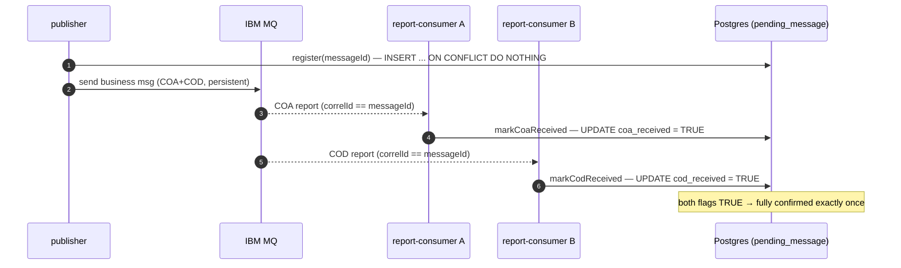
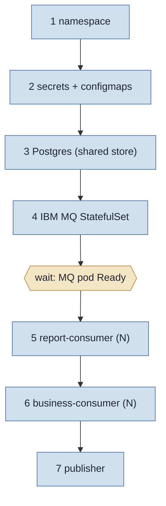

# Local k3s distributed harness — IBM MQ + competing-consumer microservices

This directory holds the **versioned, ready-to-apply** manifests for the distributed COA/COD harness
(issue #18): IBM MQ plus a publisher and competing-consumer microservices, backed by a **shared,
persistent correlation store** so correlation reconciles cluster-wide.

> **Status — human checkpoint.** The Java wiring, the Dockerfile, and every manifest below are
> complete and ready to `kubectl apply`. **Standing up a live k3s cluster and validating
> end-to-end message flow (acceptance 1) and cluster-wide exactly-once reconciliation (acceptance 2)
> is the human's infrastructure step.** Everything here is correctness-by-construction; the live
> proof is performed on a real cluster.
>
> For the single-broker runnable walkthrough and validation flows, see `docs/runbook.md` (issue #17).
> This README covers only the distributed k3s harness.

## What gets deployed

A single application image serves three roles, selected at runtime by the `HARNESS_ROLE` env
(`publisher` / `business-consumer` / `report-consumer`). The same producer/consumer/report code from
`ibmmq-jms-guide` is reused unchanged — the harness only adds a per-role gated runner loop.


- **publisher** sends persistent business messages with COA+COD requested, and `register`s each
  pending message in the shared store.
- **business-consumer** (N replicas) does a destructive GET on `DEV.QUEUE.1`. IBM MQ hands each
  message to exactly one consumer — the **competing-consumer** pattern across pods. Each commit
  releases a COD report.
- **report-consumer** (N replicas) drains `DEV.QUEUE.2`, classifies COA/COD via `JMS_IBM_Feedback`,
  and reconciles against the **shared** `pending_message` table in Postgres.
- **Postgres** is the shared store: a COA seen by one report-consumer pod and a COD seen by another
  still reconcile to a single row, because all pods read/write the same table.

## How the shared store makes correlation cluster-wide (acceptance 2)

The in-memory store is per-pod, so cluster-wide it is useless: pod A's COA never meets pod B's COD.
`JdbcCorrelationStore` (gated by `correlation.store=jdbc`, set in `app-config`) replaces it with a
Postgres-backed table shared by every pod.



**Idempotency (reports are at-least-once):** `register` is `INSERT ... ON CONFLICT DO NOTHING`;
`markCoa/CodReceived` are `UPDATE ... SET flag = TRUE` (setting TRUE again is a no-op); `remove` is a
`DELETE` (deleting an absent row is harmless). Duplicate report delivery and concurrent processing by
competing consumers therefore never double-count and never error.

**Order-independent reconciliation (no operator sweep needed).** `ReportMessageConsumer` calls
`removeIfFullyConfirmed(correlationId)` in **both** the COA and COD branches, and the store performs an
atomic `DELETE ... WHERE coa_received AND cod_received`. So whichever report completes the pair removes
the row — even when **COD lands before COA** on a different competing-consumer pod. Concurrent callers
race safely (exactly one `DELETE` affects the row; the rest affect zero), each flag is still set exactly
once (idempotent `UPDATE`), and `pendingCount()` drains to **0** cluster-wide on its own.

To inspect genuinely still-pending rows (a message missing a report — e.g. dead-lettered):

```sql
SELECT message_id, business_key, coa_received, cod_received, sent_at
FROM pending_message
WHERE NOT (coa_received AND cod_received)
ORDER BY sent_at;
```

## Read/write-split datasources for the delivery-report audit (issue #40, ADR-0005)

Beyond the transient `pending_message` ledger, the consumer also appends every COA/COD report to a
durable, append-only **`delivery_report`** audit table, against an **Aurora-like read/write connection
split** — a `default` (writer/primary) datasource and a `reader` (replica) datasource. The app config is
already wired for both:

- `31-app-config.yaml` sets `DATASOURCES_DEFAULT_*` (→ `datasources.default.*`, the **writer**, used by
  `JdbcCorrelationStore` reconciliation **and** the audit `INSERT`s) and `DATASOURCES_READER_*`
  (→ `datasources.reader.*`, the **replica**, audit read-model queries only), with HikariCP
  `maximum-pool-size` sized per-pod × replica (see the comments in that file).
- `10-secrets.yaml` carries `DATASOURCES_DEFAULT_PASSWORD` and `DATASOURCES_READER_PASSWORD`.

> **Status — primary+replica StatefulSet is a HITL follow-up (issue #21).** The `reader` URL in
> `31-app-config.yaml` points at a `postgres-replica` Service
> (`postgres-replica.ibmmq-harness.svc.cluster.local`). The current `20-postgres.yaml` ships **only the
> single-replica `postgres` StatefulSet** (the writer/primary) that backs the shared correlation store —
> it does **not** yet provision the streaming-replicated standby + its `postgres-replica` Service. Standing
> up the primary+replica StatefulSet pair on a live cluster and validating physical replication + the
> read-from-reader path is **issue #21 (HITL)**, deliberately out of #40's scope.
>
> Until that manifest lands, on a live cluster you can either (a) point `DATASOURCES_READER_URL` at the
> same `postgres` Service as the writer (single-instance, immediately consistent — the split degrades to
> the writer with no behavior change, since the reader is query-only), or (b) add a
> `bitnami/postgresql` primary+replica StatefulSet pair mirroring `ibmmq-jms-guide/docker-compose.yml`'s
> `postgres-primary`/`postgres-replica` services (image `bitnami/postgresql:16.4.0`,
> `POSTGRESQL_REPLICATION_MODE=master`/`slave`, repl user `repluser`) and expose the standby as the
> `postgres-replica` Service. The read/write split is **connection-level**, so neither option touches the
> application code — and a real Aurora deployment maps `default`/`reader` straight onto the Aurora
> writer/reader endpoints.
>
> The split's persist + idempotency logic is verified off-cluster by `DeliveryReportPersistenceIT` (in
> the default `verify` gate) and the physical-replication read-from-reader path by the opt-in
> `DeliveryReportReplicationIT` (`mvn -pl ibmmq-jms-guide verify -Preplication`). See `docs/runbook.md`
> §2.5.

## Build the image and load it into k3s (no registry)

There is no image registry in this harness; build locally and import into the k3s containerd store.

```bash
# 1) Build the single multi-role image (context = ibmmq-jms-guide/).
docker build -t ibmmq-jms-harness:1.0.0 -f ibmmq-jms-guide/Dockerfile ibmmq-jms-guide

# 2) Import it into the k3s containerd image store (so imagePullPolicy: IfNotPresent finds it).
docker save ibmmq-jms-harness:1.0.0 | sudo k3s ctr images import -

# Verify it landed:
sudo k3s ctr images ls | grep ibmmq-jms-harness
```

> **Using k3d instead of native k3s?** This harness was validated end-to-end on a **k3d** cluster
> (k3s-in-Docker). With k3d the import command differs — use
> `k3d image import ibmmq-jms-harness:1.0.0 -c <cluster>` (and likewise import
> `icr.io/ibm-messaging/mq:9.4.5.0-r2`, `postgres:16-alpine`, `busybox:1.36` so the cluster does not
> re-pull them over the network). The `docker save | k3s ctr images import` form above is for native k3s.
>
> If you bump the tag (e.g. `1.0.1`), change the `images:` block in `kustomization.yaml` to match —
> that single line retags all three role Deployments.
>
> **Dockerfile note:** the build stage pins `maven:3.9-amazoncorretto-25`. If that exact tag does not
> resolve in your environment, swap to a `maven:3.9` image whose JDK is 25, or `amazoncorretto:25` +
> a Maven install. The build only needs JDK 25 + Maven 3.9.x.

## Apply order

Apply staged so the queue manager is **Ready** before consumers connect (a consumer that starts first
just logs reconnect attempts until MQ is up — harmless, but the staged order keeps logs clean).



### One-shot (kustomize applies all objects together)

```bash
kubectl apply -k deploy/k3s
kubectl -n ibmmq-harness rollout status statefulset/ibmmq --timeout=300s
```

### Staged (recommended for a clean first bring-up)

```bash
kubectl apply -f deploy/k3s/00-namespace.yaml
kubectl apply -f deploy/k3s/10-secrets.yaml -f deploy/k3s/30-mq-config.yaml -f deploy/k3s/31-app-config.yaml
kubectl apply -f deploy/k3s/20-postgres.yaml
kubectl -n ibmmq-harness rollout status statefulset/postgres --timeout=180s

kubectl apply -f deploy/k3s/40-ibmmq.yaml
kubectl -n ibmmq-harness rollout status statefulset/ibmmq --timeout=300s   # wait MQ Ready

kubectl apply -f deploy/k3s/52-report-consumer.yaml
kubectl apply -f deploy/k3s/51-business-consumer.yaml
kubectl apply -f deploy/k3s/50-publisher.yaml
```

Tear everything down with one command:

```bash
kubectl delete namespace ibmmq-harness
```

## Observing cross-pod flow (acceptance 1 & 2 evidence)

### Logs across competing-consumer replicas

Each pod emits the project's narrated `[stage=...]` INFO lines with `messageId`/`correlationId` in MDC.

```bash
# All business-consumer replicas at once (competing GETs across pods):
kubectl -n ibmmq-harness logs -l app.kubernetes.io/name=business-consumer --all-containers --prefix -f

# All report-consumer replicas (COA/COD classification + reconcile):
kubectl -n ibmmq-harness logs -l app.kubernetes.io/name=report-consumer --all-containers --prefix -f

# Publisher:
kubectl -n ibmmq-harness logs -l app.kubernetes.io/name=publisher -f
```

Pick one `messageId` from the publisher and grep it across both consumer roles — it should appear in a
`[stage=CONSUME]`/`[stage=COMMIT]` on one business-consumer pod and a `[stage=COA]`/`[stage=COD]` on a
report-consumer pod (possibly a different pod), confirming cross-pod correlation.

### Queue depth and consumer status from inside MQ

```bash
MQ_POD=$(kubectl -n ibmmq-harness get pod -l app.kubernetes.io/name=ibmmq -o jsonpath='{.items[0].metadata.name}')

# Queue depths (business + report):
kubectl -n ibmmq-harness exec "$MQ_POD" -- bash -c 'echo "DIS QLOCAL(DEV.QUEUE.1) CURDEPTH" | runmqsc QM1'
kubectl -n ibmmq-harness exec "$MQ_POD" -- bash -c 'echo "DIS QLOCAL(DEV.QUEUE.2) CURDEPTH" | runmqsc QM1'

# Per-queue consumer status — multiple competing consumers show up as IPPROCS > 1:
kubectl -n ibmmq-harness exec "$MQ_POD" -- bash -c 'echo "DIS QSTATUS(DEV.QUEUE.1) IPPROCS OPPROCS" | runmqsc QM1'

# Connections (one per active pod conversation):
kubectl -n ibmmq-harness exec "$MQ_POD" -- bash -c 'echo "DIS CONN(*) WHERE(CHANNEL EQ DEV.APP.SVRCONN) APPLTAG" | runmqsc QM1'
```

### Reconciliation in the shared store

```bash
PG_POD=$(kubectl -n ibmmq-harness get pod -l app.kubernetes.io/name=postgres -o jsonpath='{.items[0].metadata.name}')

# Rows still pending (drains to 0 on its own — order-independent reconciliation, no sweep needed):
kubectl -n ibmmq-harness exec "$PG_POD" -- psql -U corr -d correlation \
  -c 'SELECT count(*) FILTER (WHERE NOT (coa_received AND cod_received)) AS pending,
             count(*) FILTER (WHERE coa_received AND cod_received)       AS fully_confirmed
      FROM pending_message;'
```

### IBM MQ web console (port-forward)

```bash
kubectl -n ibmmq-harness port-forward svc/ibmmq 9443:9443
# then open https://localhost:9443/ibmmq/console  (default dev admin/passw0rd)
# View QM1, browse DEV.QUEUE.1 / DEV.QUEUE.2, inspect message properties (Feedback = 259/260).
```

## Operational notes and gotchas

- **The MQSC grant mounts via `subPath` at `/etc/mqm/90-report-authority.mqsc` — NOT over the whole
  directory.** The IBM MQ dev image bakes its own files into `/etc/mqm`: the `10-dev.mqsc` symlink that
  creates `DEV.QUEUE.*`, the `DEV.APP.SVRCONN` channel + the `app`→MCAUSER CHLAUTH USERMAP, the web
  console config, and TLS templates. A bare ConfigMap volume mounted at `/etc/mqm` (no `subPath`)
  **masks** all of those — the autoconfig glob `/etc/mqm/*.mqsc` then finds only our grant, so the
  channel and business queue are never created and every app pod fails `MQRC_NOT_AUTHORIZED (2035)`.
  Mounting the single file via `subPath` overlays just that file and leaves the image's baked tree
  intact (the same effect as `docker-compose.yml`'s per-file bind mounts). `subPath` disables ConfigMap
  auto-update, which is fine — MQSC autoconfig only runs at QM creation anyway. Verify after bring-up:
  `kubectl -n ibmmq-harness exec <mq-pod> -- ls /etc/mqm` shows `10-dev.mqsc` + the `.tpl` files +
  `90-report-authority.mqsc`.
- **MQSC autoconfig runs ONCE, at queue-manager creation.** The report-PUT authority grant in
  `30-mq-config.yaml` (`SET AUTHREC ... AUTHADD(PUT, PASSID, PASSALL, SETID, SETALL)` on `DEV.QUEUE.2`)
  is what stops COA/COD reports from silently dead-lettering with `MQRC_NOT_AUTHORIZED (2035)`. The key
  permission is **`passid`** (verified live: the QMgr *passes* the original message's identity context
  into the report, so `+setall` alone is insufficient — `AMQ8077W: ... unauthorized: passid`). Because the
  grant is applied only at QM creation, **changing the MQSC requires deleting the MQ PVC** so the queue
  manager is recreated:
  ```bash
  kubectl -n ibmmq-harness delete statefulset ibmmq
  kubectl -n ibmmq-harness delete pvc qm1-data-ibmmq-0
  kubectl apply -f deploy/k3s/40-ibmmq.yaml
  ```
- **Two passwords must match.** The MQ container's `app` password (`mq-credentials.mqAppPassword`) and
  the Java client's `IBM_MQ_PASSWORD` (`app-credentials`) must be identical, or every JMS connection
  fails 2035. They are both `passw0rd` here — change both together. Likewise the Postgres password is
  shared between `db-credentials.POSTGRES_PASSWORD` and `app-credentials.DATASOURCES_DEFAULT_PASSWORD`.
- **Liveness probes** are intentionally minimal. The app has no HTTP server, so MQ uses a `tcpSocket`
  probe on 1414 and the app pods use an `exec` `pgrep` probe (requires `procps-ng`, installed in the
  image). Because each app runs the JVM as PID 1 with a non-daemon worker thread, a dead JVM already
  exits the container and the kubelet restarts it — the probe is a secondary check, not the primary
  crash-detection mechanism.
- **Startup ordering + pod hardening.** Each app Deployment has an `initContainer` (`wait-deps`) that
  blocks until `ibmmq:1414` and `postgres:5432` accept TCP, so first bring-up is clean regardless of
  apply order (belt-and-suspenders with the app's reconnect loop and the store's schema-init retry).
  App containers run a hardened `securityContext` (non-root UID 1000, `allowPrivilegeEscalation: false`,
  all capabilities dropped, `RuntimeDefault` seccomp); `readOnlyRootFilesystem` is left off because the
  MQ client may write FFST/trace under the workdir. Hardening the MQ and Postgres pods (official images
  with their own UID/permission needs) is a documented follow-up.
- **Competing-consumer parallelism = replicas, not threads.** Each pod's loop is single-threaded by
  design; scale `business-consumer`/`report-consumer` replicas (in `kustomization.yaml`) to add
  concurrency. At the standing ~10k rpm target you would scale business-consumers accordingly.
- **Secrets are DEV placeholders.** Do not commit real credentials. For anything beyond a local
  laptop, replace with sealed-secrets / external-secrets and rotate.

## Known limitations & follow-ups

Surfaced during live k3s validation. None block the steady-state AC1/AC2 demonstration (a warm system
drains `pending_message` to 0); they are documented so the reference is honest about its edges.

- **Cold-start "resurrection" race (rare).** Reconciliation removes a `pending_message` row when both
  COA and COD are confirmed. If — at cold start — both reports for a message are processed *and the row
  removed* BEFORE the producer's `register()` commits (the producer can only `register` after `send`,
  since the MsgId is assigned on send), `register`'s `INSERT ... ON CONFLICT` re-inserts a flagless
  orphan (`coa=f, cod=f`) that never drains. Observed live as ~2 of the very first messages; the warm
  steady state drains to 0. **Robust fix (follow-up):** pre-generate the MsgId client-side
  (`WMQ_MQMD_WRITE_ENABLED` + set the MQMD MsgId) and `register` BEFORE `send` so the row always exists
  before any report — or keep a short-lived tombstone instead of deleting. Until then, the still-pending
  query above surfaces any orphans.
- **Store resilience to DB unavailability.** `JdbcCorrelationStore` throws `IllegalStateException` on
  `SQLException`; on the report path (AUTO_ACKNOWLEDGE) a transient DB outage can drop a report. A
  production build should classify `SQLException` (transient vs permanent) with bounded retry/backoff,
  and consume reports under `CLIENT_ACKNOWLEDGE`/transacted `JMSContext` so a store failure leaves the
  report on the queue for redelivery. (`ensureSchema` already retries with backoff.)
- **Schema bootstrap.** `CREATE TABLE IF NOT EXISTS` runs from every pod at startup. For production,
  move DDL to a single-owner step (a Kubernetes `Job`/init-container, or Flyway/Liquibase with a lock
  table) instead of in-app creation.
- **IBM MQ availability.** A single-replica MQ StatefulSet is a SPOF and cannot meet the standing
  ~10k-rpm availability bar. A production reference would use IBM MQ **NativeHA** (or multi-instance),
  with `chkmqready`/`chkmqhealthy` probes rather than a bare TCP check. k3s single-node is the explicit
  dev limitation here (per ADR-0003).
- **Pod hardening scope.** The app pods run a hardened `securityContext`; the MQ and Postgres pods
  (official images with their own UID/permission needs) are left at image defaults — hardening them is a
  follow-up.

## File map

| File | Purpose |
| --- | --- |
| `00-namespace.yaml` | `ibmmq-harness` namespace |
| `10-secrets.yaml` | MQ app/admin, app client, and Postgres credentials |
| `20-postgres.yaml` | Postgres StatefulSet + headless Service + PVC (shared store backend = the `default`/writer datasource; the `reader`/replica StatefulSet is a #21 HITL follow-up — see "Read/write-split datasources") |
| `30-mq-config.yaml` | MQSC ConfigMap — report-PUT authority grant (`AUTHADD(PUT, PASSID, PASSALL, SETID, SETALL)`) |
| `31-app-config.yaml` | Non-secret app config (MQ connection, `correlation.store=jdbc`, datasource) |
| `40-ibmmq.yaml` | IBM MQ StatefulSet + headless Service + PVC |
| `50-publisher.yaml` | Publisher Deployment (`HARNESS_ROLE=publisher`) |
| `51-business-consumer.yaml` | Business-consumer Deployment, N replicas (competing consumers) |
| `52-report-consumer.yaml` | Report-consumer Deployment, N replicas (competing consumers) |
| `kustomization.yaml` | Parameterizes replicas + image tag; `kubectl apply -k deploy/k3s` |
