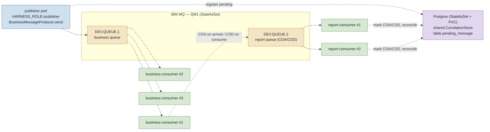
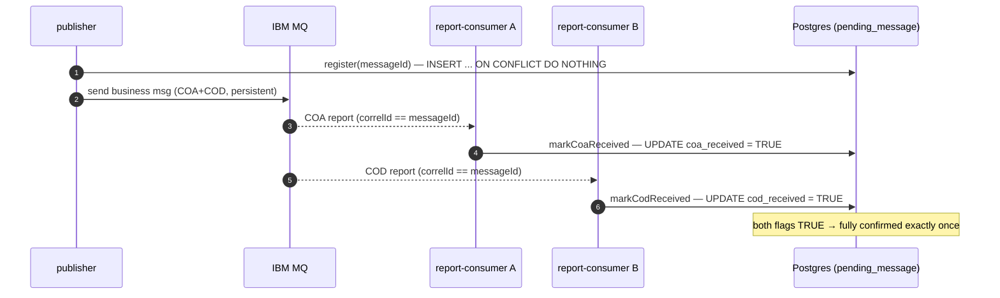
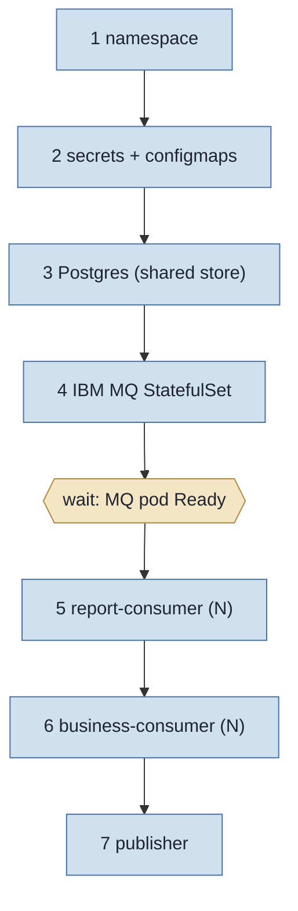

# Local k3s distributed harness — IBM MQ + competing-consumer microservices

This directory holds the **versioned, ready-to-apply** manifests for the distributed COA/COD harness
(issue #18): IBM MQ plus a publisher and competing-consumer microservices, backed by a **shared,
persistent correlation store** so correlation reconciles cluster-wide.

> **Status — human checkpoint.** The Java wiring, the Dockerfile, and every manifest below are
> complete and ready to `kubectl apply`. **Standing up a live k3s cluster and validating
> end-to-end message flow (acceptance 1) and cluster-wide exactly-once reconciliation (acceptance 2)
> is the human's infrastructure step.** Everything here is correctness-by-construction; the live
> proof is performed on a real cluster.
>
> For the single-broker runnable walkthrough and validation flows, see `docs/runbook.md` (issue #17).
> This README covers only the distributed k3s harness.

## What gets deployed

A single application image serves three roles, selected at runtime by the `HARNESS_ROLE` env
(`publisher` / `business-consumer` / `report-consumer`). The same producer/consumer/report code from
`ibmmq-jms-guide` is reused unchanged — the harness only adds a per-role gated runner loop.



- **publisher** sends persistent business messages with COA+COD requested, and `register`s each
  pending message in the shared store.
- **business-consumer** (N replicas) does a destructive GET on `DEV.QUEUE.1`. IBM MQ hands each
  message to exactly one consumer — the **competing-consumer** pattern across pods. Each commit
  releases a COD report.
- **report-consumer** (N replicas) drains `DEV.QUEUE.2`, classifies COA/COD via `JMS_IBM_Feedback`,
  and reconciles against the **shared** `pending_message` table in Postgres.
- **Postgres** is the shared store: a COA seen by one report-consumer pod and a COD seen by another
  still reconcile to a single row, because all pods read/write the same table.

## How the shared store makes correlation cluster-wide (acceptance 2)

The in-memory store is per-pod, so cluster-wide it is useless: pod A's COA never meets pod B's COD.
`JdbcCorrelationStore` (gated by `correlation.store=jdbc`, set in `app-config`) replaces it with a
Postgres-backed table shared by every pod.



**Idempotency (reports are at-least-once):** `register` is `INSERT ... ON CONFLICT DO NOTHING`;
`markCoa/CodReceived` are `UPDATE ... SET flag = TRUE` (setting TRUE again is a no-op); `remove` is a
`DELETE` (deleting an absent row is harmless). Duplicate report delivery and concurrent processing by
competing consumers therefore never double-count and never error.

**Documented ordering limitation.** The "reconcile + remove when fully confirmed" decision lives in
`ReportMessageConsumer` (reused unchanged) and only removes the row in the COD branch when
`isFullyConfirmed()`. Across competing report-consumers COA and COD can be processed out of order on
different pods; if **COD lands before COA**, the row is correctly marked but not removed, and the later
COA branch does not remove it either. The data is never lost or double-counted — each flag is set
exactly once — but `pendingCount()` may not reach 0 under out-of-order delivery without an operator
sweep:

```sql
-- Rows that are fully confirmed but were not removed (COD-before-COA ordering). Safe to delete.
DELETE FROM pending_message WHERE coa_received AND cod_received;

-- Genuinely still-pending (missing a report): inspect, do NOT blind-delete.
SELECT message_id, business_key, coa_received, cod_received, sent_at
FROM pending_message
WHERE NOT (coa_received AND cod_received)
ORDER BY sent_at;
```

Tightening this to consumer-side "remove whenever both flags are TRUE, regardless of which branch sees
it last" is a deliberate follow-up — it would change `ReportMessageConsumer`, out of scope for #18.

## Build the image and load it into k3s (no registry)

There is no image registry in this harness; build locally and import into the k3s containerd store.

```bash
# 1) Build the single multi-role image (context = ibmmq-jms-guide/).
docker build -t ibmmq-jms-harness:1.0.0 -f ibmmq-jms-guide/Dockerfile ibmmq-jms-guide

# 2) Import it into the k3s containerd image store (so imagePullPolicy: IfNotPresent finds it).
docker save ibmmq-jms-harness:1.0.0 | sudo k3s ctr images import -

# Verify it landed:
sudo k3s ctr images ls | grep ibmmq-jms-harness
```

> If you bump the tag (e.g. `1.0.1`), change the `images:` block in `kustomization.yaml` to match —
> that single line retags all three role Deployments.
>
> **Dockerfile note:** the build stage pins `maven:3.9-amazoncorretto-25`. If that exact tag does not
> resolve in your environment, swap to a `maven:3.9` image whose JDK is 25, or `amazoncorretto:25` +
> a Maven install. The build only needs JDK 25 + Maven 3.9.x.

## Apply order

Apply staged so the queue manager is **Ready** before consumers connect (a consumer that starts first
just logs reconnect attempts until MQ is up — harmless, but the staged order keeps logs clean).



### One-shot (kustomize applies all objects together)

```bash
kubectl apply -k deploy/k3s
kubectl -n ibmmq-harness rollout status statefulset/ibmmq --timeout=300s
```

### Staged (recommended for a clean first bring-up)

```bash
kubectl apply -f deploy/k3s/00-namespace.yaml
kubectl apply -f deploy/k3s/10-secrets.yaml -f deploy/k3s/30-mq-config.yaml -f deploy/k3s/31-app-config.yaml
kubectl apply -f deploy/k3s/20-postgres.yaml
kubectl -n ibmmq-harness rollout status statefulset/postgres --timeout=180s

kubectl apply -f deploy/k3s/40-ibmmq.yaml
kubectl -n ibmmq-harness rollout status statefulset/ibmmq --timeout=300s   # wait MQ Ready

kubectl apply -f deploy/k3s/52-report-consumer.yaml
kubectl apply -f deploy/k3s/51-business-consumer.yaml
kubectl apply -f deploy/k3s/50-publisher.yaml
```

Tear everything down with one command:

```bash
kubectl delete namespace ibmmq-harness
```

## Observing cross-pod flow (acceptance 1 & 2 evidence)

### Logs across competing-consumer replicas

Each pod emits the project's narrated `[stage=...]` INFO lines with `messageId`/`correlationId` in MDC.

```bash
# All business-consumer replicas at once (competing GETs across pods):
kubectl -n ibmmq-harness logs -l app.kubernetes.io/name=business-consumer --all-containers --prefix -f

# All report-consumer replicas (COA/COD classification + reconcile):
kubectl -n ibmmq-harness logs -l app.kubernetes.io/name=report-consumer --all-containers --prefix -f

# Publisher:
kubectl -n ibmmq-harness logs -l app.kubernetes.io/name=publisher -f
```

Pick one `messageId` from the publisher and grep it across both consumer roles — it should appear in a
`[stage=CONSUME]`/`[stage=COMMIT]` on one business-consumer pod and a `[stage=COA]`/`[stage=COD]` on a
report-consumer pod (possibly a different pod), confirming cross-pod correlation.

### Queue depth and consumer status from inside MQ

```bash
MQ_POD=$(kubectl -n ibmmq-harness get pod -l app.kubernetes.io/name=ibmmq -o jsonpath='{.items[0].metadata.name}')

# Queue depths (business + report):
kubectl -n ibmmq-harness exec "$MQ_POD" -- bash -c 'echo "DIS QLOCAL(DEV.QUEUE.1) CURDEPTH" | runmqsc QM1'
kubectl -n ibmmq-harness exec "$MQ_POD" -- bash -c 'echo "DIS QLOCAL(DEV.QUEUE.2) CURDEPTH" | runmqsc QM1'

# Per-queue consumer status — multiple competing consumers show up as IPPROCS > 1:
kubectl -n ibmmq-harness exec "$MQ_POD" -- bash -c 'echo "DIS QSTATUS(DEV.QUEUE.1) IPPROCS OPPROCS" | runmqsc QM1'

# Connections (one per active pod conversation):
kubectl -n ibmmq-harness exec "$MQ_POD" -- bash -c 'echo "DIS CONN(*) WHERE(CHANNEL EQ DEV.APP.SVRCONN) APPLTAG" | runmqsc QM1'
```

### Reconciliation in the shared store

```bash
PG_POD=$(kubectl -n ibmmq-harness get pod -l app.kubernetes.io/name=postgres -o jsonpath='{.items[0].metadata.name}')

# Rows still pending (should trend toward 0; see the ordering-limitation sweep above):
kubectl -n ibmmq-harness exec "$PG_POD" -- psql -U corr -d correlation \
  -c 'SELECT count(*) FILTER (WHERE NOT (coa_received AND cod_received)) AS pending,
             count(*) FILTER (WHERE coa_received AND cod_received)       AS fully_confirmed
      FROM pending_message;'
```

### IBM MQ web console (port-forward)

```bash
kubectl -n ibmmq-harness port-forward svc/ibmmq 9443:9443
# then open https://localhost:9443/ibmmq/console  (default dev admin/passw0rd)
# View QM1, browse DEV.QUEUE.1 / DEV.QUEUE.2, inspect message properties (Feedback = 259/260).
```

## Operational notes and gotchas

- **The MQSC ConfigMap mounts as a directory at `/etc/mqm` — this is intentional.** Unlike
  `docker-compose.yml` (which bind-mounts individual `.mqsc` files), the k8s manifest mounts the whole
  ConfigMap at `/etc/mqm`, MQ's documented drop-in autoconfig directory. The queue manager's own
  state (`mqs.ini`, logs, message store) lives under `/mnt/mqm`, mounted separately from the PVC, so
  masking `/etc/mqm` with the ConfigMap is the correct IBM-documented pattern — do **not** "fix" it
  into per-file mounts.
- **MQSC autoconfig runs ONCE, at queue-manager creation.** The report-PUT authority grant in
  `30-mq-config.yaml` (`SET AUTHREC ... AUTHADD(PUT, SETALL)` on `DEV.QUEUE.2`) is what stops COA/COD
  reports from silently dead-lettering with `MQRC_NOT_AUTHORIZED (2035)`. Because it is applied only at
  QM creation, **changing the MQSC requires deleting the MQ PVC** so the queue manager is recreated:
  ```bash
  kubectl -n ibmmq-harness delete statefulset ibmmq
  kubectl -n ibmmq-harness delete pvc qm1-data-ibmmq-0
  kubectl apply -f deploy/k3s/40-ibmmq.yaml
  ```
- **Two passwords must match.** The MQ container's `app` password (`mq-credentials.mqAppPassword`) and
  the Java client's `IBM_MQ_PASSWORD` (`app-credentials`) must be identical, or every JMS connection
  fails 2035. They are both `passw0rd` here — change both together. Likewise the Postgres password is
  shared between `db-credentials.POSTGRES_PASSWORD` and `app-credentials.DATASOURCES_DEFAULT_PASSWORD`.
- **Liveness probes** are intentionally minimal. The app has no HTTP server, so MQ uses a `tcpSocket`
  probe on 1414 and the app pods use an `exec` `pgrep` probe (requires `procps-ng`, installed in the
  image). Because each app runs the JVM as PID 1 with a non-daemon worker thread, a dead JVM already
  exits the container and the kubelet restarts it — the probe is a secondary check, not the primary
  crash-detection mechanism.
- **Competing-consumer parallelism = replicas, not threads.** Each pod's loop is single-threaded by
  design; scale `business-consumer`/`report-consumer` replicas (in `kustomization.yaml`) to add
  concurrency. At the standing ~10k rpm target you would scale business-consumers accordingly.
- **Secrets are DEV placeholders.** Do not commit real credentials. For anything beyond a local
  laptop, replace with sealed-secrets / external-secrets and rotate.

## File map

| File | Purpose |
| --- | --- |
| `00-namespace.yaml` | `ibmmq-harness` namespace |
| `10-secrets.yaml` | MQ app/admin, app client, and Postgres credentials |
| `20-postgres.yaml` | Postgres StatefulSet + headless Service + PVC (shared store backend) |
| `30-mq-config.yaml` | MQSC ConfigMap — report-PUT authority grant (`AUTHADD(PUT, SETALL)`) |
| `31-app-config.yaml` | Non-secret app config (MQ connection, `correlation.store=jdbc`, datasource) |
| `40-ibmmq.yaml` | IBM MQ StatefulSet + headless Service + PVC |
| `50-publisher.yaml` | Publisher Deployment (`HARNESS_ROLE=publisher`) |
| `51-business-consumer.yaml` | Business-consumer Deployment, N replicas (competing consumers) |
| `52-report-consumer.yaml` | Report-consumer Deployment, N replicas (competing consumers) |
| `kustomization.yaml` | Parameterizes replicas + image tag; `kubectl apply -k deploy/k3s` |
