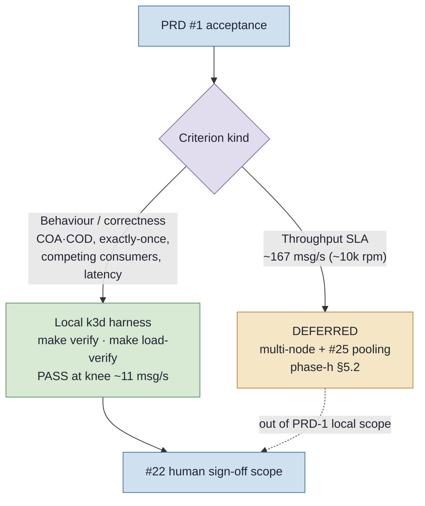

# PRD #1 — Final acceptance checklist

**Tracks:** issue #22 (*Final acceptance pass against the updated checklist*) · parent PRD #1.
**Status of this document:** the **locked checklist** (criteria + fresh-evidence commands + current
status). The heavy gates are **not** run by the act of writing this file — they are run fresh in the
HITL execution pass (below) and the human records the verdict in **§ Sign-off**.

This checklist is **authoritative against the integrated tree on the umbrella branch**, evaluated by
**fresh evidence**, not by issue OPEN/CLOSED state (orchestrate slice issues do not auto-close on an
umbrella branch — a deliverable can be merged while its issue stays OPEN).

---

## Scope & method (the four settled decisions)

| # | Decision | Resolution |
|---|----------|-----------|
| a | Where is acceptance evaluated? | On the **umbrella tip** (`orchestrate/umbrella-prd1-20260601-025041`), where all 12 slices are integrated. Merge-to-`development`/`main` is a separate **release** gate, not an acceptance gate. |
| b/d | What does "PASS" mean for load? | **Behaviour** (COA/COD correctness, exactly-once across replicas, audit latency, competing consumers) is proven **locally**; the **~167 msg/s throughput target is DEFERRED** (capacity goal, not a PRD-1 gate). |
| c | Authoritative criteria source | The **33 PRD #1 user stories** (organised by the 4 Solution deliverable groups). The brief's still-valid *technical* premises (P6/P13/P19/P20) inform content depth; its **pt-BR-only language premises (P14/P16/P17-language, §3.1 "100% Brazilian Portuguese") are SUPERSEDED by ADR-0002** (English docs + the single bilingual `index.html`). |

### Throughput reconciliation (the load line)

> The **~167 msg/s (~10k rpm)** figure is a **standing capacity mandate** in `CLAUDE.md`, **not** a line
> in the locked brief and **not** a PRD-1 story gate. The local single-node k3d box (4 vCPU/8 GB WSL2,
> shared by MQ + Postgres + every JVM) is **report-drain-bound** at ~12–15 msg/s because the producer
> **and** consumers are **connect-per-operation** (a fresh `JMSContext` + MQ handshake per message), so
> adding publisher pods *thrashes* the shared vCPUs and aggregate throughput **falls**. The validated
> sustainable-knee run (`research-output/phase-h-load-baseline-k3d.md` §4.3) achieved **~11 msg/s over
> 338 s with zero loss** (COA 4000/4000, COD 4000/4000, 0 duplicate rows, DLQ 0, p99 COA 15 ms / COD
> 25 ms vs pre-declared ceilings 5000/15000 ms), work split evenly across the 3 business + 2 report
> competing-consumer replicas; the 63 msg/s run **fails as expected** (§4.2), characterising the
> saturation point. **Consequence:** story 29's load AC **PASSES at the sustainable knee**; reaching
> **167 msg/s is deferred to a multi-node cluster (§5.2) gated on #25 (connection pooling)** — out of
> PRD-1's local acceptance scope (ADR-0007).



---

## How to run the evidence commands

```bash
cd /home/rodrigo/IBM-MQ
source /home/rodrigo/.local/ibmmq-env.sh   # JDK 25 + Maven 3.9.9 (bare `mvn` is the wrong 3.8.6)
# Heavy gates need: Docker running (Testcontainers / docker-compose) and, for k3d, `make up` (~10 min).
# Disable the Claude Bash sandbox for any command that reaches the Docker socket or k3d.
```

**Status legend** — ✅ **PASS (tree)**: confirmed by a cheap check this pass; re-confirm at sign-off.
⏳ **NEEDS-RUN**: heavy gate (mvn / make / build-html / demo) — must be run **fresh** at sign-off
(Iron Law). 👤 **HUMAN**: human-judgment criterion, no command. 🔧 **FIXED (this pass)**: was a defect,
corrected during #22 prep — re-confirm.

---

## Group 0 — Build & Test gate

| Criterion | Fresh-evidence command | Status |
|-----------|------------------------|--------|
| Module **unit** suite is green (compiles all snippet-source classes — brief P15 "real code" — and passes correlation logic, MDC logging, demo gating, MQMD field/timestamp parse). | `mvn -f ibmmq-jms-guide/pom.xml -q test` | ⏳ NEEDS-RUN |
| Default **integration** gate is green (Testcontainers broker; end-to-end COA 259 / COD 260 IT + untagged Group A + Group C field-recovery ITs). | `mvn -f ibmmq-jms-guide/pom.xml -q verify` | ⏳ NEEDS-RUN |
| **Tagged IT profiles** pass (no single invocation covers all — mutually-exclusive inverting tag filters). | `mvn -f ibmmq-jms-guide/pom.xml -q verify -Pscenarios && mvn -f ibmmq-jms-guide/pom.xml -q verify -Pvt` | ⏳ NEEDS-RUN |

---

## Group 1 — Documentation / bilingual HTML / bibliography / scenarios

| Story | Criterion | Fresh-evidence command | Status |
|------|-----------|------------------------|--------|
| 1 | Guide walks concepts → advanced in order (Section 1 Fundamentals → 2 COA/COD → 3 Env → 4 Implementation → 5 Testing → appendices). | `grep -nE '^#{1,3} (Section\|Appendix)' docs/guide-ibmmq-jms-micronaut.md` | ✅ PASS (tree) |
| 2 | **ALL durable docs are English** (research-output, brief, handoffs **and READMEs**); only `docs/index.html` + ADR-0004 exceptions (JUnit `@DisplayName`, grandfathered in-code/log text) are exempt; originals recoverable via git. | `git grep -nIE '\b(produtor\|consumidor\|fila\|relatorio\|gerenciador\|aplicacao\|pre-requisitos\|conceito)\b' -- '*.md' ':!docs/i18n/*' ':!docs/index.html'` → prose is English; the runbook's quoted **log-line output** is now English too (the bean `LOG.*` text was translated under #73, ADR-0004, so the runbook §4.3 excerpt was aligned to match the runtime output). | 🔧 FIXED (this pass — README translated; prose clean; runbook log excerpt now English) |
| 3–8 | **Bilingual standalone HTML**: pt-BR view preserved (3), whole-page toggle (4), browser-default + pt-BR fallback (5), `localStorage` persistence (6), EN/pt-BR kept synced by the 4-part parity gate (7), single offline file, zero required external resource loads (8). | `.venv-docs/bin/python docs/build-html.py` (full parity-gated build) | ⏳ NEEDS-RUN (toggle/standalone proven cheaply: `lang-toggle`/`data-lang`/`localStorage`/browser-detect present; Mermaid runtime inlined; no external resource loads) |
| 9 | Every diagram is a **coloured, animated Mermaid** diagram legible on light **and** dark (explicit `classDef` fills/strokes — no theme defaults). | `for f in docs/guide-ibmmq-jms-micronaut.md docs/i18n/guia-ibmmq-jms-micronaut.md; do echo "$f mermaid=$(grep -cP '^\x60{3}mermaid' $f) classDef=$(grep -c classDef $f)"; done` | ✅ PASS (tree) + 👤 colour/animation is a content-review property |
| 10–11 | `docs/references.md` is the **single source of truth** (each source + grounded concept/term + link); `README.md` summarises+links it; `build-html.py render_references()` generates the HTML section from it (no divergent copies). | `test -f docs/references.md && grep -q 'docs/references.md' README.md && grep -q 'def render_references' docs/build-html.py && grep -q 'class="references"' docs/index.html && echo OK` | ✅ PASS (tree) |
| 12–13 | `docs/testing-scenarios.md` catalogues every implemented scenario (tiered Rich/Compact template), maps each to a real test file+method, and is **cross-linked from both the guide and `index.html`**. | `test -f docs/testing-scenarios.md && grep -q '## Template tiers' docs/testing-scenarios.md && grep -q testing-scenarios.md docs/guide-ibmmq-jms-micronaut.md && grep -q testing-scenarios.md docs/index.html && echo OK` | ✅ PASS (tree) |
| 31 | A **project-agnostic analysis skill** points an LLM at any IBM MQ + JMS app and reports where/why/impact/solutions per finding. | `test -f ai/skills/jms-mq-delivery-report-analyzer/SKILL.md && echo OK` | ✅ PASS (tree) |
| 32 | A **domain glossary** (`CONTEXT.md`, terms only) and a **status/roadmap** doc (`docs/project-status.md`) both exist. | `ls -1 CONTEXT.md docs/project-status.md` | ✅ PASS (tree) |
| — | **ADR-0006 doc addendum** (in PRD-1 acceptance): Guide §4.1 *Connection pooling & factory topology* + `research-output/pooled-jms-factory-tuning.md` + ADR-0006 + references entry. *(The CODE half is routed to #25 — NOT a PRD-1 acceptance line.)* | `ls -1 docs/adr/0006-role-based-connection-factories.md research-output/pooled-jms-factory-tuning.md && echo OK` | ✅ PASS (tree) |

---

## Group 2 — Observability / demo / runbook

| Story | Criterion | Fresh-evidence command | Status |
|------|-----------|------------------------|--------|
| 14–15 | Each COA/COD lifecycle stage emits a `[stage=…]` INFO line with `messageId`+`correlationId` bound via **MDC**; `LoggingFlowTest` captures and asserts every emitted stage and its per-line MDC ids. | `mvn -f ibmmq-jms-guide/pom.xml -q -Dtest=LoggingFlowTest test` | ⏳ NEEDS-RUN (no-broker unit; stage tags + `MDC.put`/`remove` confirmed by grep) |
| 16–17 | With `-Dmicronaut.environments=demo` against the docker-compose broker, the **gated** `CoaCodDemoRunner` runs produce→consume→COA/COD once and logs `[result=PASS]` (feedback 259+260, `correlId==messageId`); absent the flag the runner bean is **not** instantiated. | `docker compose -f ibmmq-jms-guide/docker-compose.yml up -d && mvn -f ibmmq-jms-guide/pom.xml mn:run -Dmn.jvmArgs="--enable-native-access=ALL-UNNAMED -Dmicronaut.environments=demo" 2>&1 \| grep -E '\[result=PASS\]\|feedback=259\|feedback=260'` | ⏳ NEEDS-RUN (live demo is the only faithful proof of the broker-backed path — no `*IT` covers it; gating proven by `CoaCodDemoRunnerGatingTest`) |
| 18–20 | `docs/runbook.md` lists every dependency + config value, drives a new operator from broker bring-up → COA/COD demo → `[result=PASS]` with explicit per-step validation, and carries an accurate **9443 web-console** walkthrough (login, view QM/queues, publish, browse). | `mvn -f ibmmq-jms-guide/pom.xml verify` (runbook §5.2 deterministic IT) — then walk §6 web-console by hand | ⏳ NEEDS-RUN + 👤 (AC "validate from the runbook alone" is experiential; web-console step is manual). 🔧 production-authority guidance (`+setall` → `+passid`) and the runbook/demo `[result=…]` token tracked in #73 (guide-side reconciliation in #75) |

---

## Group 3 — Local k3s distributed harness

| Story | Criterion | Fresh-evidence command | Status |
|------|-----------|------------------------|--------|
| 21·22·24 | A versioned harness (`deploy/k3s/` + `Makefile`) deploys IBM MQ + a publisher + a **competing-consumer** microservice at N replicas (business=3, report=2) that **reuse the production beans**; `make verify` proves cross-pod flow (**IPPROCS>1** on DEV.QUEUE.1/2) and **DLQ CURDEPTH=0** on a real k3d cluster. | `make up && make verify` | ⏳ NEEDS-RUN (live-k3d; cluster ephemeral — `make down` destroys it; replicas 3/2 + IPPROCS>1 + DLQ=0 asserts confirmed in manifests/Makefile) |
| 23 | The correlation store is **shared/persistent across replicas** (Postgres `pending_message` backing `JdbcCorrelationStore`): a report received by one pod reconciles a message handled by another, idempotently, cluster-wide. | `make up && make verify` (asserts cross-pod coa/cod/both counts) | ⏳ NEEDS-RUN (live-k3d) |

---

## Group 4 — Deferred COA/COD hardening

| Story | Criterion | Fresh-evidence command | Status |
|------|-----------|------------------------|--------|
| 25–27 | The **six report-MQMD fields** (`applIdentityData`, `accountingToken`, `correlationIdBytes`, `messageIdBytes`, `putTimestampUtc`, `reportTypeChar`) are recovered from the report's **own descriptor**, `PutDate`/`PutTime` parsed to **UTC with explicit `ZoneOffset.UTC`** (no JVM default zone), and the feedback classified to a report type incl. a derived report-type char — asserted on **both** a COA(259) and a COD(260). | `mvn -f ibmmq-jms-guide/pom.xml -q -Dtest=ReportDescriptorTest,MqmdTimestampsTest test && mvn -f ibmmq-jms-guide/pom.xml -q -Dit.test=DeliveryReportPersistenceIT verify` | ⏳ NEEDS-RUN. 🔧 doc inconsistency fixed this pass (AccountingToken **32 bytes** = `MQ_ACCOUNTING_TOKEN_LENGTH`, was "24") |
| 28 | The named **edge-case matrix** is covered by tests: auth-failure→DLQ, persistence inheritance, syncpoint timing, expiration(258), poison-message backout, with-data payload, queue-full(2053), client auto-reconnect, pooled-jms stale-connection/pool invalidation. | `mvn -f ibmmq-jms-guide/pom.xml -q verify && mvn -f ibmmq-jms-guide/pom.xml -q verify -Pscenarios` | ⏳ NEEDS-RUN (Group A = 6 untagged + 3 `-Pscenarios` ITs) |
| 30 | **Virtual-Threads** right-vs-wrong patterns measured (throughput + p50/p95/p99) and the **JEP-491 pinning boundary** demonstrated deterministically (`jdk.VirtualThreadPinned` does not scale per `synchronized` block on Java 25), with the MQ-I/O residual-pinning recording. | `mvn -f ibmmq-jms-guide/pom.xml -q verify -Pvt` | ⏳ NEEDS-RUN (`VirtualThreadsEvidenceIT`, 3 `@Tag(vt)` ITs) |
| 29 | **Sustained load**: `make load` drives a **bounded known-N** run; `make load-verify` asserts **AC1 zero-loss** (distinct COA==N **and** COD==N), **AC2 p99 ≤ pre-declared ceiling** (COA≤5000 ms / COD≤15000 ms), **AC3 exactly-once** (0 duplicate `(correlation_id,feedback)` rows + IPPROCS>1 on both queues) and **DLQ==0**, exiting non-zero on breach; excluded from the default `verify` gate. **PASS is claimed at the validated sustainable knee (~11 msg/s), NOT at ~167 msg/s** (see throughput reconciliation). | `make up && make load LOAD_PUB_REPLICAS=2 LOAD_INTERVAL_MS=150 LOAD_COUNT_PER_POD=2000 && make load-verify` | ⏳ NEEDS-RUN (live-k3d; evidence home: `research-output/phase-h-load-baseline-k3d.md` §4.3) |

---

## Group 5 — Content quality (human-judgment, no command)

These augment the brief's still-valid quality premises (#22: "original brief criteria … **augmented**").
Not 1:1 with a story and not command-provable — the reviewer **confirms** each by reading the artefact.

| Source | Criterion | Status |
|--------|-----------|--------|
| Brief §2 / P-structure | Mandatory guide sections **1–5 + appendices** are present **in depth** (not stubs). | 👤 HUMAN |
| Brief P19 | Each critical topic (connection, COA/COD, transactions, concurrency, security) carries a **✅ good × ❌ bad** pair with *why it fails* + *observable symptom*, framed for distributed high-concurrency microservices. | 👤 HUMAN |
| Brief P17 | HTML: side nav + active-section, syntax highlight + **copy button**, callouts ✅/❌/⚠️/ℹ️, responsive, **WCAG AA** (contrast ≥ 4.5:1). | 👤 HUMAN |
| Brief P20 | HTML uses the neutral eye-friendly palette + reading typography (light default; body ≥ 16 px, line-height ≈ 1.6), **not** the `frontend-design` maximalist bias. | 👤 HUMAN |

---

## Defects corrected during this acceptance-prep pass

| ID | Defect | Fix |
|----|--------|-----|
| D1 | `docs/runbook.md` stated the report-PUT needs `+setall` / `AUTHADD(PUT, SETALL)` — contradicting the validated **2035 gotcha** (live-k3s: `+put +setall` still failed on `passid`). | Corrected to the full context set `AUTHADD(PUT, PASSID, PASSALL, SETID, SETALL)` in §2.2 and §7.1. |
| D2 | `ibmmq-jms-guide/README.md` was pt-BR prose (a durable README must be English — ADR-0002), blocking a clean story-2 PASS. | Translated to English (pt-BR original recoverable via git); the demo-section authority note corrected to `+passid` too. |
| D3 | AccountingToken documented as **24 bytes** in `ReportDescriptor`/`DeliveryReportRecord`/`DeliveryEvent`/`CoaCodEndToEndIT` JavaDoc, `docs/testing-scenarios.md`, and the `DeliveryReportPersistenceIT` fixture — contradicting `phase-f` (`MQ_ACCOUNTING_TOKEN_LENGTH = 32`). | Corrected to **32 bytes** everywhere; the IT fixture is now a realistic 32-byte token (hex recomputed, `hasSize(64)`). |

---

## Known residual / deferred (record at sign-off — not silent)

- **~167 msg/s throughput is NOT met locally** (~10× above the ~11 msg/s validated knee; report-drain-bound).
  Deliberate, documented deferral (ADR-0007 + phase-h §5.2) — blocks any throughput **SLA** claim, not the
  behavioural ACs. Closing it needs **#25 (connection pooling)** + a **multi-node** cluster.
- **`docs/index.html` editorial drift:** this pass edited upstream truth (`runbook.md`,
  `testing-scenarios.md`, Java JavaDoc). Run `sync-html-docs` in **check** mode (read-only) before sign-off;
  the guide build sources (`docs/guide-*.md`, `docs/i18n/*.md`, `docs/references.md`) were **not** changed,
  so the parity gate is not broken — only editorial freshness needs a scan.
- **`postgres-replica` StatefulSet** (CQRS reader) is a k3s stopgap (`31-app-config.yaml` reader → `postgres`);
  a deferred clean-up, not a PRD-1 acceptance blocker.

---

## Execution pass (HITL) — run every ⏳ NEEDS-RUN fresh, then record below

Recommended order (each line maps to a group above):

```bash
cd /home/rodrigo/IBM-MQ && source /home/rodrigo/.local/ibmmq-env.sh
# 1) Unit + integration + tagged ITs (Docker running)
mvn -f ibmmq-jms-guide/pom.xml -q test
mvn -f ibmmq-jms-guide/pom.xml -q verify
mvn -f ibmmq-jms-guide/pom.xml -q verify -Pscenarios && mvn -f ibmmq-jms-guide/pom.xml -q verify -Pvt
# 2) Bilingual HTML parity build
.venv-docs/bin/python docs/build-html.py
# 3) Gated demo (broker up)
docker compose -f ibmmq-jms-guide/docker-compose.yml up -d
mvn -f ibmmq-jms-guide/pom.xml mn:run -Dmn.jvmArgs="--enable-native-access=ALL-UNNAMED -Dmicronaut.environments=demo"
# 4) k3d harness behaviour + sustained load at the knee (make up ~10 min)
make up && make verify
make load LOAD_PUB_REPLICAS=2 LOAD_INTERVAL_MS=150 LOAD_COUNT_PER_POD=2000 && make load-verify
make down
```

---

## Sign-off

The acceptance pass is **HITL** — an agent assembles and runs the evidence above; a human accepts.

- [ ] Group 0 — Build & Test gate green (paste `mvn test` / `mvn verify` / `-Pscenarios` / `-Pvt` results)
- [ ] Group 1 — Docs / HTML / bibliography / scenarios (parity build green; story-2 grep clean)
- [ ] Group 2 — Observability / demo / runbook (`[result=PASS]`; web-console walked)
- [ ] Group 3 — k3s harness (`make verify`: IPPROCS>1, DLQ=0, cross-pod reconciliation)
- [ ] Group 4 — COA/COD hardening (MQMD recovery, edge-case matrix, VThreads, load PASS at the knee)
- [ ] Group 5 — Content quality (reviewer-confirmed: sections depth, good/bad pairs, WCAG AA, palette)
- [ ] Residual/deferred items recorded (167 msg/s deferral; `sync-html-docs` check run)

**Throughput scope acknowledged:** PRD-1 acceptance certifies **COA/COD behaviour + exactly-once +
audit-latency** on the local harness; the **~167 msg/s target is explicitly deferred** to a multi-node
cluster gated on #25.

| Field | Value |
|-------|-------|
| Evidence assembled by | _(agent/run)_ |
| Evidence date (UTC) | _(fill at run)_ |
| Umbrella commit verified | _(SHA)_ |
| **Human sign-off** | _(name / date — ACCEPT / REJECT)_ |
