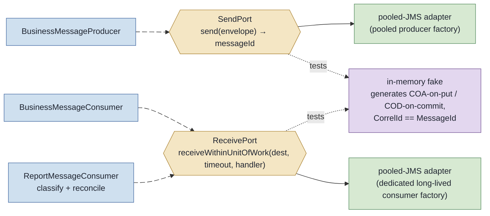

# 0008 — Messaging seam: two role-based ports exchanging decoded domain envelopes

Status: accepted (2026-06-02) — implementation tracked in issue #25; pairs with ADR-0006 (role-based connection factories).

## Context

The seam between the COA/COD modules and JMS sits today at `javax.jms.ConnectionFactory`. Each entry point opens
and closes its own `JMSContext`: `BusinessMessageProducer.send` (`createContext(AUTO_ACKNOWLEDGE)`),
`BusinessMessageConsumer.receiveOne` (`createContext(SESSION_TRANSACTED)` + `commit()` — the commit is what releases
the COD), and `ReportMessageConsumer.receiveOneReport` (`createContext(AUTO_ACKNOWLEDGE)` → `handleReport`).

Two problems follow from putting the seam there:

1. **No broker-free integrated test exists.** `CoaCodEndToEndIT` imports no production entry-point bean — it builds
   its own `MQConnectionFactory` and reimplements produce → consume → read-reports in raw JMS, so
   `BusinessMessageProducer`/`BusinessMessageConsumer`/`ReportMessageConsumer` are driven by no test against any
   broker. The only unit coverage (`LoggingFlowTest`) hand-stubs a 7-call JMS chain to test one bean. There is no
   middle ground between that mock chain and the `MQContainer`-backed `*IT` classes.
2. **`ConnectionFactory` is a huge interface for the leverage tests get** (context → consumer → producer → queue →
   message). Its deletion test fails: it does not concentrate complexity, it forces every test to either spin a
   broker or reimplement JMS.

ADR-0006 already decided **role-based connection factories** (a pooled producer factory + a dedicated long-lived
consumer factory) and named issue #25 as their build site. This ADR records the seam contract that rides on top of
that topology; the two decisions move together.

## Decision

Place the seam at **two role-based ports**, each backed by **two adapters** (a pooled-JMS production adapter + an
in-memory fake).

- **Two ports by role** mirroring ADR-0006's two factories:
  - **`SendPort`** over the pooled producer factory — short-lived, bursty send.
  - **`ReceivePort`** over the dedicated long-lived consumer factory — used by both the business consumer and the
    report consumer.
- **Decoded domain envelopes cross the seam, never `javax.jms.Message`.**
  - *Outbound* (`SendPort`): an envelope carrying payload + businessKey + report options (COA/COD) + replyTo
    destination + delivery mode; returns the assigned `messageId`.
  - *Inbound* (`ReceivePort`): a **decoded report envelope** carrying the feedback code, the correlationId, the body,
    and the six recovered MQMD values (today's `ReportDescriptor`). All JMS/MQMD extraction
    (`getIntProperty(JMS_IBM_FEEDBACK)`, `ReportDescriptor.from`, the `?mdReadEnabled=true` URI form) moves **into the
    pooled-JMS adapter**. No `javax.jms` type reaches a seam caller (AC6).
- **Transaction semantics live on the port as a callback unit-of-work:**
  `receiveWithinUnitOfWork(dest, timeout, handler)` begins a receive, runs `handler` on the decoded envelope,
  **commits on normal return and rolls back if the handler throws.** "Commit releases the COD" and "rollback ⇒ no
  COD" become assertable *through the seam* (AC5).
- **Behavior-preserving refactor.** The report path keeps its current `AUTO_ACKNOWLEDGE` / best-effort idempotent
  audit semantics, now expressed through the `ReceivePort`. Upgrading the report path to commit-after-process
  (transactionally-consistent audit) is **out of scope for #25** and remains a tracked **ADR-0005 follow-up** with its
  own go/no-go.
- **The in-memory fake models COA/COD generation faithfully:** on a send with report options it enqueues a COA
  (feedback 259) on arrival and a COD (feedback 260) on destructive consume + commit, each with
  `CorrelationID == original MessageId` (mirroring the QM's `MQRO_COPY_MSG_ID_TO_CORREL_ID` default and COA-on-put /
  COD-on-commit timing). This lets the broker-free unit test run the full produce → consume → receive-report →
  reconcile → remove cycle (AC3). The fidelity risk (the fake re-encodes broker semantics) is **bounded** because the
  rewritten `CoaCodEndToEndIT` drives the **same production modules** through the pooled-JMS adapter against a real
  `MQContainer` (AC4) — the real broker stays the source of truth.
- **Fallout for `handleReport` and destination resolution.** `handleReport`'s JMS-reading moves into the adapter;
  classification (`ReportFeedbackRouter`) and reconciliation (`CorrelationStore.removeIfFullyConfirmed`) stay in the
  consumer, now operating on the envelope, and the previously-untested receive loop folds into the seam-tested path.
  The `queue:///` prefixing and the `?mdReadEnabled=true` suffix, duplicated across the three beans today, move behind
  the seam.

## Alternatives considered

- **A raw `javax.jms.Message` crosses the receive side.** Minimal adapter, but JMS leaks across the seam and the fake
  must fabricate a `Message` mock — the broker-free test keeps wrestling with JMS types and AC6 is violated. Rejected.
- **Hybrid: outbound envelope + an inbound typed property accessor** (no `javax.jms` exposed, but the adapter does not
  fully decode the MQMD). A real middle ground, but the fake must still model the MQMD property map faithfully and
  `handleReport` keeps reading via the accessor. Rejected as the default in favour of full decoding (clearer contract,
  the report decoding has one home); retained as a fallback if full decoding proves too coupled to MQMD specifics.
- **One unified messaging seam** (send + receive + receiveAndCommit in one interface). Fights ADR-0006: a single seam
  must hold both factories or pick one, re-mixing the opposite lifecycles the factory split separated. Rejected.
- **Transport-only fake** (reports enqueued by hand in the test). Simpler fake, but it does not exercise the
  produce → report causal chain; the id-propagation invariant would only be asserted by hand, never generated.
  Rejected.

## Consequences

- **Code (issue #25, done test-first):** introduce `SendPort` + `ReceivePort`, the pooled-JMS adapters (wired to the
  role-based factories of ADR-0006), and the in-memory fake; route the producer and both consumers through the ports
  so no entry point opens a `JMSContext` directly; move JMS/MQMD extraction and destination resolution into the
  adapter. #25 is the union of this seam work and the ADR-0006 factory rewrite.
- **A broker-free unit test (AC3)** exercises produce → consume → receive-report → reconcile → remove through the fake;
  **`CoaCodEndToEndIT` (AC4)** is rewritten to drive the production modules through the pooled-JMS adapter, and its
  raw-JMS duplication is deleted, with COA(259)+COD(260) and `CorrelId == MessageId` still asserted.
- **Correctness is unchanged.** The seam relocates JMS handling and the unit-of-work expression; it does not change
  commit semantics or idempotency. The Correlation store remains the delivery-idempotency defence.
- **No `CONTEXT.md` change.** `SendPort` / `ReceivePort` / "messaging seam" are architecture (port/adapter) vocabulary,
  not domain language; `CONTEXT.md` stays a glossary devoid of implementation detail. The seam vocabulary lives here
  and in the issue.
- **Reversibility:** moving the seam later (e.g. back to raw `Message`, or to a single port) means re-wiring the
  producer, both consumers, both adapters, the fake, the harness runners, the demo runner, and the rewritten IT — a
  cross-cutting change, which is why the contract is recorded as an ADR rather than left implicit in a closed issue.
