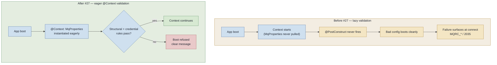

# 0011 — MqProperties fail-fast validation at startup (eager `@Context`, credential rule enforced at boot)

Status: accepted (2026-06-02) — implementation tracked in issue #27.

## Context

`MqProperties` (`@ConfigurationProperties("ibm-mq")`) binds the ~18 fields that configure the IBM MQ `ConnectionFactory`. Issue #27 adds fail-fast validation so misconfiguration refuses to boot loudly instead of surfacing as an `MQRC_*` at connect time. The project already shipped one such latent bug — a `sharingConversations` count mapped into the YES/NO `WMQ_SHARE_CONV_ALLOWED` flag — that only blew up at live-cluster connect (CrashLoopBackOff), fixed by PR #38.

Two facts make "validate at startup" non-trivial here:

1. **The bean is lazy and nothing eagerly pulls it.** `MqProperties`' only consumers (the producer and the consumers) are lazy `@Singleton`s that no eager bean injects, so its `@PostConstruct` cross-field check never fires at boot — a context built with bad config (`ApplicationContext.run(Map.of("ibm-mq.queue-manager",""))`) starts cleanly. Acceptance criterion #2 of #27 was empirically unmet for exactly this reason.

2. **The "blessed" default config can resolve to an invalid credential combination.** The bean's field defaults are self-inconsistent — `user = "app"` (non-blank) + `password = ""` (blank) — and `application.yml` binds `password: ${IBM_MQ_PASSWORD:passw0rd}`, whose `:default` applies only when the variable is **unset**; an environment that exports `IBM_MQ_PASSWORD=` **empty** (as the orchestrate worktree did) yields a blank password. Either path produces `user=app` + blank password, which trips the new credential rule. k8s/production always sets a concrete password via secret (`deploy/k3s/10-secrets.yaml`), so this is a **dev/test-only** footgun — captured in `research-output/micronaut-config-validation-startup.md`.

A first attempt to force eager validation with `@Context` regressed five pre-existing context-start tests, because those tests boot the ambient (blank-password) config — which is what surfaced fact #2.

## Decision

Validate `MqProperties` **fail-fast at context startup**, strictly:

- Mark the bean `@Context @Validated @ConfigurationProperties("ibm-mq")` so it is instantiated and validated at boot, not lazily. `@Context` here is **validation-only** — `MqProperties` opens no MQ connection (its `@PostConstruct` only throws on violation), so it does **not** reintroduce the eager-connect hang that bit a connecting `@Singleton` earlier in the project (project memory `lazy-singleton-never-runs`).
- Enforce **structural** constraints (`@Min`/`@Max` on port 1–65535, `@NotBlank` on channel/queueManager, TLS-enabled ⇒ cipher non-blank and not `TLS_RSA_*` per ADR-0001) **and the credential cross-field rule** (`user` non-blank ⇒ `password` required) all **at boot**. The credential rule is deliberately kept at boot, not deferred to a connect-time guard.
- The **no-auth contract is preserved**: a deployment with no MQ authentication leaves `user` blank, so the credential rule does not fire. Auth deployments — including dev, whose MQ image requires `MQ_APP_PASSWORD` — must supply a non-blank password.
- Make the **test suite environment-independent** so boot validation is deterministic regardless of how the runner injects env vars: context-start tests that do not exercise MQ pin a valid `ibm-mq.password` in their own property map; the AC#2 proof (`MqPropertiesStartupValidationTest`, previously `@Disabled`) is enabled and pins both invalid configs (which must refuse to boot) and an explicit valid config (which must boot). Secondarily, the local dev env script exports a non-blank `IBM_MQ_PASSWORD` and the set-empty-vs-unset footgun is documented.

## Alternatives considered

- **Defer the credential rule to a connect-time guard; eager-validate only structural constraints at boot.** Rejected: it weakens the guarantee to the point of re-opening the user-+-blank-password footgun #27 exists to close — the misconfig would again only fail at connect (`2035`), not at boot.
- **Scope the credential rule to an auth-required profile only.** Rejected: the dev path *is* auth (the dev MQ image requires a password), so scoping the rule away from a "no-auth" path does not help the actual failing contexts; it makes the rule that ships differ from the rule that is tested, and adds profile branching for no real gain.
- **Rely solely on fixing the dev env to export a non-blank password.** Rejected as the *primary* mechanism: the orchestrate run proved an environment can still inject an empty `IBM_MQ_PASSWORD`, so an env-only fix leaves the suite fragile. Kept as a secondary ergonomics improvement on top of the env-independent suite.

## Consequences

- **Code (#27):** `MqProperties` becomes `@Context @Validated`; the `@PostConstruct` cross-field check stays; the bean stays a mutable `@ConfigurationProperties` class (not a record). The self-inconsistent field defaults (`user="app"` + `password=""`) are a latent footgun the implementer should neutralise or explicitly call out.
- **Tests:** context-start tests pin a valid password; the startup-validation proof is enabled. The CF read-back mapping test surface (the other half of #27) is unaffected.
- **Boot behavior changes:** a genuinely misconfigured context now refuses to start (previously it booted and failed later at connect). This is the intended improvement, but it means every deployment must present a valid config — including a non-blank password whenever `user` is set.
- **Relation to ADR-0006 / issue #25:** both #25 (role-based factories) and #27 touch `MqConnectionFactoryFactory` / `MqProperties`; coordinate so the factory rewrite and the validation land without stepping on each other.
- **Reversibility:** moving back to lazy validation would silently restore the "bad config boots" gap; recorded as an ADR so the eager `@Context` choice is not "simplified" away by a future reader who does not know it is load-bearing.
