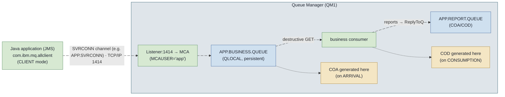
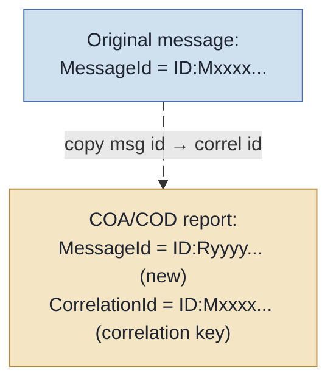
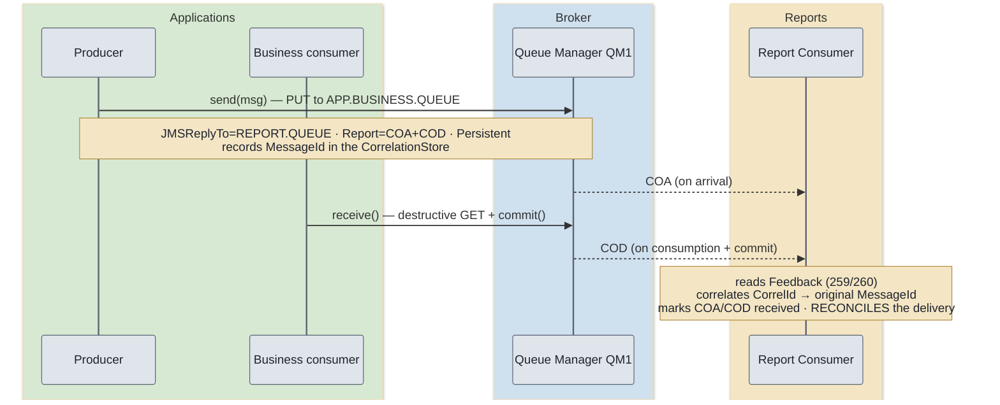
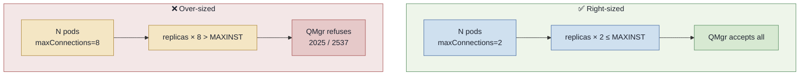
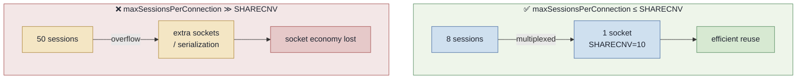
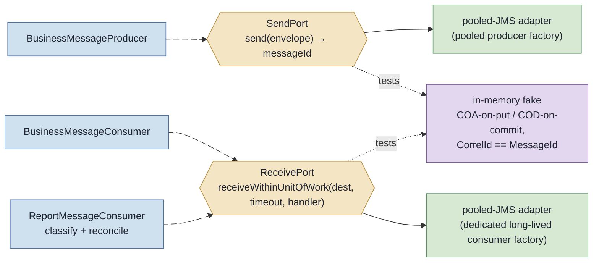
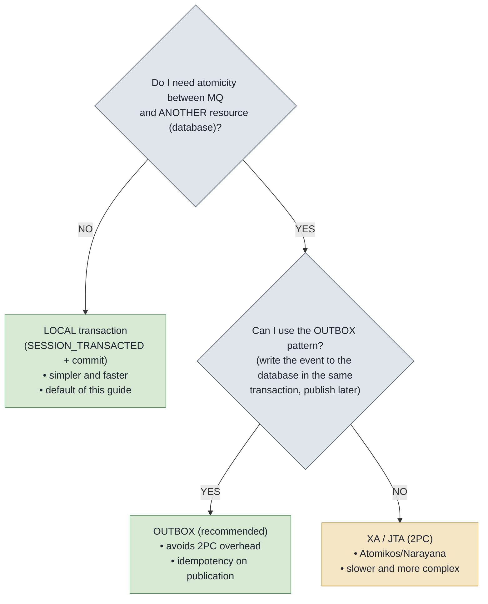

# Production Guide — Java 25 / Micronaut 4 + IBM MQ over JMS 2.0, focused on COA/COD delivery reports

> Technical guide, from basic to advanced, for a software engineer who **does not know IBM MQ** but must integrate and
> operate it in a **real, critical, high-concurrency environment** (microservices). The guiding thread is the reliable delivery
> of messages and their **proof of delivery** via **COA** (Confirmation On Arrival) and *
*COD** (Confirmation On Delivery) reports.

**Locked stack of this guide:**

| Item                | Version / Coordinate                                                  | Note                                                                                                                                                |
|---------------------|----------------------------------------------------------------------|-----------------------------------------------------------------------------------------------------------------------------------------------------------|
| Production runtime  | **Java 25** (LTS)                                                    | Amazon Corretto 25 (`maven.compiler.release=25`). Java 25 is LTS and documented for MQ 9.4.x; run with `--enable-native-access=ALL-UNNAMED` and avoid `TLS_RSA_*`. See ADR `docs/adr/0001-java-25-runtime.md`.                                       |
| Framework           | **Micronaut 4.9.4** (BOM `io.micronaut.platform:micronaut-platform`) | The 4.9.x line of the BOM **ends at 4.9.4** — `4.9.9` **does not exist** in the platform BOM. Maven plugin `io.micronaut.maven:micronaut-maven-plugin:4.11.6`. |
| MQ client           | **`com.ibm.mq:com.ibm.mq.allclient:9.4.5.0`**                        | Namespace **`javax.jms`** (JMS 2.0). **CD** line (see the CD×LTS note in Section 1).                                                                           |
| JMS pool            | **`org.messaginghub:pooled-jms:2.0.9`**                              | The 2.x line is still `javax.jms` (3.x is already `jakarta.jms`).                                                                                                   |
| Image (tests/dev)   | **`icr.io/ibm-messaging/mq:9.4.5.0-r2`**                             | IBM MQ Advanced for Developers. The "pure" `9.4.5.0` tag **does not exist** (format `9.4.<fixpack>-r<N>`).                                                     |

> ℹ️ **Note — language convention.** All prose, headings, callouts, and captions are in English. *
*Code identifiers stay in English** (convention); code **comments** are also in English.
> Well-known terms (Queue Manager, channel, syncpoint, etc.) are kept as-is, with an explanation at first
> occurrence.

> ℹ️ **Note — reference project.** All code excerpts in this guide are extracted from a **real, compilable** *
*Micronaut project** in `ibmmq-jms-guide/`. File references are relative to that folder. Where a topic (XA,
> full mTLS, Virtual Threads) does **not** have compilable code in the project, the excerpt is presented as **illustrative** and
> flagged as such.

---

## Table of Contents

1. [Section 1 — Fundamentals and Concepts](#section-1--fundamentals-and-concepts)
2. [Section 2 — Delivery Reports: COA / COD (exhaustive reference)](#section-2--delivery-reports-coa--cod-exhaustive-reference)
3. [Section 3 — Environment Configuration (properties deep dive)](#section-3--environment-configuration-properties-deep-dive)
4. [Section 4 — Practical Implementation (real, compilable code)](#section-4--practical-implementation-real-compilable-code)
5. [Section 5 — Testing and Resilience (real environment)](#section-5--testing-and-resilience-real-environment)
6. [Appendices](#appendices)

## Section 1 — Fundamentals and Concepts

This section answers the "what is it" and the "why". If you have never operated IBM MQ, read everything: the concepts here are
a prerequisite to understanding why COA/COD exist and how they flow.

### 1.1 IBM MQ Architecture

IBM MQ is a **message broker** (message intermediary) oriented around **queues** and based on the
*store-and-forward* paradigm: the producer hands the message to the broker, which **persists** it and holds it until the consumer
retrieves it. Producer and consumer are **decoupled in time** — they do not need to be online at the same time.

**Queue Manager (QMgr) — "queue manager".** It is the central component, the MQ server. Each QMgr has a name (e.g.:
`QM1`), owns the queues, the channels, the recovery log, and the security definitions. An application always connects
*to a QMgr*, not "to a queue" directly.

**Queues — four types you need to distinguish:**

| Queue type             | What it is                                                                                                                       | When it appears in this guide                                                                          |
|------------------------|----------------------------------------------------------------------------------------------------------------------------------|-------------------------------------------------------------------------------------------------------|
| **Local** (`QLOCAL`)   | Physical queue that **resides on this QMgr**; messages are effectively stored here.                                              | Business queue, report queue, DLQ, backout queue.                                                     |
| **Remote** (`QREMOTE`) | A **pointer** to a local queue that lives on **another** QMgr; MQ forwards (transmission queue + channel) to the real target.     | Out of practical scope (we do not use multi-QMgr routing here), but you will see the concept when doing HA. |
| **Alias** (`QALIAS`)   | An **alias** for another queue (local or remote); useful for indirection/security without changing the application.             | Cited as a good decoupling practice.                                                                  |
| **Model** (`QMODEL`)   | A **template**: on opening, a **dynamic queue** is generated on demand (e.g.: temporary reply queues).                          | The concept behind `JMSContext.createTemporaryQueue()`.                                               |

**Channels — "channels".** They are the communication conduits. The type relevant to a client application is the **SVRCONN** (
server-connection): it is the channel through which a JMS client in **CLIENT mode** connects to the QMgr over TCP/IP. The channel carries
security rules (CHLAUTH, TLS) and identity (MCAUSER).

**Listener and port.** The QMgr runs a TCP **listener** (default port **1414**) that accepts inbound connections on the
channels. Without an active listener on the port, no client connects (reason code `2538 HOST_NOT_AVAILABLE`).

**MCA (Message Channel Agent).** It is the agent that moves messages across a channel. On an SVRCONN, the server-side MCA
represents the client application inside the QMgr and runs under an **identity** (the `MCAUSER`), which is what the
authorization checks evaluate.

**MQMD (Message Descriptor).** It is the low-level header of every MQ message (MessageId, CorrelationId, Persistence,
**Report**, **Feedback**, ReplyToQ, Expiry, etc.). You do not manipulate it directly in JMS — the JMS client fills it
from the `JMS_IBM_*` properties. **COA/COD live here:** the MQMD's `Report` field says "I want COA/COD", and the report's
`Feedback` field says "this is a COA/COD".

#### Textual diagram — path of a message in CLIENT mode



The key point: in **CLIENT mode** the application does not have the QMgr embedded; everything passes through the SVRCONN channel's TCP socket. (The
alternative mode, **BINDINGS**, requires the application on the same machine as the QMgr and uses shared memory — it is not the microservices
scenario we deal with here.)

### 1.2 JMS 2.0 vs. native IBM MQ (MQI)

IBM MQ has its own native API, the **MQI** (Message Queue Interface), low-level, with verbs such as `MQCONN`,
`MQOPEN`, `MQPUT`, `MQGET`. It is powerful and exposes **everything** (including the raw MQMD), but it is verbose, procedural, and couples the
code to MQ.

**JMS (Java Message Service) 2.0** (namespace `javax.jms`, brought in by `com.ibm.mq.allclient`) is the standard Java
abstraction for messaging. Why use it on Java 25?

- **Portability and familiarity:** the same conceptual API as other JMS brokers; the team does not need to learn MQI.
- **JMS 2.0 simplifications:** the `JMSContext` unifies `Connection` + `Session` into a single, **`AutoCloseable`
  ** object (it closes connection and session at once in a *try-with-resources*); `JMSProducer` and `JMSConsumer` are lightweight and
  fluent objects; messages can be created directly from the context.
- **Less *boilerplate*, fewer resource leaks:** the *auto-close* eliminates the entire class of "I forgot to
  close the Session" bugs.

```java
// JMS 2.0: a single AutoCloseable object covers connection + session.
try(JMSContext context = connectionFactory.createContext(JMSContext.AUTO_ACKNOWLEDGE)){
JMSProducer producer = context.createProducer();
    producer.

send(queue, context.createTextMessage("payload"));
        } // connection and session closed automatically here
```

**Where the JMS abstraction "leaks" (and why this matters for COA/COD).** Standard JMS **does not know** the concept of
MQ delivery report. COA/COD are a **proprietary** IBM MQ feature, exposed through **IBM extensions**: the
`JMS_IBM_Report_*` properties (to request the report) and `JMS_IBM_Feedback` (to read it), plus the integer constants
`MQRO_*`/`MQFB_*`. In other words: to do COA/COD you **step outside generic JMS** and use `com.ibm.msg.client.wmq.WMQConstants`
and `com.ibm.mq.constants.MQConstants`. This is the main abstraction "leak" that this guide explores.

> ⚠️ **Attention — architecture decision: manual JMS, not `micronaut-jms`.** This guide does **not** use the declarative module
`io.micronaut.jms` (with `@JMSListener`). Technical reason: the 4.x line of that module is **jakarta-only** (`jakarta.jms`) and *
*abstracts away the `JMSContext`** — exactly the object we need to control by hand to manipulate the report properties.
> Micronaut comes in here **only** for DI, `@ConfigurationProperties`/`@Factory`, lifecycle, and injection of the
`ConnectionFactory`/pool. *Trade-off:* you lose the declarative `@JMSListener` (you write the consumption loops), but
> you gain the full control required by COA/COD.

### 1.3 CD vs. LTS note (V.R.M.F release model)

IBM MQ uses the `V.R.M.F` (Version.Release.Modification.Fixpack) version scheme. This guide's version, **`9.4.5.0`**,
has the **third digit ≠ 0**, so it belongs to the **CD (Continuous Delivery)** line: it delivers new *features* with each
release, with a **shorter support window**. The **LTS (Long Term Support)** line corresponds to the third digit `0` (
e.g.: `9.4.0.x`) and prioritizes long-term stability/patches.

> ℹ️ **Note.** The trade-off is: **CD** = the latest features, short patch/support cycle; **LTS** = stability and
> extended support, older features. The project pins **`9.4.5.0` (CD)** because it is the real dependency in use. The production
> runtime is **Java 25** (Amazon Corretto): MQ 9.4.x **documents Java 25** (with operational guidance —
> `TLS_RSA_*` disabled, native-access warning), and the client runs on it with `--enable-native-access=ALL-UNNAMED`. The 9.3
> was discarded because Java 21+ requires MQ 9.4.x (the bundled Semeru is 21; the client, however, executes on Java 25).

### 1.4 Inventory of required MQ objects

For this guide's COA/COD flow you need, in the QMgr, the following objects (real MQSC definitions in
`mqsc/20-queues.mqsc` and `mqsc/10-channel-auth.mqsc`):

| Object               | Type                   | Role                                                                                   |
|----------------------|------------------------|----------------------------------------------------------------------------------------|
| `QM1`                | Queue Manager          | The MQ server the application connects to.                                             |
| `APP.SVRCONN`        | Channel `SVRCONN`      | Client connection channel for the applications.                                        |
| `APP.BUSINESS.QUEUE` | `QLOCAL` (persistent)  | Business queue — destination of the messages. Defines `BOTHRESH`/`BOQNAME` (poison message). |
| `APP.REPORT.QUEUE`   | `QLOCAL` (persistent)  | **Dedicated** report queue — receives COA/COD via `JMSReplyTo`.                        |
| `APP.BACKOUT.QUEUE`  | `QLOCAL`               | Backout queue — receives the message after exceeding `BOTHRESH` rollbacks.            |
| `APP.DLQ`            | `QLOCAL`               | The QMgr's Dead Letter Queue (`ALTER QMGR DEADQ('APP.DLQ')`).                          |
| Listener (1414)      | —                      | Accepts TCP connections on the channels (created by the dev image).                   |

```mqsc
* Real excerpt from mqsc/20-queues.mqsc — business queue with backout (poison message).
* BOTHRESH(5): after 5 backouts (rollbacks), the "poisoned" message is moved...
* BOQNAME(APP.BACKOUT.QUEUE): ...to the backout queue, instead of stalling the queue.
DEFINE QLOCAL('APP.BUSINESS.QUEUE') +
       DESCR('Fila de negocio do guia COA/COD') +
       DEFPSIST(YES) +
       BOTHRESH(5) BOQNAME('APP.BACKOUT.QUEUE') +
       REPLACE
```

> ℹ️ **Note — `APP.*` (production) × `DEV.*` (test) split.** The `mqsc/` files define the **`APP.*`** objects (production
> setup, with CONNAUTH/CHLAUTH). The `application.yml` and the integration test, however, use the dev image's defaults *
*`DEV.QUEUE.1`/`DEV.QUEUE.2`** (with the `app` user pre-authorized to `DEV.**`). This
> choice is deliberate: the IT uses `DEV.*` for reliability (objects guaranteed to exist in the image), while the guide
> documents the `APP.*` setup you would take to production. Keep this distinction in mind when reading the examples.

> ✅ **Good practice — dedicated report queue.** Use an **exclusive** queue for reports (`APP.REPORT.QUEUE`), separate
> from the business queue. That way the report consumer does not compete with the business one, *sizing* and retention are
> independent, and you do not pollute the business queue with control messages.
>
> ❌ **Bad practice — pointing `JMSReplyTo` at the business queue itself.** The COA/COD would come back to the business queue
> and the business consumer would try to process them as requests. **Observable symptom:** "strange" messages (empty body
> or with a report header) being processed as business, parsing breaking, and correlation impossible. Under high
> concurrency, this becomes an error *loop* and fills up the backout queue/DLQ.

## Section 2 — Delivery Reports: COA / COD (exhaustive reference)

This is the central section of the guide. *Delivery reports* are messages **generated automatically by
IBM MQ** (or by the consuming application, in the case of PAN/NAN) that report the **state of an original message** throughout
its life cycle. They are the foundation for building **proof of delivery** and reconciliation in critical systems.

### 2.1 The five report types

| Report                       | Acronym | What it confirms                                                                                                                            | Who generates it                          | When                                                |
|------------------------------|---------|--------------------------------------------------------------------------------------------------------------------------------------------|-------------------------------------------|------------------------------------------------------|
| **Confirmation On Arrival**  | **COA** | The message **arrived** (was put) on the destination queue.                                                                                | Queue Manager owning the destination queue. | At the `PUT` to the destination queue (see timing × transaction). |
| **Confirmation On Delivery** | **COD** | The message was **destructively retrieved** (consumed) by the application.                                                                 | Queue Manager.                            | At the destructive `GET` (see timing × transaction).        |
| **Exception**                | —       | The message **could not** be delivered/processed (e.g.: queue full, PUT inhibited, no authority).                                          | Queue Manager.                            | When the exception condition occurs.                 |
| **Expiration**               | —       | The message **expired** (its `Expiry` elapsed) before being consumed.                                                                      | Queue Manager.                            | When the expired message is discarded.                    |
| **PAN / NAN**                | PAN/NAN | **Positive/Negative Action Notification**: the consuming application processed the business logic with **success** (PAN) or **failure** (NAN). | **The consuming application** (not the QMgr). | When the app decides to issue the notification.            |

> ℹ️ **Note — PAN/NAN belong to the application, not the broker.** COA/COD/Exception/Expiration are the QMgr's responsibility. *
*PAN/NAN** are *application* semantics: the broker does not know whether your business rule "succeeded"; it is your consuming app
> that must explicitly emit the PAN or NAN report (generating a report message). That is why `MQRO_PAN`/
`MQRO_NAN` request the report, but its generation depends on the consumer code.

### 2.2 When to use — and when NOT to use

Each report is an **extra message** that travels, is persisted, and must be consumed. Under high concurrency, this *
*doubles** (COA+COD = 2 control messages per business message) or triples the I/O volume.

> ✅ **Good practice — use COA/COD where proof of delivery has business value.** Payments, orders, regulatory
> events, any flow where "the message was silently lost" is an incident. There, the extra cost pays for itself.
>
> ❌ **Bad practice — enabling COA+COD+Exception+Expiration "just in case" on all high-volume traffic.** You triple
> the I/O and latency, fill up the report queue, and the report consumer becomes a bottleneck. **Observable symptom:**
*throughput* plummeting, `APP.REPORT.QUEUE` with growing depth (backlog), QMgr disk saturating. Enable
> reports **selectively**, by flow type.

### 2.3 Generation mechanics — it is the MESSAGE that requests, not the QMgr

This is the concept most misunderstood by those coming from other brokers: **there is no "turn COA/COD on at the Queue
Manager" button.** What requests the report is the **original message itself**, through two things:

1. **The report options in the MQMD** (`Report` field), which in JMS you set via the `JMS_IBM_Report_*` properties
   passing the corresponding `MQRO_*` integer.
2. **The `JMSReplyTo`** — defines the `ReplyToQ`/`ReplyToQMgr`, that is, **where** the report should be sent. Without
   `JMSReplyTo`, the QMgr has no destination and the report is not generated (or goes to the DLQ).

```java
// Real excerpt from ibmmq-jms-guide/src/main/java/com/example/ibmmq/producer/BusinessMessageProducer.java
message.setJMSReplyTo(reportQueue); // WHERE the reports go (ReplyToQ)

// The Java field is UPPER_SNAKE (JMS_IBM_REPORT_COA) and the value passed is the MQRO_* integer.
message.

setIntProperty(WMQConstants.JMS_IBM_REPORT_COA, MQConstants.MQRO_COA); // requests COA
message.

setIntProperty(WMQConstants.JMS_IBM_REPORT_COD, MQConstants.MQRO_COD); // requests COD
```

**What is actually configured on the QMgr** (not the reports themselves): the **existence** of the report queue, its persistence,
the DLQ, the **authorities** (crucial — see the `+passid` *gotcha* in Section 5), and `Expiry` policies. The QMgr is the
infrastructure; the *intent* to receive a report lives in the message.

> ⚠️ **Caution — `WMQConstants` vs. `MQConstants` (common mistake).** The JMS **request** properties (
`JMS_IBM_REPORT_COA`, `JMS_IBM_FEEDBACK`...) live in **`com.ibm.msg.client.wmq.WMQConstants`** — the **field name** is
> UPPER_SNAKE (`JMS_IBM_REPORT_COA`) and the **String value** is mixed-case (`"JMS_IBM_Report_COA"`). The **integer values
** `MQRO_*` and `MQFB_*`, however, live in **`com.ibm.mq.constants.CMQC`** (aggregated by **`MQConstants`**), **not** in
`WMQConstants`. Always reference them as `MQConstants.MQRO_COA`, `MQConstants.MQFB_COD`. (`WMQConstants` declares only 1
> field of its own, `sccsid`.)

### 2.4 Identifier propagation and traceability

How do you correlate a report back to the message that originated it? Through **id propagation**, controlled by `MQRO_*`
options:

| Option (`MQRO_*`)                   | Value           | Effect on the report's `CorrelationId`                                                                                          |
|-------------------------------------|-----------------|---------------------------------------------------------------------------------------------------------------------------------|
| **`MQRO_COPY_MSG_ID_TO_CORREL_ID`** | **0 (default)** | The **original message's `MessageId`** becomes the report's **`CorrelationId`**. This is what makes correlation possible "for free". |
| `MQRO_PASS_MSG_ID`                  | 128             | The report **keeps the same `MessageId`** as the original (instead of generating a new one).                                    |
| `MQRO_PASS_CORREL_ID`               | 64              | The report **copies the original's `CorrelationId`** (instead of copying the MessageId into the CorrelId).                      |
| `MQRO_NEW_MSG_ID`                   | 0 (default)     | The report receives its own **new `MessageId`** (default — it does not conflict with the original).                            |

In practice, **with the defaults** (`MQRO_COPY_MSG_ID_TO_CORREL_ID` + `MQRO_NEW_MSG_ID`):



That is why the report consumer does `findByMessageId(report.getJMSCorrelationID())` — the report's `CorrelationId`
is the original `MessageId`. This is exactly the model used in `CorrelationStore`/`InMemoryCorrelationStore`.

**Data flags — `*_WITH_DATA` and `*_WITH_FULL_DATA`.** You can request that the report include part (`_WITH_DATA`) or
all (`_WITH_FULL_DATA`) of the original payload:

| Constant                                                      | Value               |
|---------------------------------------------------------------|---------------------|
| `MQRO_COA` / `MQRO_COA_WITH_DATA` / `MQRO_COA_WITH_FULL_DATA` | 256 / 768 / 1792    |
| `MQRO_COD` / `MQRO_COD_WITH_DATA` / `MQRO_COD_WITH_FULL_DATA` | 2048 / 6144 / 14336 |

> ⚠️ **Caution — `*_WITH_DATA`/`_WITH_FULL_DATA` duplicate the payload and expose PII.** Requesting the data in the report
> means **copying the message body** to the report queue. Consequences: (a) *sizing* — the report queue
> now holds twice the data; (b) **PII exposure** — sensitive data that was only on the business queue now
> is also on the report queue, possibly with different access control. Use `_WITH_DATA`/`_WITH_FULL_DATA`
> only when the reconciler **really** needs the body, and never for PII without masking.

### 2.5 Feedback code table (how the consumer classifies)

When a report arrives, its **type** is in the MQMD `Feedback` field, read in JMS via
`WMQConstants.JMS_IBM_FEEDBACK`:

| Constant (`MQFB_*`, in `CMQC`/`MQConstants`) | Value       | Meaning                                                                                                                                                                                       |
|-----------------------------------------------|-------------|----------------------------------------------------------------------------------------------------------------------------------------------------------------------------------------------|
| `MQFB_COA`                                    | **259**     | Arrival report (COA).                                                                                                                                                                        |
| `MQFB_COD`                                    | **260**     | Delivery/consumption report (COD).                                                                                                                                                          |
| `MQFB_EXPIRATION`                             | **258**     | Expiration report.                                                                                                                                                                          |
| `MQFB_PAN`                                    | **275**     | Positive Action Notification.                                                                                                                                                                |
| `MQFB_NAN`                                    | **276**     | Negative Action Notification.                                                                                                                                                                |
| *(Exception)*                                 | an `MQRC_*` | **There is no `MQFB_EXCEPTION`.** An exception report carries in `Feedback` an `MQRC_*` **reason code** (e.g.: `2051 MQRC_PUT_INHIBITED`, `2053 MQRC_Q_FULL`, `2035 MQRC_NOT_AUTHORIZED`). |

> ⚠️ **Caution — an exception report has no fixed `MQFB_`.** When branching in the consumer, explicitly handle the
`MQFB_*` known ones (259/260/258/275/276); any other feedback in the system range (`MQFB_SYSTEM_FIRST`=1 ..
`MQFB_SYSTEM_LAST`=65535) that is none of them is an **exception report** carrying an `MQRC_*`. **Watch out** for
> collisions: `271` is `MQFB_XMIT_Q_MSG_ERROR`, **not** COA — that is why the comparison must be by exact equality, not by
> range.

This is exactly the logic of `ReportFeedbackRouter.classify(int)` (Section 4), which maps the feedback integer to a
`ReportType`.

### 2.6 Timing vs. transaction (the critical detail that changes what the reconciler observes)

The nominal *timing* is:

- **COA** is generated when the message **arrives** (is put) on the destination queue.
- **COD** is generated when the message is **destructively retrieved** (destructive GET) by the application.

But, **under syncpoint/transaction**, visibility changes — and this directly affects your tests and your reconciler:

| Scenario                                               | When the report actually flows                                                                                                                                                                       |
|--------------------------------------------------------|--------------------------------------------------------------------------------------------------------------------------------------------------------------------------------------------------------|
| Producer in **local transaction** (`SESSION_TRANSACTED`) | The message only "arrives" on the queue — and the **COA only becomes retrievable** — **after the producer's `commit()`**. Before the commit, the message is invisible to the rest of the world.       |
| Producer in **AUTO_ACKNOWLEDGE**                       | Each `send` is acknowledged immediately (the producer "commits" each send), so the COA flows right after the PUT.                                                                                     |
| Consumer in **local transaction** (`SESSION_TRANSACTED`) | The **COD is generated within the consumer's UoW (unit of work)** and is only **sent at the `commit()`**. If the UoW undergoes **rollback** (backout), **the COD is not sent** and the message goes back to the queue. |

> ℹ️ **Note — why this is "correct".** The rollback-aware COD is exactly the desired behavior: you only
> receive "delivery confirmation" when the message was **actually** consumed and the transaction **committed**. If
> processing failed and went back to the queue, it was not "really delivered" — and the COD does not lie. See in
`BusinessMessageConsumer`: the `context.commit()` after processing is what **releases the COD**.

> ⚠️ **Caution — implication for integration tests.** Because the COD only appears after the consumer's `commit()`, an end-to-end
> test needs to: (1) produce, (2) **consume and commit**, and only then (3) wait for the COD on the report queue —
> with a generous *timeout*, since the report is asynchronous. This is precisely what `CoaCodEndToEndIT` does (15s to consume,
> a 30s window to see COA **and** COD).

### 2.7 Report persistence (important CORRECTION)

> ⚠️ **Caution — reports INHERIT the persistence of the original message.** A common (and wrong) belief is that "COA/COD
> reports are non-persistent by default". **False.** The IBM documentation is explicit: the report's persistence is *"
Copied from the original message descriptor"* — that is, **a persistent original message generates, by default, a
persistent COA/COD**. This holds for COA, COD, exception, expiration, PAN, and NAN.

Practical consequence for a critical environment: if you use **persistent business messages** (the case of this guide), your
reports **will also be persistent** and **will survive a QMgr restart** — exactly what you want for a reliable
proof of delivery. To reinforce it, define the report queue with `DEFPSIST(YES)` (as in
`mqsc/20-queues.mqsc`), ensuring persistence even for messages that do not specify it explicitly.

> ✅ **Good practice — align the persistence of the message, the report, and the correlation store.** Persistent message →
> persistent report → **persistent correlation store** (DB/Redis). All three survive a restart, and reconciliation
> closes even after a deploy/restart.
>
> ❌ **Bad practice — persistent message + correlation store only in memory (`ConcurrentHashMap`).** The report
> persists and arrives after the restart, but the registered `messageId` **vanished** with the JVM. **Observable symptom:**
> "orphan" reports — the consumer receives a COD whose `CorrelationId` matches no known pending entry; the
> reconciliation reports "unknown" deliveries and you cannot close the cycle. (That is why the project ships a
shared, persistent store — `JdbcCorrelationStore` — see Section 4.)

### 2.8 Full-flow diagram



## Section 3 — Environment Configuration (properties deep dive)

This section is the reference for connection properties. The **field names** are those of
`com.ibm.msg.client.wmq.WMQConstants` (verified in the bytecode of `com.ibm.mq.allclient:9.4.5.0`). You apply them on an
`MQConnectionFactory` via `setIntProperty`/`setStringProperty`/`setBooleanProperty`.

### 3.1 Exhaustive table (beginner → advanced)

| `WMQConstants` field               | Internal String value                   | What it does                                                              | Real default    | When to use / impact                                                                                                                            |
|------------------------------------|-----------------------------------------|---------------------------------------------------------------------------|-----------------|-------------------------------------------------------------------------------------------------------------------------------------------------|
| `WMQ_CONNECTION_MODE`              | `XMSC_WMQ_CONNECTION_MODE`              | Connection mode (CLIENT vs BINDINGS).                                     | —               | Always `WMQ_CM_CLIENT` (**=1**) in microservices (TCP/IP via SVRCONN). `WMQ_CM_BINDINGS`=0 requires the app on the same machine as the QMgr.    |
| `WMQ_HOST_NAME`                    | `XMSC_WMQ_HOST_NAME`                    | MQ listener host.                                                         | `localhost`     | Used if there is **no** `CONNECTION_NAME_LIST`. A single point of failure on its own.                                                           |
| `WMQ_PORT`                         | `XMSC_WMQ_PORT`                         | Listener port (`setIntProperty`).                                         | `1414`          | Defaults to 1414. Align it with the listener's published port.                                                                                  |
| `WMQ_CHANNEL`                      | `XMSC_WMQ_CHANNEL`                      | SVRCONN channel.                                                          | —               | E.g. `DEV.APP.SVRCONN`. Determines the applicable CHLAUTH/TLS/identity.                                                                         |
| `WMQ_QUEUE_MANAGER`                | `XMSC_WMQ_QUEUE_MANAGER`                | Target QMgr name.                                                         | —               | May be empty for "any QMgr" via CCDT, but normally fixed (e.g. `QM1`).                                                                          |
| `WMQ_CONNECTION_NAME_LIST`         | `XMSC_WMQ_CONNECTION_NAME_LIST`         | Multi-host CONNAME list `host(port),host(port)`.                          | empty           | **Resilience:** required to reconnect to **another** QMgr (multi-instance). Takes precedence over host/port.                                     |
| `WMQ_CCDTURL`                      | `XMSC_WMQ_CCDTURL`                      | URL of a CCDT (Client Channel Definition Table).                         | empty           | A centralized alternative to in-code config; supports CCDT over **HTTPS**. Casing: `CCDTURL` (no underscore before `URL`).                      |
| `WMQ_CLIENT_RECONNECT_OPTIONS`     | `XMSC_WMQ_CLIENT_RECONNECT_OPTIONS`     | Auto-reconnect policy.                                                    | —               | Values below. Requires `TRANSPORT=CLIENT` + CONNAMELIST/CCDT. **High resilience**, but be careful with the pool (Section 5).                    |
| `WMQ_CLIENT_RECONNECT`             | (int) **16777216**                      | Reconnects to **any** QMgr in the list (admin `ANY` / `MQCNO_RECONNECT`). | —               | Use with multi-instance `CONNECTION_NAME_LIST`.                                                                                                 |
| `WMQ_CLIENT_RECONNECT_Q_MGR`       | (int) **67108864**                      | Reconnects **to the same** QMgr (admin `QMGR` / `MQCNO_RECONNECT_Q_MGR`). | —               | For a multi-instance QMgr (same identity on standby).                                                                                           |
| `WMQ_CLIENT_RECONNECT_AS_DEF`      | (int) **0**                             | Uses the channel default (`ASDEF`).                                       | (default)       | Defers the decision to the channel/CCDT.                                                                                                        |
| `WMQ_CLIENT_RECONNECT_DISABLED`    | (int) **33554432**                      | Turns auto-reconnect off.                                                 | —               | When you want to fail fast and leave reconnection to the layer above.                                                                           |
| `WMQ_CLIENT_RECONNECT_TIMEOUT`     | `XMSC_WMQ_CLIENT_RECONNECT_TIMEOUT`     | Time (s) before giving up on reconnection (String key that takes an int). | **1800s**       | 30 min is the documented default. Reduce it to fail earlier in low-tolerance scenarios.                                                         |
| `WMQ_SHARE_CONV_ALLOWED`           | `XMSC_WMQ_SHARE_CONV_ALLOWED`           | Shared conversations per socket (**SHARECNV**).                          | —               | **Performance:** multiplexes N conversations over one TCP socket, reducing sockets under high concurrency. Must match the channel's `SHARECNV`. |
| `WMQ_APPLICATIONNAME`              | `XMSC_WMQ_APPNAME`                      | App name (visible in `DIS CONN`).                                         | —               | **Observability:** identifies your app in QMgr monitoring. ⚠️ field `APPLICATIONNAME`, but key `APPNAME`.                                       |
| `USER_AUTHENTICATION_MQCSP`        | `XMSC_USER_AUTHENTICATION_MQCSP`        | Turns on the MQCSP flow (modern user/password). **Boolean.**             | —               | ⚠️ **No `WMQ_` prefix**; inherited from `JmsConstants`. `setBooleanProperty(..., true)`.                                                        |
| `USERID`                           | `XMSC_USERID`                           | MQCSP user.                                                              | —               | Pairs with `PASSWORD`.                                                                                                                          |
| `PASSWORD`                         | (`XMSC_PASSWORD`)                       | MQCSP password.                                                          | —               | **Never** hardcode it; inject it via secret/env.                                                                                                |
| `WMQ_SSL_CIPHER_SUITE`             | `XMSC_WMQ_SSL_CIPHER_SUITE`             | TLS CipherSuite (Java side). **Setting this ENABLES TLS** on the CF.     | empty (TLS off) | E.g. `TLS_AES_256_GCM_SHA384`. **Avoid `TLS_RSA_*`** (disabled in Java 25).                                                                     |
| `WMQ_SSL_PEER_NAME`                | `XMSC_WMQ_SSL_PEER_NAME`                | Expected DN of the peer certificate (SSLPEER).                           | —               | Hardens the handshake (validates the QMgr's identity). Ignored if CipherSuite is not set.                                                       |
| `WMQ_SSL_CERT_STORES_COL` / `_STR` | `XMSC_WMQ_SSL_CERT_STORES_COL` / `_STR` | Certificate stores for CRL/OCSP.                                         | —               | ⚠️ **There is no plain `WMQ_SSL_CERT_STORES`**: `_STR`=single LDAP URL, `_COL`=Collection.                                                      |

> ⚠️ **Caution — `useIBMCipherMappings` was REMOVED.** In older guides you will see `com.ibm.mq.cfg.useIBMCipherMappings`
> to toggle IBM vs Oracle names. **Do not set it** — the property was **removed from the product as of IBM MQ
9.4.0**. From 9.4.0 onward the Cipher may be provided as a CipherSpec **or** a CipherSuite and is handled automatically.

### 3.2 Programmatic configuration (real snippet)

This is the translation of the properties above into code, extracted from `MqConnectionFactoryFactory.buildMqConnectionFactory`:

```java
// ibmmq-jms-guide/src/main/java/com/example/ibmmq/config/MqConnectionFactoryFactory.java
MQConnectionFactory cf = new MQConnectionFactory();

// CLIENT mode (TCP/IP via SVRCONN). WMQ_CM_CLIENT = 1.
cf.

setIntProperty(WMQConstants.WMQ_CONNECTION_MODE, WMQConstants.WMQ_CM_CLIENT);

// SVRCONN channel and Queue Manager.
cf.

setStringProperty(WMQConstants.WMQ_CHANNEL, props.getChannel());
        cf.

setStringProperty(WMQConstants.WMQ_QUEUE_MANAGER, props.getQueueManager());

// Address: prefer the CONNAME list (required to reconnect to another QMgr); otherwise host+port.
        if(props.

hasConnectionNameList()){
        cf.

setStringProperty(WMQConstants.WMQ_CONNECTION_NAME_LIST, props.getConnectionNameList());
        }else{
        cf.

setStringProperty(WMQConstants.WMQ_HOST_NAME, props.getHost());
        cf.

setIntProperty(WMQConstants.WMQ_PORT, props.getPort());
        }

// Application name (visible in DIS CONN). Field APPLICATIONNAME -> key APPNAME.
        cf.

setStringProperty(WMQConstants.WMQ_APPLICATIONNAME, props.getApplicationName());

// SHARECNV: shared conversations per socket — reduces sockets under high concurrency.
        cf.

setIntProperty(WMQConstants.WMQ_SHARE_CONV_ALLOWED, props.getSharingConversations());

// MQCSP authentication (user/password) — note: USER_AUTHENTICATION_MQCSP is boolean and has NO WMQ_ prefix.
        if(props.

hasCredentials()){
        cf.

setBooleanProperty(WMQConstants.USER_AUTHENTICATION_MQCSP, true);
    cf.

setStringProperty(WMQConstants.USERID, props.getUser());
        cf.

setStringProperty(WMQConstants.PASSWORD, props.getPassword());
        }

// Automatic reconnection (requires TRANSPORT=CLIENT + CONNAMELIST/CCDT).
int reconnectOption = props.isReconnectEnabled()
        ? WMQConstants.WMQ_CLIENT_RECONNECT             // = MQCNO_RECONNECT (any QMgr)
        : WMQConstants.WMQ_CLIENT_RECONNECT_DISABLED;
cf.

setIntProperty(WMQConstants.WMQ_CLIENT_RECONNECT_OPTIONS, reconnectOption);
```

### 3.3 Configuration via `application.yml` (Micronaut)

The project externalizes everything in a `@ConfigurationProperties("ibm-mq")` bean (`MqProperties`) fed by the
`ibm-mq:` block of `application.yml`:

```yaml
# ibmmq-jms-guide/src/main/resources/application.yml
ibm-mq:
  host: localhost
  port: 1414
  channel: DEV.APP.SVRCONN
  queue-manager: QM1
  # CONNAME list for multi-instance reconnection (host(port),host(port)). Empty = uses host/port.
  connection-name-list: ""
  user: app
  # In dev the image requires a password (MQ_APP_PASSWORD). Override via IBM_MQ_PASSWORD / -Dibm-mq.password.
  password: ${IBM_MQ_PASSWORD:passw0rd}
  application-name: ibmmq-jms-guide
  business-queue: DEV.QUEUE.1
  report-queue: DEV.QUEUE.2
  reconnect-enabled: true
  reconnect-timeout-seconds: 1800
  sharing-conversations: 10
  # TLS off in dev. To enable: tls-enabled=true + ssl-cipher-suite (avoid TLS_RSA_* ciphers).
  tls-enabled: false
  ssl-cipher-suite: ""
```

Each kebab-case key (`queue-manager`) binds to the camelCase setter of `MqProperties` (`setQueueManager`). The password comes
from an environment variable (`${IBM_MQ_PASSWORD:passw0rd}`), never hardcoded in the source.

> ✅ **Good practice — secrets out of the code and out of the versioned YAML.** Inject `password` via a secret/environment variable (
`${IBM_MQ_PASSWORD}`), as the project does. **Symptom avoided:** a credential leaked into Git/history, and the
`2035 NOT_AUTHORIZED` when someone rotates the password and forgets to update the secret (rather than a fresh build).

### 3.4 Note on CCDT

The **CCDT (Client Channel Definition Table)** is a binary file (or JSON, as of MQ 9.x) that describes client
channels — host, port, TLS, CONNAME list — **outside** the code. You point `WMQ_CCDTURL` at it (it supports `file://` and *
*HTTPS**). The advantage: the connection topology (including multi-host failover) is managed by **operations**, not by the
application's *deploy*. It is the recommended alternative to `CONNECTION_NAME_LIST` when the infrastructure changes
independently of the app.

> ✅ **Good practice — CCDT/CONNAME list for HA, operationally managed.** Centralize the connection topology (
> multi-host, TLS) in a CCDT distributed via configuration. **Impact:** failover without a rebuild; the app only knows the
> CCDT URL.
>
> ❌ **Bad practice — fixed, hardcoded host/port and a single address.** In an *outage* of the primary QMgr, the app has nowhere
> to reconnect. **Observable symptom:** `2059 Q_MGR_NOT_AVAILABLE` / `2538 HOST_NOT_AVAILABLE` cascading, with no
> auto-recovery, until someone redeploys with the new host.

## Section 4 — Practical Implementation (real, compilable code)

All the code in this section comes from the `ibmmq-jms-guide/` project (compiles with `maven.compiler.release=25`).

### 4.1 Micronaut bootstrap — dependencies and the pool `@Factory`

The exact coordinates (from the real `pom.xml`):

```xml
<!-- ibmmq-jms-guide/pom.xml (excerpts) -->
<properties>
    <micronaut.version>4.9.4</micronaut.version>              <!-- BOM 4.9.x stops at 4.9.4 -->
    <micronaut.maven.plugin.version>4.11.6</micronaut.maven.plugin.version>
    <ibm.mq.version>9.4.5.0</ibm.mq.version>                  <!-- javax.jms / JMS 2.0 client -->
    <pooled.jms.version>2.0.9</pooled.jms.version>            <!-- 2.x is still javax; 3.x = jakarta -->
</properties>

        <!-- allclient = javax.jms (JMS 2.0). Brings com.ibm.mq.*, com.ibm.msg.client.*,
             com.ibm.mq.constants.* (CMQC/MQConstants) and the transitive javax.jms-api 2.0.1. -->
<dependency>
<groupId>com.ibm.mq</groupId>
<artifactId>com.ibm.mq.allclient</artifactId>
<version>${ibm.mq.version}</version>
<scope>compile</scope>
</dependency>
        <!-- JMS connection pool (javax). Class: org.messaginghub.pooled.jms.JmsPoolConnectionFactory. -->
<dependency>
<groupId>org.messaginghub</groupId>
<artifactId>pooled-jms</artifactId>
<version>${pooled.jms.version}</version>
<scope>compile</scope>
</dependency>
```

The `@Factory` produces the **two role-based connection factories** of ADR-0006, not one shared pool — the
producer and the consumer have opposite connection lifecycles (short-lived bursty `send` vs. one long-held
consumer connection per pod), and a single pool cannot be tuned for both. Both wrap the same base
`MQConnectionFactory` (IBM MQ client, built in §3.2) but differ in pooling and lifecycle. The `@Named(PRODUCER)`
factory is `@Primary`, so the entry points that still inject an unqualified `javax.jms.ConnectionFactory`
resolve to it without a `NonUniqueBeanException`:

```java
// ibmmq-jms-guide/src/main/java/com/example/ibmmq/config/MqConnectionFactoryFactory.java
public static final String PRODUCER = "producer";
public static final String CONSUMER = "consumer";

// PRODUCER side — POOLED. The send path opens a short-lived JMSContext per send, so a pool of physical
// connections/sessions is the right profile. @Primary makes the still-unqualified ConnectionFactory
// injections resolve here; preDestroy="stop" closes the pool at shutdown.
@Singleton
@Bean(preDestroy = "stop")
@Named(PRODUCER)
@Primary
public JmsPoolConnectionFactory producerConnectionFactory(MqProperties props) throws JMSException {
    JmsPoolConnectionFactory pool = new JmsPoolConnectionFactory();
    pool.setConnectionFactory(buildMqConnectionFactory(props)); // the base CF built in §3.2
    pool.setMaxConnections(2);            // keep maxConnections × replicas ≤ MAXINST
    pool.setMaxSessionsPerConnection(10); // ≤ SHARECNV (10) negotiated on the SVRCONN channel
    return pool;
}

// CONSUMER side — NON-pooled. The consumer adapter holds one long-lived JMSContext for the pod's life
// (ADR-0006), so there is no per-op churn to pool. No preDestroy: MQConnectionFactory has no stop();
// the adapter closes its held contexts in its own @PreDestroy.
@Singleton
@Named(CONSUMER)
public MQConnectionFactory consumerConnectionFactory(MqProperties props) throws JMSException {
    return buildMqConnectionFactory(props);
}
```

> ✅ **Good practice — pool the bursty producer's CF.** The `JmsPoolConnectionFactory` reuses physical connections and limits
> their number (`maxConnections`). **Impact:** under high concurrency the producer does not open/close a TCP socket per `send`. (The long-lived consumer is the opposite case — a dedicated, non-pooled factory; see "One pool or two?" below.)
>
> ❌ **Bad practice — a raw `new MQConnectionFactory()` and opening a connection per message.** Each `createContext` opens a new
> TCP connection to the QMgr. **Observable symptom:** high *latency* due to the repeated handshake, socket/thread
> exhaustion, and the QMgr hitting `MAXCHANNELS`/`MAXINST` (refusing connections). At peak, the service "hangs" with no
> obvious error.

#### What each knob controls — `maxConnections` vs `maxSessionsPerConnection`

These two knobs bound **different resources** and are routinely confused. `maxConnections` limits **physical connections** (TCP sockets to the QMgr, each paying a TCP + TLS + MQ handshake and one slot against the SVRCONN channel). `maxSessionsPerConnection` limits **sessions** — the cheap, logical units of work multiplexed onto *each* physical connection as shared conversations. The values below are the authentic `pooled-jms` 2.0.9 defaults (validated in `research-output/pooled-jms-factory-tuning.md`).

| Knob | Bounds | Default (2.0.9) | Real-world bound |
|---|---|---|---|
| `maxConnections` | Physical TCP connections held by the pool | **1** | `maxConnections × replicas` must stay under the channel's `MAXINST` |
| `maxSessionsPerConnection` | Active sessions lent by **each** connection | **500** | Keep at/below the channel's `SHARECNV` |
| `blockIfSessionPoolIsFull` | What happens when sessions are exhausted | **true** (block, not throw) | A starved caller waits; it does not fail fast |
| `blockIfSessionPoolIsFullTimeout` | How long to block | **-1** (forever) | Starvation presents as a *hang*, not an error |

The effective ceiling on the concurrent sessions a single pod can hand out is the **product** `maxConnections × maxSessionsPerConnection`. When a thread requests a session beyond that ceiling, the default behaviour is to **block indefinitely** (`blockIfSessionPoolIsFull=true`, timeout `-1`) — not to throw. That is why an under-sized pool under load looks like a frozen service with no stack trace.

> ⚠️ **Attention — an under-sized pool fails *silently*.** With the defaults, exhausting the `maxConnections × maxSessionsPerConnection` ceiling makes `createContext`/`createSession` **block forever**, not raise. **Symptom:** request threads pile up waiting, throughput flatlines, and there is *no* exception to grep for. Either size the product to your real concurrency, or set `blockIfSessionPoolIsFullTimeout` so starvation surfaces as a timeout you can alert on.

#### Sizing the producer pool under ~10k rpm

Under the standing topology (Kubernetes, competing consumers, ~167 msg/s), the pool lives **per pod**, so the QMgr sees `replicas × maxConnections` physical connections in total. That total is capped by the SVRCONN channel's `MAXINST` (and per-address `MAXINSTC`); exceed it and the QMgr **refuses** new connections with `2025 MQRC_MAX_CONNS_LIMIT_REACHED` / `2537 MQRC_CHANNEL_NOT_AVAILABLE`. So `maxConnections` is never a pod-local decision — a value that is harmless at one replica becomes a channel-exhaustion outage at fifty. On the session axis, keep `maxSessionsPerConnection` at or below the channel's negotiated `SHARECNV` (10 on the dev `DEV.APP.SVRCONN`); sessions beyond that cannot all share one socket, so the client opens extra sockets and the socket-economy the pool exists for erodes.

> ℹ️ **Note — two bounds, two scopes.** `maxConnections` is bounded *cluster-side* by `replicas × maxConnections ≤ MAXINST`; `maxSessionsPerConnection` is bounded *channel-side* by `≤ SHARECNV`. Size each against its own ceiling — they do not trade off against each other.

#### `maxConnections`: good vs. bad scenarios



#### `maxSessionsPerConnection`: good vs. bad scenarios



#### One pool or two? Producer vs. consumer factories

The producer and the consumer have **opposite connection lifecycles**, so a pool that is right for one is wrong for the other. A producer opens a short-lived `JMSContext` per `send` and returns it — exactly the churn the pool optimises, so **pooling the producer is a strong, unconditional win**. The idiomatic production consumer is the opposite: it is **long-lived**, holding one physical connection for the pod's life and looping `receive()`/`commit()` on the same session. A pool wrapping a single long-held connection collapses to effective size 1 — it adds nothing — and for an async `MessageListener`, `pooled-jms` actively discourages pooling (the connection is held outside the pool's control).

| Role | Connection lifecycle | Does the pool help? |
|---|---|---|
| **Producer** | Short-lived context per `send` | **Yes, strongly** — reuses the socket across sends |
| **Long-lived consumer** | One connection held for the pod's life | **Little to none** — pool collapses to size 1; a raw CF is cleaner |
| **Churning consumer** (didactic) | Context per poll, like a producer | **Yes** — same reuse argument as the producer |

This is why the real-world topology of **a pooled factory for the publisher + a raw `MQConnectionFactory` for the consumer** is sound, not a smell — *provided the consumer is long-lived*. A raw, non-pooled factory is correct **only** for a long-lived consumer; pairing it with a churning consumer would handshake a socket per message. The two themes meet here: the *sizing* knobs above govern the producer's pool, while the *topology* decision governs whether the consumer should be on that pool at all. (This role-based topology is recorded in ADR-0006 and is now the **wired default** — the two `@Named` factories shown in §4.1 above; implementation tracked in issue #25.)

> ✅ **Good practice — role-based factories.** A `JmsPoolConnectionFactory` for the producer (sized per the rules above) and a **dedicated** factory for the long-lived consumer. **Impact:** each side is tuned to its own lifecycle; the consumer's long-held connection never steals a slot from the producer's pool.
>
> ❌ **Bad practice — one shared pool used blindly for everything, *with* an async listener on it.** The pool is tuned for one workload while serving two opposites, and a `MessageListener` pins a pooled connection outside the pool's control. **Symptom:** a producer that intermittently blocks on checkout because a consumer holds pooled connections, plus the listener caveats `pooled-jms` warns about. (A single shared pool is acceptable only when **both** sides churn short-lived contexts and **no** async listener is used.)

#### Pool, commit, and idempotency — three different layers

A frequent conflation is that the connection factory somehow affects commit or idempotency. It does not. These live in three different layers, and the factory choice touches only the first:

| Layer | What it is | What owns it |
|---|---|---|
| **Connection / session lifecycle** | How sockets and sessions are created, reused, sized | The ConnectionFactory / pool — **the only thing pooling affects** |
| **Commit** | Confirming a unit of work | The **session** (`context.commit()`), never the connection; the pool only rolls back an uncommitted transacted session on return |
| **Idempotency** | Not reprocessing a duplicate delivery | The shared/persistent **Correlation store**, deduping by id — independent of the factory |

So swapping pooled ↔ raw, or shared ↔ per-role factories, has **zero** effect on commit semantics or delivery idempotency. The real relationship is *inverse*: a pool — or any connection failure around the commit, such as a connection invalidated mid-transaction — can be a **source** of redelivery; the Correlation store is the **defence** that makes that redelivery harmless.

> ℹ️ **Note — the pool is a duplicate *source*, the store is the *defence*.** Do not reason "the pool gives me exactly-once" — it does not. Exactly-once comes from a transacted consume plus an idempotent Correlation store; the factory only decides how connections and sessions are created and reused.

### 4.2 The messaging seam — role-based ports and decoded envelopes

ADR-0008 moves the JMS boundary **out of the entry points** and behind **two role-based ports**, one per
ADR-0006 factory. The producer and both consumers stop opening their own `JMSContext`; they exchange
**decoded domain envelopes** with the ports, and *all* `javax.jms` handling lives inside the adapters. Two
payoffs: the entry points become broker-agnostic (testable with no MQ), and each port is tuned to its
factory's lifecycle — short-lived pooled `send` vs. one long-lived held receive connection per pod.



**`SendPort`** rides the pooled producer factory; **`ReceivePort`** rides the dedicated long-lived consumer
factory and is shared by the business consumer and the report consumer. The contracts are tiny and JMS-free:

```java
// ibmmq-jms-guide/src/main/java/com/example/ibmmq/messaging/{SendPort,ReceivePort}.java
public interface SendPort {
    // Returns the assigned messageId (the report's CorrelationId under MQRO_COPY_MSG_ID_TO_CORREL_ID).
    String send(OutboundMessage message);
}

public interface ReceivePort {
    // Business consume in a transacted unit of work: commit on the handler's normal return (releases
    // the COD), rollback on a throw (no COD); null on timeout.
    String receiveWithinUnitOfWork(String queueName, long timeoutMillis, UnitOfWorkHandler handler);
    // Report receive under AUTO_ACKNOWLEDGE; the adapter applies ?mdReadEnabled=true and decodes the MQMD.
    ReportEnvelope receiveReport(String queueName, long timeoutMillis);
}
```

The **decoded envelopes** carry exactly what the domain needs — no `javax.jms.Message` ever crosses the seam:

```java
// ibmmq-jms-guide/src/main/java/com/example/ibmmq/messaging/{OutboundMessage,ReportEnvelope}.java
// Outbound: payload + businessKey + report options + replyTo + persistence (PLAIN queue names; the adapter
// adds the queue:/// prefix and builds the TextMessage / JMS_IBM_REPORT_* / DeliveryMode).
public record OutboundMessage(String businessKey, String payload, String destinationQueue,
        String replyToQueue, boolean requestCoa, boolean requestCod, DeliveryPersistence persistence) { }

// Inbound report: the already-extracted feedback code, correlationId, body, and the six recovered MQMD
// values (issue #19) — a fully JMS-free record the report consumer classifies and reconciles on.
public record ReportEnvelope(int feedbackCode, String correlationId, String body, ReportDescriptor descriptor) { }
```

Each port has **two adapters**: the production `PooledJms{Send,Receive}Adapter` — the only classes that touch
`javax.jms`, wired by default — and an **in-memory fake** (`InMemory{Send,Receive}Port` over `InMemoryBroker`,
selected by `messaging.adapter=fake`). The fake is the *point* of the seam: it models the QMgr's report
causality faithfully — a send enqueues the **COA on put (259)**, a committed destructive consume enqueues the
**COD on commit (260)**, a rollback yields **no COD**, and both reports carry `CorrelationId == original
messageId` (mirroring `MQRO_COPY_MSG_ID_TO_CORREL_ID`). That lets the whole produce → consume → receive-report
→ reconcile chain run as a fast unit test with **no broker**, while the Testcontainers `CoaCodEndToEndIT`
drives the *same* entry points through the pooled-JMS adapters against a real MQ — so the fake's fidelity is
bounded by a real-broker test.

> ℹ️ **Note — the seam relocates JMS; it does not change semantics.** Commit still releases the COD;
> idempotency still comes from the Correlation store. What changed is *where* the JMS lives (the adapters) and
> that the entry points now speak decoded envelopes. See ADR-0008 (seam contract) and ADR-0006 (factories).

### 4.3 Producer — enables COA/COD, persists, and records the correlation

The entry point no longer opens a `JMSContext` — it builds a decoded `OutboundMessage` and calls `SendPort`:

```java
// ibmmq-jms-guide/src/main/java/com/example/ibmmq/producer/BusinessMessageProducer.java
public String send(String businessKey, String jsonPayload) {
    // Decoded outbound envelope: a persistent business message with COA+COD requested, bound for the
    // report (reply-to) queue. No javax.jms here — the SendPort adapter owns all JMS construction.
    OutboundMessage outbound = OutboundMessage.persistentWithCoaCod(
            businessKey, jsonPayload, props.getBusinessQueue(), props.getReportQueue());

    // The port returns the assigned messageId. Default MQRO_COPY_MSG_ID_TO_CORREL_ID makes this id the
    // report's CorrelationId — so we record it in the CorrelationStore to close the loop when it arrives.
    String messageId = sendPort.send(outbound);
    correlationStore.register(PendingMessage.newlySent(messageId, businessKey, jsonPayload));
    return messageId;
}
```

All the JMS that used to live here now lives in the production adapter — the only class on the send side that
touches `javax.jms`, drawing a short-lived context from the **pooled producer factory** (ADR-0006):

```java
// ibmmq-jms-guide/src/main/java/com/example/ibmmq/messaging/PooledJmsSendAdapter.java
@Override
public String send(OutboundMessage message) {
    // Short-lived JMSContext from the POOLED producer factory (@Named(PRODUCER)); returned to the pool on close.
    try (JMSContext context = connectionFactory.createContext(JMSContext.AUTO_ACKNOWLEDGE)) {
        TextMessage jmsMessage = context.createTextMessage(message.payload());
        // JMSReplyTo: WHERE the QMgr delivers COA/COD. The adapter adds the queue:/// prefix.
        jmsMessage.setJMSReplyTo(context.createQueue("queue:///" + message.replyToQueue()));
        // Enable the reports: UPPER_SNAKE field (WMQConstants), integer value MQRO_* (MQConstants).
        if (message.requestCoa()) jmsMessage.setIntProperty(WMQConstants.JMS_IBM_REPORT_COA, MQConstants.MQRO_COA);
        if (message.requestCod()) jmsMessage.setIntProperty(WMQConstants.JMS_IBM_REPORT_COD, MQConstants.MQRO_COD);

        JMSProducer producer = context.createProducer();
        producer.setDeliveryMode(toJmsDeliveryMode(message.persistence())); // PERSISTENT → reports inherit it
        producer.send(context.createQueue("queue:///" + message.destinationQueue()), jmsMessage);

        // The JMSMessageID exists only after the send — the correlation key for the future COA/COD reports.
        return jmsMessage.getJMSMessageID();
    } catch (Exception e) {
        throw new IllegalStateException("Falha ao enviar mensagem de negocio: " + message.businessKey(), e);
    }
}
```

Points to note: (1) the producer builds a **decoded `OutboundMessage`** and never touches `javax.jms` — the
`JMSReplyTo`, the `JMS_IBM_REPORT_*` options, `DeliveryMode`, and the `queue:///` resolution all moved into
`PooledJmsSendAdapter` (ADR-0008); (2) the adapter draws its short-lived context from the **pooled producer
factory** (ADR-0006); (3) the `messageId` the port returns is recorded in the `CorrelationStore`
**immediately after** the `send` (before the report can arrive).

### 4.4 Business consumer — the destructive GET triggers the COD

The entry point no longer opens a `JMSContext` or calls `commit()` — it hands a unit-of-work handler to
`ReceivePort`, which owns the transacted commit/rollback:

```java
// ibmmq-jms-guide/src/main/java/com/example/ibmmq/consumer/BusinessMessageConsumer.java
public String receiveOne(long timeoutMillis) {
    // Transacted unit of work owned by the port: it commits on the handler's normal return (releasing the
    // COD) or rolls back on a throw (the message returns; no COD). We never call commit()/rollback() here.
    String body = receivePort.receiveWithinUnitOfWork(props.getBusinessQueue(), timeoutMillis, consumedBody -> {
        LOG.info("[stage=CONSUME] Business message consumed (destructive GET): body={}", consumedBody);
        // ... business processing here ...
        return consumedBody;
    });
    if (body == null) {
        return null; // timeout: no message in the window (the handler never ran)
    }
    // The port committed on the handler's normal return — the COD is now released to the report queue.
    LOG.info("[stage=COMMIT] Consume committed: COD released to the report queue");
    return body;
}
```

The receive adapter holds **one long-lived `SESSION_TRANSACTED` context for the pod's life**, drawn from the
**dedicated, non-pooled consumer factory** (ADR-0006). It is created lazily, reused across polls, reconnected
on failure, and closed in `@PreDestroy`:

```java
// ibmmq-jms-guide/src/main/java/com/example/ibmmq/messaging/PooledJmsReceiveAdapter.java
@Override
public String receiveWithinUnitOfWork(String queueName, long timeoutMillis, UnitOfWorkHandler handler) {
    JMSContext context = businessContext(); // held SESSION_TRANSACTED context (lazy; @Named(CONSUMER), non-pooled)
    JMSConsumer consumer = context.createConsumer(context.createQueue("queue:///" + queueName));

    // Destructive GET — removes the message and (given MQRO_COD on the original) schedules the COD.
    Message message = consumer.receive(timeoutMillis);
    if (message == null) {
        return null; // timeout — nothing to commit; the held context stays open for the next poll.
    }
    String body = (message instanceof TextMessage tm) ? tm.getText() : "(payload nao-texto)";
    try {
        String result = handler.handle(body);
        context.commit();   // confirms the consume and RELEASES the COD to the report queue
        return result;
    } catch (Exception handlerFailure) {
        context.rollback(); // the message returns to the queue and the COD is NOT generated
        throw new IllegalStateException("Unit-of-work handler failed — rolled back", handlerFailure);
    }
    // (a JMS failure here drops the held context so the next call reconnects.)
}

@PreDestroy
void close() { /* closes the long-lived held consumer contexts at pod shutdown (SIGTERM) */ }
```

> ⚠️ **Caution — there is no JMS API to "request the COD at consumption time."** The COD follows **automatically** from the report options
> already written into the MQMD by the original message. The consumer only needs to do the destructive GET and **commit** — the QMgr takes care
> of generating the COD.

> ℹ️ **Note — the consume path loses `messageId` in the MDC (ADR-0008).** The unit-of-work handler sees only
> the decoded **body** (`handle(String body)`), never the consumed message's id, so the `[stage=CONSUME]` /
> `[stage=COMMIT]` lines cannot bind `messageId`/`correlationId` in the MDC the way `PRODUCE` and the report
> path do. End-to-end correlation is **preserved**: under `MQRO_COPY_MSG_ID_TO_CORREL_ID` the report's
> `correlationId == original messageId`, so a delivery is still greppable from PRODUCE through its COA/COD.
> Widening the seam to re-surface the consumed id was rejected (it would break the port contract and the
> broker-free flow test); the bounded log gap is the accepted cost.

### 4.5 Report consumer — classifies the decoded envelope and correlates

The heart of reconciliation. The receive adapter has already extracted the report into a decoded
`ReportEnvelope`; the consumer then classifies by feedback code and correlates `CorrelationId → MessageId` of
the original — never touching `javax.jms`. First, the adapter's `decode` (the only place a report's JMS is read):

```java
// ibmmq-jms-guide/src/main/java/com/example/ibmmq/messaging/PooledJmsReceiveAdapter.java
// receiveReport() applies the queue:///<q>?mdReadEnabled=true URI form (issue #19) so the JMS_IBM_MQMD_*
// values are populated, then decodes the report into a ReportEnvelope — the ONLY place a report's JMS is read.
private ReportEnvelope decode(Message report) throws Exception {
    int feedback = report.getIntProperty(WMQConstants.JMS_IBM_FEEDBACK);  // canonical, always populated
    String correlationId = report.getJMSCorrelationID();                  // == original MsgId by default
    ReportType type = feedbackRouter.classify(feedback);
    ReportDescriptor descriptor = ReportDescriptor.from(report, type);    // the six MQMD values (issue #19), null-safe
    String body = (report instanceof TextMessage tm) ? tm.getText() : null;
    return new ReportEnvelope(feedback, correlationId, body, descriptor);
}
```

The consumer then works purely on the envelope — classify, correlate, and reconcile:

```java
// ibmmq-jms-guide/src/main/java/com/example/ibmmq/consumer/ReportMessageConsumer.java
public DeliveryEvent handleReport(ReportEnvelope env) {
    try {
        // The adapter already read the feedback and correlation id; we classify and reconcile off the envelope.
        int feedback = env.feedbackCode();
        String correlationId = env.correlationId();

        ReportType type = feedbackRouter.classify(feedback);

        // Correlates back (default MQRO_COPY_MSG_ID_TO_CORREL_ID: CorrelId == original MessageId).
        Optional<PendingMessage> pending = correlationStore.findByMessageId(correlationId);
        String originalMessageId = pending.map(PendingMessage::messageId).orElse(correlationId);

        switch (type) {
            // One higher-level call per branch: CorrelationStore.recordReport(correlationId, type)
            // composes mark* + removeIfFullyConfirmed and returns a ReconcileResult {outcome, pending}.
            // Order-independent: whichever of COA/COD completes the pair reconciles (issue #26).
            case COA, COD -> {
                ReconcileResult result = correlationStore.recordReport(correlationId, type);
                switch (result.outcome()) {
                    case COMPLETED -> LOG.info("[stage=RECONCILE] Delivery complete (COA+COD): reconciled, "
                            + "pendingRemaining={}", correlationStore.pendingCount());
                    // ORPHAN = a COA/COD with no prior registration (orphan-on-redelivery, or never
                    // registered here): surfaced as a WARN + an orphan-rate counter, NOT swept.
                    case ORPHAN -> LOG.warn("[stage=ORPHAN] Orphan {} report (no prior registration): "
                            + "correlId={}, orphanReportCount={}", type, correlationId, orphanReportCount.incrementAndGet());
                    case RECORDED -> { /* Known message, pair not yet complete. */ }
                }
            }
            case EXPIRATION, NAN, EXCEPTION -> LOG.warn("Relatorio de problema: tipo={}, feedback={}, correlId={}",
                    type, feedback, correlationId);
            default -> { /* PAN/UNKNOWN: just records. */ }
        }
        return new DeliveryEvent(type, feedback, correlationId, originalMessageId, Instant.now());
    } catch (Exception e) {
        throw new IllegalStateException("Falha ao processar relatorio de entrega", e);
    }
}
```

> The store-level reconciliation now lives behind one method: `CorrelationStore.recordReport` is a
`default` method on the interface that composes the existing primitives (`findByMessageId`, `markCoa/
CodReceived`, `removeIfFullyConfirmed`) and returns a `ReconcileResult { Outcome outcome, PendingMessage
pending }` with `Outcome ∈ {RECORDED, COMPLETED, ORPHAN}`. Because it is a `default` method, both the
in-memory and JDBC adapters inherit identical reconciliation logic on top of their own primitives — the
JDBC store is **not** rewritten (ADR-0005-safe). The consumer derives `originalMessageId`/`sentAt` for the
`DeliveryEvent` from the pre-switch `findByMessageId`, and switches on `outcome` only for logging + the
orphan-rate metric.

> ⚠️ **Caution — `JMS_IBM_Feedback` vs. `JMS_IBM_MQMD_Feedback`.** Use `WMQConstants.JMS_IBM_FEEDBACK`: it is the
**canonical and always-populated** property for reports. `JMS_IBM_MQMD_Feedback` is only filled in when
`WMQ_MQMD_READ_ENABLED=true` on the destination. Using the wrong one makes the feedback arrive as `0` and **turns every report into `UNKNOWN`
**.

The pure routing (no broker dependency — unit-testable) lives in `ReportFeedbackRouter.classify`:

```java
// ibmmq-jms-guide/src/main/java/com/example/ibmmq/report/ReportFeedbackRouter.java
public ReportType classify(int feedbackCode) {
    if (feedbackCode == MQConstants.MQFB_COA) return ReportType.COA;        // 259
    if (feedbackCode == MQConstants.MQFB_COD) return ReportType.COD;        // 260
    if (feedbackCode == MQConstants.MQFB_EXPIRATION) return ReportType.EXPIRATION; // 258
    if (feedbackCode == MQConstants.MQFB_PAN) return ReportType.PAN;        // 275
    if (feedbackCode == MQConstants.MQFB_NAN) return ReportType.NAN;        // 276
    if (feedbackCode == MQConstants.MQFB_NONE) return ReportType.UNKNOWN;    // 0

    // System range (1..65535) that is not a known MQFB_* = exception report (MQRC_*).
    if (feedbackCode >= MQConstants.MQFB_SYSTEM_FIRST
            && feedbackCode <= MQConstants.MQFB_SYSTEM_LAST) {
        return ReportType.EXCEPTION;
    }
    return ReportType.UNKNOWN;
}
```

### 4.6 Correlation store — in-memory and the persistent path

The `InMemoryCorrelationStore` is the default — gated by `@Requires(property = "correlation.store", notEquals = "jdbc")`, the complement of the JDBC store's `correlation.store=jdbc` gate, so exactly one bean exists in any configuration. It uses a `ConcurrentHashMap` with atomic updates via `compute`/`computeIfPresent` (safe under report concurrency):

```java
// ibmmq-jms-guide/src/main/java/com/example/ibmmq/correlation/InMemoryCorrelationStore.java
@Override
public Optional<PendingMessage> markCoaReceived(String messageId) {
    return markFlag(messageId, true, false); // atomic compute: creates a stub if the report beat register()
}
```

To survive a restart — and to reconcile across competing-consumer pods — the project ships `JdbcCorrelationStore`, a shared persistent store backed by Postgres via plain JDBC (gated by `correlation.store=jdbc`, the k3s harness default; ADR-0005). Every mutation is idempotent (reports are delivered *at-least-once*): `register` is `INSERT ... ON CONFLICT (message_id) DO UPDATE` of the descriptive fields only; the COA/COD marks are `INSERT ... ON CONFLICT DO UPDATE SET <flag> = TRUE ... RETURNING` (an upsert that creates a stub when a report arrives before the send's `register`); completion is an atomic `DELETE ... WHERE coa_received AND cod_received`. Redis is an alternative backend (a `corr:{messageId}` hash with `EXPIRE`); for the strongest guarantee, do the pending `INSERT` in the **same transaction** as the send (*outbox*/XA pattern).

> ✅ **Good practice — persistent store + idempotent markings in critical production.** An
`UPDATE ... SET coa_received=true WHERE message_id=?` is idempotent by nature. Marking twice causes no side
> effect.
>
> ❌ **Bad practice — in-memory store in a multi-instance service.** Instance A sends (records in its own memory); the COD
> arrives at instance **B** (which consumes from a shared report queue). B does not know about A's pending entry. *
*Observable symptom:** fragmented reconciliation — each instance only "closes" the reports whose send went through it;
> deliveries look orphaned/incomplete in aggregate. **Use a shared store** (DB/Redis) across the instances.

## Section 5 — Testing and Resilience (real environment)

### 5.1 Hybrid testing strategy

| Layer          | Tool                                        | What it validates                                                                                                   | Needs Docker?      |
|----------------|---------------------------------------------|---------------------------------------------------------------------------------------------------------------------|--------------------|
| **Unit**       | JUnit 5 + **Mockito**                       | feedback→`ReportType` mapping, `CorrelationId→MessageId` correlation, idempotency of the markings. Deterministic.    | No                 |
| **Integration**| **Testcontainers 2.x** + official IBM module| **End-to-end COA/COD** flow against a **real** IBM MQ.                                                               | Yes                |

**Unit (no broker):** `ReportFeedbackRouterTest` exercises the exact integer values (259/260/258/275/276) and the edge
cases (271 = `MQFB_XMIT_Q_MSG_ERROR` does **not** become COA). `InMemoryCorrelationStoreTest` fabricates synthetic
`ReportEnvelope`s (`ReportEnvelope.synthetic`) — the seam (ADR-0008) delivers decoded envelopes, never a
`javax.jms.Message` — and validates the correlation:

```java
// ibmmq-jms-guide/src/test/java/com/example/ibmmq/correlation/InMemoryCorrelationStoreTest.java
store.register(PendingMessage.newlySent(ORIGINAL_MSG_ID, "pedido-3", "{}"));

// The seam (ADR-0008) delivers a decoded ReportEnvelope — no javax.jms.Message mock needed.
// Default MQRO_COPY_MSG_ID_TO_CORREL_ID: the report carries CorrelationId == original MessageId.
ReportEnvelope coaReport = ReportEnvelope.synthetic(
        MQConstants.MQFB_COA, ORIGINAL_MSG_ID, "", ReportType.COA);

DeliveryEvent event = reportConsumer.handleReport(coaReport);

assertEquals(ReportType.COA, event.reportType());
assertEquals(259, event.feedbackCode());
```

**Integration (with a real broker):** `CoaCodEndToEndIT` brings up an IBM MQ via Testcontainers, produces with COA+COD,
consumes+commits, and requires that **both** reports arrive, each with `CorrelationId == MessageId` of the original.
The full per-scenario catalogue (rich entry for IT-01, compact entries for UT-01 and UT-02) is in [`docs/testing-scenarios.md`](testing-scenarios.md).

> ℹ️ **Note — Testcontainers via the official IBM module (there is no `org.testcontainers` module for MQ).** The real setup uses *
*`org.testcontainers:testcontainers:2.0.5`** (core) + **`com.ibm.mq:mq-java-testcontainer:2.0.3`** (class
`com.ibm.mq.testcontainers.MQContainer`), with the image `icr.io/ibm-messaging/mq:9.4.5.0-r2`. Stand-in brokers like
> ActiveMQ Artemis do **not** implement COA/COD — only a real MQ validates this flow.

```java
// ibmmq-jms-guide/src/test/java/com/example/ibmmq/integration/CoaCodEndToEndIT.java
mq =new

MQContainer("icr.io/ibm-messaging/mq:9.4.5.0-r2")
        .

acceptLicense()
        .

withQueueManager(QUEUE_MANAGER)
        .

withAppPassword(SECRET)     // enables the 'app' user
        .

withAdminPassword(SECRET);  // enables the 'admin' user (used by this test)
mq.

start();
```

### 5.2 Real *gotchas* we hit (and how to fix them) — gold for the reader

These are concrete problems faced while setting up the environment. Documenting them saves hours for anyone repeating the setup.

**(a) `commons-codec` — `Charsets` removed.** `docker-java-transport-zerodep:3.7.1` (pulled in by Testcontainers
2.0.5) references `org.apache.commons.codec.Charsets`, a class **removed in commons-codec 1.17+**. Symptom:
`NoClassDefFoundError`/`ClassNotFoundException` when bringing up the container. **Fix:** pin `commons-codec:1.16.1` (scope
`test`), the last version that still has the class:

```xml

<dependency>
    <groupId>commons-codec</groupId>
    <artifactId>commons-codec</artifactId>
    <version>1.16.1</version>
    <scope>test</scope>
</dependency>
```

**(b) Docker engine 29.x — API range `[1.40, 1.54]` → HTTP 400.** The `docker-java` bundled in Testcontainers **1.20.x
** negotiates an API version outside that range, and the daemon responds **HTTP 400** → "Could not find a valid Docker
environment". **Fix:** migrate to **Testcontainers 2.x** (modern, compatible docker-java). If you are still on
1.20.x, pin `DOCKER_API_VERSION=1.44` (any value in `[1.40, 1.54]`).

**(c) Corretto 25 — native-access and ciphers.** The MQ client loads native libraries via `System.loadLibrary`; on
Java 25 this emits a *native-access* warning. **Fix:** pass `--enable-native-access=ALL-UNNAMED` to the JVM (already in
surefire/failsafe's `argLine`). Additionally, **avoid `TLS_RSA_*` ciphers** (disabled from Java 25 on).

**(d) — The *gotcha* that surprises the most: context authority for the report PUT.**

> ⚠️ **Attention — report going to the DLQ with `2035 MQRC_NOT_AUTHORIZED`.** For the Queue Manager to **generate and deliver**
> a COA/COD, it does a **PUT-with-context** on the `ReplyToQ`. The QMgr **passes the original message's identity
> context into the report**, so this requires **`+passid`** (pass identity context) — `+setall` alone is **insufficient**.
> The low-privilege `app` user of the dev image **lacks it**. Result: the report PUT fails with `2035` and the
> report **goes to the DLQ** — the report queue stays **empty** and you (wrongly) conclude that "COA/COD does not
> work".

This behavior is documented in the integration test itself — which is why it connects as **`admin`** (full
authority), not as `app`:

```java
// CoaCodEndToEndIT — real comment explaining why it connects as admin:
// For the Queue Manager to GENERATE and DELIVER a report (COA/COD), it does a PUT-with-context on the
// ReplyToQ, passing the original message's identity context. This requires +passid (+setall alone is
// insufficient), which the low-privilege app user does NOT have — the report would fail with MQRC_NOT_AUTHORIZED (2035) and go to the DLQ.
private static final String ADMIN_CHANNEL = "DEV.ADMIN.SVRCONN";
private static final String ADMIN_USER = "admin";
```

**Fix in production** — grant the minimum authority needed to the application principal (instead of using `admin`):

```mqsc
* Grants PUT + the full context set (PASSID, PASSALL, SETID, SETALL) to the application group on the report queue,
* allowing the QMgr to deliver COA/COD on behalf of connections of that principal (+passid is the minimum).
SET AUTHREC PROFILE('APP.REPORT.QUEUE') OBJTYPE(QUEUE) +
    GROUP('appgrp') AUTHADD(PUT, PASSID, PASSALL, SETID, SETALL)
REFRESH SECURITY TYPE(AUTHSERV)
```

> ✅ **Good practice — diagnose a "vanished report" by looking at the DLQ first.** Before suspecting the code, inspect the
> DLQ: if there are reports there with reason `2035`, the problem is context authorization, not the application.
>
> ❌ **Bad practice — running the production app as `admin` "to fix the 2035".** You open a giant security hole
> (remote admin via the client channel) just to deliver reports. **Future symptom:** audit failing, CHLAUTH
> blocking admins (`BLOCKUSER *MQADMIN`), and the service breaking when the security rule is hardened. Grant
`PUT, PASSID, PASSALL, SETID, SETALL` to the specific principal.

### 5.3 Poison messages — backout, DLQ, and idempotency

A message that **always fails** when processed (corrupted, an impossible rule) is a *poison message*. Without protection,
it is consumed, rolls back, returns to the queue, is consumed again... an infinite *loop* that stalls the queue.

The defense is the `BOTHRESH`/`BOQNAME` pair (in `mqsc/20-queues.mqsc`): after `BOTHRESH(5)` rollbacks, MQ moves the message
to `BOQNAME('APP.BACKOUT.QUEUE')`. The QMgr's DLQ (`ALTER QMGR DEADQ('APP.DLQ')`) receives messages that the broker itself
cannot deliver.

> ✅ **Good practice — `BOTHRESH`/`BOQNAME` + idempotent processing.** Limit retries and isolate the poison message in a
> backout queue for inspection. Make the processing **idempotent** (the same message processed 2× = 1 effect), because under
> redelivery/reconnection you may reprocess.
>
> ❌ **Bad practice — infinite retry without `BOTHRESH` and without idempotency.** A single bad message consumes 100% of a
> thread in a loop, and if there is a side effect (writing to a database, calling an API), each retry **duplicates** the effect. **Observable
symptom:** a "stalled" queue (the poison message at the head blocks the rest under ordering), one consumer's CPU at
> 100%, and data duplication downstream.

### 5.4 Auto-reconnect and connection resilience

Auto-reconnect (`WMQ_CLIENT_RECONNECT_OPTIONS` = `WMQ_CLIENT_RECONNECT`) makes the client **re-establish** the connection
transparently after a drop, using the `CONNECTION_NAME_LIST` (or CCDT) to pick an available QMgr, within the
`WMQ_CLIENT_RECONNECT_TIMEOUT` (default 1800s).

> ⚠️ **Attention — *sharp edge*: pool (`pooled-jms`) × auto-reconnect.** A connection **inside the pool** that underwent
> automatic reconnection can have subtle behavior: the pool keeps the connection object "alive", but the underlying
> session/consumer may have been invalidated/repositioned by the reconnection. Validate that the pool **invalidates/renews** failed
> connections (instead of handing them back "dead"). Under reconnection, a consumer may need to be recreated; chaos tests (dropping
> the QMgr and observing recovery) are the only reliable way to validate this interaction in your setup.

### 5.5 Transactions: local vs. XA (decision tree)

**Local transaction** = the transacted JMS session (`SESSION_TRANSACTED` + `commit()`/`rollback()`), covering **only
MQ operations**. It is the default of this guide (see `BusinessMessageConsumer`).

**XA transaction (2PC)** = a **distributed** transaction, coordinated by a *transaction manager* (Atomikos/Narayana in
Micronaut), spanning **MQ + another resource** (e.g., a database) atomically.



> ✅ **Good practice — prefer local transaction + outbox over XA, unless there is a real need.** XA (2PC) has coordination
> *overhead* and extra failure points. The outbox pattern (writing the event in the **same transaction** as the database and publishing
> idempotently) covers most cases.
>
> ❌ **Bad practice — XA "to guarantee everything" without need, or incorrect commit/ack under concurrency.** Poorly
> configured XA leads to *in-doubt* transactions (stuck) and manual *recovery*. And sharing a transacted `Session`/`JMSContext`
> between threads corrupts the unit of work: a `commit()` from one thread commits another's work. *
*Observable symptom:** unexpectedly committed/lost messages, in-doubt transactions in the QMgr, and *deadlocks* in the
> transaction manager.

> ℹ️ **Note — XA code is illustrative.** The compilable project uses **local** transactions. A complete XA setup (
> Atomikos/Narayana + XA datasource + the MQ `XAConnectionFactory`) is out of scope for the reference code; treat the
> diagram above as a decision guide, not as a snippet extracted from the project.

### 5.6 Applied security — a progressive spectrum

Raise security in levels, validating each one:

**(a) Dev without TLS** — only for the local machine; `tls-enabled: false`.

**(b) User/password via CONNAUTH/MQCSP** — `USER_AUTHENTICATION_MQCSP=true` on the client; on the QMgr, an `AUTHINFO IDPWOS`
wired via `CONNAUTH` (real, from `mqsc/10-channel-auth.mqsc`):

```mqsc
DEFINE AUTHINFO('APP.IDPWOS') AUTHTYPE(IDPWOS) +
       CHCKCLNT(REQUIRED) ADOPTCTX(YES) +
       DESCR('Autenticacao user/senha via SO') REPLACE
ALTER QMGR CONNAUTH('APP.IDPWOS')
REFRESH SECURITY TYPE(CONNAUTH)   -- required after changing CONNAUTH

-- CHLAUTH (the verb is SET, not DEFINE): blocks admins on the channel and maps the 'app' user.
SET CHLAUTH('APP.SVRCONN') TYPE(BLOCKUSER) USERLIST('*MQADMIN') ACTION(REPLACE)
SET CHLAUTH('APP.SVRCONN') TYPE(USERMAP) CLNTUSER('app') USERSRC(MAP) MCAUSER('app') ACTION(REPLACE)
```

**(c) One-way TLS** — only the client validates the server's certificate. Set `WMQ_SSL_CIPHER_SUITE` (this **enables TLS
** on the CF), point a **PKCS12 truststore** via `-Djavax.net.ssl.trustStore`, and configure the corresponding **CipherSpec**
on the channel (`SSLCIPH`).

**(d) mTLS (two-way)** — server **and** client present a certificate. Adds a **PKCS12 keystore** on the client (
`-Djavax.net.ssl.keyStore`) and `SSLCAUTH(REQUIRED)` on the channel; optionally `WMQ_SSL_PEER_NAME` to pin the peer's DN.

**CipherSpec ↔ CipherSuite pairing.** On the QMgr you define a **CipherSpec** (e.g., `ECDHE_RSA_AES_256_GCM_SHA384`); in
Java you define the equivalent **CipherSuite**. In **TLS 1.3** the names match on both sides (
`TLS_AES_256_GCM_SHA384`). In TLS 1.2 there is a mapping (CipherSpec `ECDHE_RSA_AES_128_GCM_SHA256` ↔ CipherSuite
`TLS_ECDHE_RSA_WITH_AES_128_GCM_SHA256` on the Oracle JRE/`SSL_...` on the IBM JRE).

> ✅ **Good practice — TLS 1.3 with matching names and PKCS12; no `useIBMCipherMappings`.** In 9.4 the cipher is handled
> automatically as either CipherSpec or CipherSuite. Use `TLS_AES_256_GCM_SHA384`.
>
> ❌ **Bad practice — `TLS_RSA_*` and/or `useIBMCipherMappings`.** `TLS_RSA_*` is disabled on Java 25 (handshake fails,
`2397 JSSE_ERROR`); `useIBMCipherMappings` no longer exists (9.4.0+). **Observable symptom:**
`2393 SSL_INITIALIZATION_ERROR`/`2397` on connect, with no obvious cause if you do not know about these two pitfalls.

### 5.7 Virtual Threads — an honest analysis (Java 25 / JEP 491)

Virtual Threads shine in I/O-bound **orchestration**: fan-out of calls, aggregation of responses. With the MQ client, the
picture **changed in Java 25**:

> ℹ️ **Note — JEP 491 changes the *pinning* game.** Up to Java 21, a virtual thread that blocked **inside a
> `synchronized` block** *pinned* the carrier thread (did not unmount), nullifying the scaling gain — and the MQ client has
> internal `synchronized` on the I/O path. **JEP 491** (final in JDK 24, present in **Java 25**) **eliminated that
> pinning**: blocking `synchronized` blocks no longer pin. In Java 25, the MQ client's main pinning vector
> **disappeared**.

> ⚠️ **Attention — what STILL requires care in Java 25.**
> - **Residual pinning:** now occurs only in **native frames (JNI)** and FFM *downcalls*. The MQ client **loads
>   native libraries** (`System.loadLibrary` — hence `--enable-native-access=ALL-UNNAMED`), so **measure** the residual
>   pinning (`-Djdk.tracePinnedThreads=full` or JFR events `jdk.VirtualThreadPinned`) before assuming a full gain.
> - **Thread-safety (unchanged):** `Session`/`JMSContext` **remain non-thread-safe**, in any version. A
>   `JMSContext` belongs to **one** thread at a time (virtual or platform). Sharing it across VTs is incorrect.
> - **Connection storm (the new pitfall under high concurrency):** with VTs it is tempting to open **one VT per message**,
>   each creating its own `JMSContext`. Under **~10,000 rpm** this becomes a storm of sessions/connections that blows past
>   the `JmsPoolConnectionFactory` and the QMgr's limits. The bottleneck stops being CPU and becomes the pool/QMgr.

> ✅ **Good practice (Java 25) — VTs for orchestration; JMS I/O with a `JMSContext` per unit of work, from the pool, with
> limited concurrency.** Use virtual threads in the logic fan-out; for JMS I/O, **one `JMSContext` per task** coming
> from the `JmsPoolConnectionFactory`, with a **concurrency limit** (semaphore/bulkhead) sized to the pool and the channel's
> `SHARECNV`. Measure the residual pinning on the native calls.
>
> ❌ **Bad practice — a `JMSContext` shared across VTs, or VT-per-message with no cap.** Sharing the context corrupts
> state (**symptom:** `javax.jms.IllegalStateException`, messages "vanishing"/duplicating). VT-per-message without a limit, under
> ~10k rpm, exhausts the pool and the QMgr's limits (**symptoms:** `2025 MQRC_MAX_CONNS_LIMIT_REACHED`,
> `2537 MQRC_CHANNEL_NOT_AVAILABLE`, pool checkout timeouts). In both, *throughput* ends up **worse** than with a properly
> sized pool of consumers.

### 5.8 Other performance tweaks

- **Async put** — the client can send asynchronously (does not wait for the confirmation of each PUT), increasing the
  send *throughput* at the cost of late failure detection. Use only with messages where eventual loss is tolerable,
  or combine it with periodic checking.
- **Read-ahead** — the client pre-fetches non-persistent messages into the local buffer, reducing *round-trips*. A read
  gain, but pre-fetched messages may be lost if the client drops (do not use for persistent messages that require a guarantee).
- **SHARECNV** — `WMQ_SHARE_CONV_ALLOWED` multiplexes conversations over one socket. Reduces the number of sockets/channels under high
  concurrency; it must match the `SHARECNV` defined on the channel.
- **Pool sizing** — size the producer pool so `maxConnections × replicas ≤ MAXINST` and `maxSessionsPerConnection ≤ SHARECNV`
  (deep dive in §4.1). An under-sized pool blocks `createContext` forever by default; an over-sized one exhausts the channel.

## Appendices

### Out-of-scope note (non-JMS interop)

> ℹ️ **Note — non-JMS interoperability is out of scope.** This guide covers the **Java↔Java via JMS** flow (the
> JMS client manages the **RFH2** header transparently). Integration with **non-JMS** applications — mainframe/COBOL,
> native .NET, systems that read the raw **MQMD** or expect **EBCDIC**/CCSID conversion, or that do **not** understand the
> RFH2 header — requires explicit format/encoding handling (including suppressing the RFH2 header when talking to peers that do not
> understand it) and **is not covered here**. Also **out of scope**: Pub/Sub (topics), AMQP/MQTT, and Kafka bridges —
> mentioned only to bound the scope.

### Appendix 1 — Reason-code troubleshooting

| Reason code | Name                            | Typical cause                                                                                                                                               | Fix                                                                                                                                                                              |
|-------------|---------------------------------|------------------------------------------------------------------------------------------------------------------------------------------------------------|---------------------------------------------------------------------------------------------------------------------------------------------------------------------------------------------------------------------------------------------------------------------------------------------------------------------------------------------------------|
| **2035**    | `MQRC_NOT_AUTHORIZED`           | Not authorized for the operation. **In the report flow:** the QMgr lacks `+passid` to do the PUT-with-context of the COA/COD → the report goes to the DLQ. | Grant the authority to the principal: `SET AUTHREC PROFILE('APP.REPORT.QUEUE') OBJTYPE(QUEUE) GROUP('appgrp') AUTHADD(PUT, PASSID, PASSALL, SETID, SETALL)` + `REFRESH SECURITY`. Also check CHLAUTH/MCAUSER. |
| **2059**    | `MQRC_Q_MGR_NOT_AVAILABLE`      | The target QMgr is stopped, in standby, or the name is wrong.                                                                                                | Verify the QMgr is `RUNNING`; check `WMQ_QUEUE_MANAGER`; in HA, use `CONNECTION_NAME_LIST`/CCDT for failover.                                                                                |
| **2538**    | `MQRC_HOST_NOT_AVAILABLE`       | No listener on the port/host (listener stopped, wrong port, firewall).                                                                                   | Confirm an active listener on port 1414; check `WMQ_HOST_NAME`/`WMQ_PORT` and network connectivity.                                                                                     |
| **2085**    | `MQRC_UNKNOWN_OBJECT_NAME`      | The referenced queue/object does not exist (wrong name, *case-sensitive*, not created).                                                         | Verify the exact (uppercase) queue name; confirm the MQSC was applied; `DIS QLOCAL(...)`.                                                                                     |
| **2042**    | `MQRC_OBJECT_IN_USE`            | Attempt to open an object with an exclusive option that is already in use.                                                                                       | Do not open the queue with `MQOO_INPUT_EXCLUSIVE` if another consumer holds it; use *shared input* for concurrent consumption.                                                                    |
| **2393**    | `MQRC_SSL_INITIALIZATION_ERROR` | TLS initialization failure (missing keystore/truststore, wrong password, unavailable cipher).                                                                | Check `-Djavax.net.ssl.*` paths/password; ensure the CipherSuite exists in the JRE; avoid `TLS_RSA_*` on Java 25.                                                               |
| **2397**    | `MQRC_JSSE_ERROR`               | Generic JSSE error in the handshake (incompatible cipher, invalid cert, peer name mismatch).                                                               | Align CipherSpec↔CipherSuite; validate the certificate chain; check `WMQ_SSL_PEER_NAME` vs. the real DN.                                                                               |

### Appendix 2 — Glossary

| Term                            | Meaning                                                                                                      |
|---------------------------------|------------------------------------------------------------------------------------------------------------------|
| **QMgr** (Queue Manager)        | Queue Manager — the MQ server-side runtime that hosts queues, channels, and security.                                      |
| **MCA** (Message Channel Agent) | Agent that moves messages over a channel; runs under the `MCAUSER` identity.                                         |
| **MQMD** (Message Descriptor)   | Low-level header of every message (MessageId, CorrelationId, Report, Feedback, Persistence...).          |
| **RFH2**                        | Rules/format header that the JMS client adds to carry JMS properties; transparent between JMS apps. |
| **CCSID**                       | Coded Character Set Identifier — identifies the character encoding (e.g., 1208=UTF-8, 500/37=EBCDIC).        |
| **CipherSpec**                  | Name of the TLS algorithm **on the QMgr side** (e.g., `ECDHE_RSA_AES_256_GCM_SHA384`).                                 |
| **CipherSuite**                 | Name of the TLS algorithm **on the Java/JSSE side** (e.g., `TLS_AES_256_GCM_SHA384`); pairs with the CipherSpec.            |
| **MQSC**                        | MQ administration command language (`DEFINE`, `ALTER`, `SET CHLAUTH`...).                              |
| **DLQ** (Dead Letter Queue)     | Queue for messages the QMgr cannot deliver.                                                            |
| **BOQ** (Backout Queue)         | Destination queue for poison messages after exceeding `BOTHRESH` rollbacks (`BOQNAME`).                                |
| **CONNAME**                     | Connection address `host(port)`; the `CONNECTION_NAME_LIST` is a list of them for HA.                            |
| **CCDT**                        | Client Channel Definition Table — describes client channels outside the code (file/HTTPS).                        |
| **SHARECNV**                    | Sharing Conversations — number of conversations multiplexed over a single TCP socket.                                |
| **MQCSP**                       | MQ Connection Security Parameters — structure of the modern user/password flow.                                     |
| **CHLAUTH**                     | Channel Authentication Records — per-channel authorization/identity rules (`SET CHLAUTH`).                     |

### Appendix 3 — Evolution to Jakarta Messaging

Starting with MQ 9.3.0 there are **two** parallel clients. The choice defines the namespace of the entire stack:

| Aspect          | `com.ibm.mq.allclient` (this guide)                                                       | `com.ibm.mq.jakarta.client`                                 |
|-----------------|------------------------------------------------------------------------------------------|-------------------------------------------------------------|
| JMS namespace   | **`javax.jms`** (JMS 2.0)                                                                | **`jakarta.jms`** (Jakarta Messaging 3.0)                   |
| Transitive API  | `javax.jms:javax.jms-api:2.0.1`                                                          | `jakarta.jms:jakarta.jms-api` (3.x)                         |
| Compatible pool | `pooled-jms` **1.x/2.x** (`2.0.9`)                                                       | `pooled-jms` **3.x** (`jakarta`)                            |
| IBM constants   | `com.ibm.msg.client.wmq.WMQConstants`, `com.ibm.mq.constants.MQConstants` (same names) | same (same constant names)                           |
| Ecosystem       | Spring Boot 2 / legacy javax frameworks                                                 | Spring Boot 3 / native Micronaut 4 / `io.micronaut.jms` 4.x |

**Migration steps (`javax` → `jakarta`):**

1. Swap the dependency `com.ibm.mq.allclient` → `com.ibm.mq.jakarta.client` (same version, e.g., `9.4.5.0`).
2. Swap `pooled-jms` 2.x → **3.x**.
3. Replace **all** `javax.jms.*` imports → `jakarta.jms.*` (the class names are identical; only the package changes).
4. **The IBM constants (`WMQConstants`, `MQConstants`, `JMS_IBM_*`, `MQRO_*`, `MQFB_*`) stay the same** — the COA/COD logic
   does not change.
5. Re-run the tests (the semantics are identical; only the namespace differs).

> ℹ️ **Note — what the Jakarta namespace adds.** Nothing to the COA/COD *semantics*. The gain is **ecosystem alignment
**: modern frameworks (Spring Boot 3, Micronaut 4) are jakarta-only, and the declarative module `io.micronaut.jms` 4.x only
> works with `jakarta.jms`. Migrating unlocks that tooling — at the cost of giving up manual control of the `JMSContext` if
> you adopt the declarative module (which abstracts away precisely the object that COA/COD needs).

### Appendix 4 — Consolidated catalogue: Good vs. bad practices in high-concurrency microservices

Quick reference of the ✅/❌ pairs used throughout the guide.

| Theme                          | ✅ Good practice                                                                     | ❌ Bad practice (and observable symptom)                                                                                                                  |
|--------------------------------|-------------------------------------------------------------------------------------|---------------------------------------------------------------------------------------------------------------------------------------------------------|
| **Report queue**               | **Dedicated** queue (`APP.REPORT.QUEUE`) pointed at by `JMSReplyTo`.                | `JMSReplyTo` to the business queue → the consumer processes reports as requests; parsing breaks, an error loop fills backout/DLQ.                   |
| **Connection**                 | Pooled factory for the producer with a bounded `maxConnections`.                    | Raw CF + connection per message → repeated handshake, socket exhaustion, QMgr at `MAXCHANNELS`, the service hangs with no obvious error.                        |
| **Factory topology**           | **Role-based**: pooled factory for the producer; dedicated factory for the long-lived consumer (ADR-0006). | One shared pool used blindly for both lifecycles, or a non-pooled CF behind a churning consumer (a socket per message). |
| **Pool sizing**                | `maxConnections × replicas ≤ MAXINST`; `maxSessionsPerConnection ≤ SHARECNV`.        | 8×8 "just in case" under a single-thread-per-pod model → 64-session ceiling never used; or under-sized → `createContext` blocks forever (silent hang).      |
| **Connection (HA)**            | CCDT/`CONNECTION_NAME_LIST` managed by operations.                               | Single fixed host/port → cascading `2059`/`2538` with no auto-recovery.                                                                                |
| **COA/COD (usage)**            | Enable selectively where proof of delivery has value.                          | COA+COD+Exception+Expiration across all high volume → throughput plummets, `REPORT.QUEUE` with backlog, QMgr disk saturates.                               |
| **COA/COD (data)**             | `MQRO_COA`/`MQRO_COD` without `_WITH_DATA` by default.                                  | Indiscriminate `_WITH_FULL_DATA` → payload duplication and **PII exposure** on the report queue.                                                  |
| **Persistence**                | Persistent message → persistent report → **persistent correlation store**. | Persistent message + in-memory store → orphaned reports after restart; reconciliation reports "unknown" deliveries.                               |
| **Multi-instance correlation** | **Shared** store (DB/Redis) across instances.                                | In-memory store in a multi-instance service → fragmented reconciliation; the COD arrives at another instance that does not know about the pending item.                      |
| **`JMS_IBM_FEEDBACK`**         | Read `JMS_IBM_FEEDBACK` (canonical, always populated).                                 | Read `JMS_IBM_MQMD_Feedback` without `WMQ_MQMD_READ_ENABLED` → feedback arrives as `0`, every report becomes `UNKNOWN`.                                            |
| **Transactions**               | Local transaction + outbox; XA only when necessary.                                  | XA "to be safe" / transacted `JMSContext` shared across threads → in-doubt transactions, commit confirms another thread's work, deadlocks. |
| **Poison message**             | `BOTHRESH`/`BOQNAME` + idempotent processing.                                   | Infinite retry without `BOTHRESH`/idempotency → a thread looping at 100% CPU, a stalled queue, duplicated data downstream.                                     |
| **Reconnection**               | Auto-reconnect + **idempotency** + validate pool×reconnect.                         | Reconnection without idempotency → duplicate reprocessing; a "dead" connection handed back by the pool.                                                            |
| **JMS concurrency**            | **One `JMSContext` per thread**; I/O on platform threads.                       | `Session`/`JMSContext` shared across threads → `IllegalStateException`, messages disappearing/duplicating.                                             |
| **Virtual Threads**            | VTs in orchestration; JMS on pooled platform threads.                         | `JMSContext` shared across VTs → state corruption; VT-per-message with no ceiling → connection storm. (Java 25/JEP 491: pinning on `synchronized` resolved; only native frames remain.)        |
| **Security (reports)**         | Grant `PUT, PASSID, PASSALL, SETID, SETALL` to the principal.                       | App running as `admin` to "fix the 2035" → security hole; breaks when CHLAUTH hardens.                                                  |
| **Security (TLS)**             | TLS 1.3, matching names, PKCS12, no `useIBMCipherMappings`.                    | `TLS_RSA_*`/`useIBMCipherMappings` → `2393`/`2397` on connect (RSA disabled on Java 25; property removed in 9.4.0).                             |
| **Secrets**                    | `password` via secret/env (`${IBM_MQ_PASSWORD}`).                                   | Hardcoded password in source/versioned YAML → leak into Git; `2035` when the password is rotated.                                                  |

---

> End of the guide. The complete reference code is in `ibmmq-jms-guide/` (compilable with `mvn test`; end-to-end
> COA/COD integration test with `mvn verify`).
