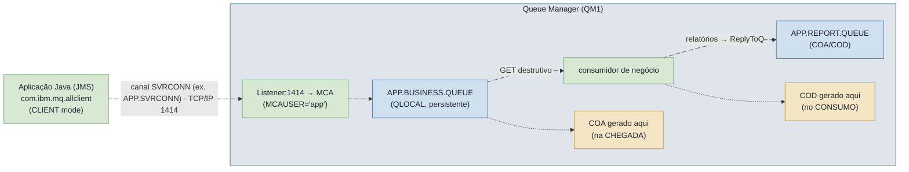
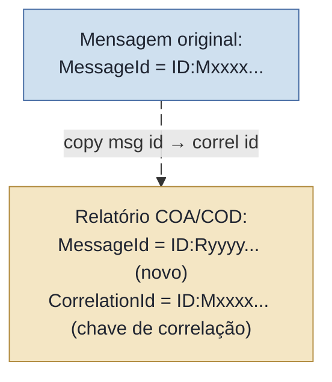
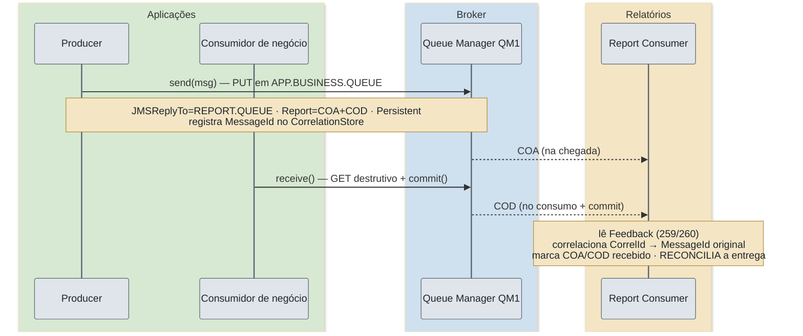
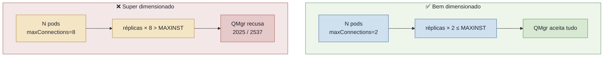
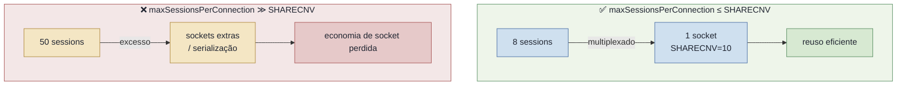
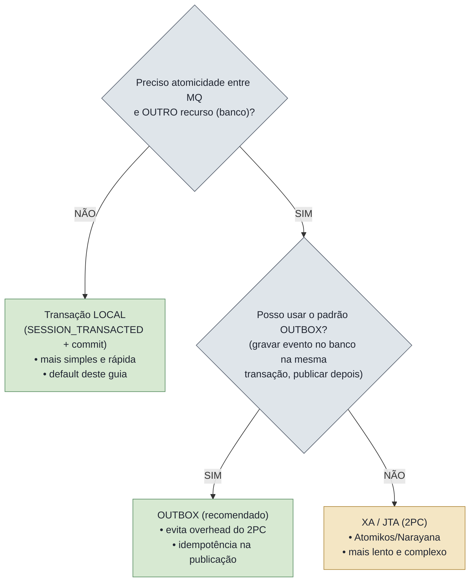

# Guia de Produção — Java 25 / Micronaut 4 + IBM MQ via JMS 2.0, com foco em relatórios COA/COD

> Guia técnico, do básico ao avançado, para um engenheiro de software que **não domina IBM MQ** mas precisa integrá-lo e
> operá-lo em um ambiente **real, crítico e de alta concorrência** (microsserviços). O fio condutor é a entrega confiável
> de mensagens e sua **prova de entrega** via relatórios **COA** (Confirmation On Arrival — confirmação de chegada) e *
*COD** (Confirmation On Delivery — confirmação de entrega/consumo).

**Stack travada deste guia:**

| Item                | Versão / Coordenada                                                  | Observação                                                                                                                                                |
|---------------------|----------------------------------------------------------------------|-----------------------------------------------------------------------------------------------------------------------------------------------------------|
| Runtime de produção | **Java 25** (LTS)                                                    | Amazon Corretto 25 (`maven.compiler.release=25`). Java 25 é LTS e documentado para o MQ 9.4.x; rode com `--enable-native-access=ALL-UNNAMED` e evite `TLS_RSA_*`. Ver ADR `docs/adr/0001-java-25-runtime.md`.                                       |
| Framework           | **Micronaut 4.9.4** (BOM `io.micronaut.platform:micronaut-platform`) | A linha 4.9.x do BOM **termina em 4.9.4** — `4.9.9` **não existe** no BOM de plataforma. Plugin Maven `io.micronaut.maven:micronaut-maven-plugin:4.11.6`. |
| Cliente MQ          | **`com.ibm.mq:com.ibm.mq.allclient:9.4.5.0`**                        | Namespace **`javax.jms`** (JMS 2.0). Linha **CD** (ver nota CD×LTS na Seção 1).                                                                           |
| Pool JMS            | **`org.messaginghub:pooled-jms:2.0.9`**                              | Linha 2.x ainda é `javax.jms` (3.x já é `jakarta.jms`).                                                                                                   |
| Imagem (testes/dev) | **`icr.io/ibm-messaging/mq:9.4.5.0-r2`**                             | IBM MQ Advanced for Developers. **Não existe** a tag `9.4.5.0` "pura" (formato `9.4.<fixpack>-r<N>`).                                                     |

> ℹ️ **Nota — convenção de idioma.** Toda a prosa, títulos, callouts e legendas estão em português brasileiro. *
*Identificadores de código permanecem em inglês** (convenção); apenas os **comentários** de código estão em PT-BR.
> Termos consagrados (Queue Manager, channel, syncpoint, etc.) são mantidos em inglês com explicação na primeira
> ocorrência.

> ℹ️ **Nota — projeto de referência.** Todos os trechos de código deste guia são extraídos de um projeto Micronaut *
*real e compilável** em `ibmmq-jms-guide/`. As referências de arquivo são relativas a essa pasta. Onde um tópico (XA,
> mTLS completo, Virtual Threads) **não** tem código compilável no projeto, o trecho é apresentado como **ilustrativo** e
> assim sinalizado.

---

## Sumário

1. [Seção 1 — Fundamentos e Conceitos](#seção-1--fundamentos-e-conceitos)
2. [Seção 2 — Relatórios de Entrega: COA / COD (referência exaustiva)](#seção-2--relatórios-de-entrega-coa--cod-referência-exaustiva)
3. [Seção 3 — Configuração do Ambiente (deep dive de propriedades)](#seção-3--configuração-do-ambiente-deep-dive-de-propriedades)
4. [Seção 4 — Implementação Prática (código real, compilável)](#seção-4--implementação-prática-código-real-compilável)
5. [Seção 5 — Testes e Resiliência (ambiente real)](#seção-5--testes-e-resiliência-ambiente-real)
6. [Apêndices](#apêndices)

## Seção 1 — Fundamentos e Conceitos

Esta seção responde ao "o que é" e ao "por quê". Se você nunca operou IBM MQ, leia tudo: os conceitos aqui são
pré-requisito para entender por que COA/COD existem e como eles fluem.

### 1.1 Arquitetura do IBM MQ

O IBM MQ é um **message broker** (intermediário de mensagens) orientado a **filas** e baseado no paradigma
*store-and-forward*: o produtor entrega a mensagem ao broker, que a **persiste** e a guarda até que o consumidor a
recupere. Produtor e consumidor são **desacoplados no tempo** — não precisam estar online ao mesmo tempo.

**Queue Manager (QMgr) — "gerenciador de filas".** É o componente central, o servidor MQ. Cada QMgr tem um nome (ex.:
`QM1`), possui as filas, os canais, o log de recuperação e as definições de segurança. Uma aplicação sempre se conecta
*a um QMgr*, não "a uma fila" diretamente.

**Filas — quatro tipos que você precisa distinguir:**

| Tipo de fila           | O que é                                                                                                                          | Quando aparece neste guia                                                                             |
|------------------------|----------------------------------------------------------------------------------------------------------------------------------|-------------------------------------------------------------------------------------------------------|
| **Local** (`QLOCAL`)   | Fila física que **reside neste QMgr**; as mensagens ficam efetivamente armazenadas aqui.                                         | Fila de negócio, fila de relatórios, DLQ, backout queue.                                              |
| **Remote** (`QREMOTE`) | Um **ponteiro** para uma fila local que vive em **outro** QMgr; o MQ encaminha (transmission queue + canal) para o destino real. | Fora de escopo prático (não usamos roteamento multi-QMgr aqui), mas você verá o conceito ao fazer HA. |
| **Alias** (`QALIAS`)   | Um **apelido** para outra fila (local ou remota); útil para indireção/segurança sem mudar a aplicação.                           | Citado como boa prática de desacoplamento.                                                            |
| **Model** (`QMODEL`)   | Um **molde**: ao abrir, gera-se uma **fila dinâmica** sob demanda (ex.: filas de resposta temporárias).                          | Conceito por trás de `JMSContext.createTemporaryQueue()`.                                             |

**Channels — "canais".** São os dutos de comunicação. O tipo relevante para uma aplicação cliente é o **SVRCONN** (
server-connection): é o canal pelo qual um cliente JMS em **CLIENT mode** se conecta ao QMgr via TCP/IP. O canal carrega
regras de segurança (CHLAUTH, TLS) e identidade (MCAUSER).

**Listener e porta.** O QMgr roda um **listener** TCP (porta padrão **1414**) que aceita as conexões de entrada nos
canais. Sem listener ativo na porta, nenhum cliente conecta (reason code `2538 HOST_NOT_AVAILABLE`).

**MCA (Message Channel Agent).** É o agente que move mensagens por um canal. Em um SVRCONN, o MCA do lado do servidor
representa a aplicação cliente dentro do QMgr e roda sob uma **identidade** (o `MCAUSER`), que é quem as verificações de
autorização avaliam.

**MQMD (Message Descriptor).** É o cabeçalho de baixo nível de toda mensagem MQ (MessageId, CorrelationId, Persistence,
**Report**, **Feedback**, ReplyToQ, Expiry, etc.). Você não o manipula diretamente em JMS — o cliente JMS o preenche a
partir das propriedades `JMS_IBM_*`. **COA/COD vivem aqui:** o campo `Report` do MQMD diz "quero COA/COD", e o campo
`Feedback` do relatório diz "isto é um COA/COD".

#### Diagrama textual — caminho de uma mensagem em CLIENT mode



O ponto-chave: em **CLIENT mode** a aplicação não tem o QMgr embutido; tudo passa pelo socket TCP do canal SVRCONN. (O
modo alternativo, **BINDINGS**, exige a aplicação na mesma máquina do QMgr e usa memória compartilhada — não é o cenário
de microsserviços que tratamos aqui.)

### 1.2 JMS 2.0 vs. IBM MQ nativo (MQI)

O IBM MQ tem uma API nativa própria, a **MQI** (Message Queue Interface), de baixo nível, com verbos como `MQCONN`,
`MQOPEN`, `MQPUT`, `MQGET`. Ela é poderosa e expõe **tudo** (inclusive o MQMD cru), mas é verbosa, procedural e acopla o
código ao MQ.

O **JMS (Java Message Service) 2.0** (namespace `javax.jms`, trazido pelo `com.ibm.mq.allclient`) é a abstração padrão
Java para mensageria. Por que usá-la em Java 25?

- **Portabilidade e familiaridade:** a mesma API conceitual de outros brokers JMS; o time não precisa aprender MQI.
- **Simplificações do JMS 2.0:** o `JMSContext` unifica `Connection` + `Session` em um objeto único e **`AutoCloseable`
  ** (fecha conexão e sessão de uma vez em *try-with-resources*); `JMSProducer` e `JMSConsumer` são objetos leves e
  fluentes; mensagens podem ser criadas direto do contexto.
- **Menos *boilerplate*, menos vazamento de recursos:** o *auto-close* elimina a classe inteira de bugs de "esqueci de
  fechar a Session".

```java
// JMS 2.0: um único objeto AutoCloseable cobre conexão + sessão.
try(JMSContext context = connectionFactory.createContext(JMSContext.AUTO_ACKNOWLEDGE)){
JMSProducer producer = context.createProducer();
    producer.

send(queue, context.createTextMessage("payload"));
        } // conexão e sessão fechadas automaticamente aqui
```

**Onde a abstração JMS "vaza" (e por que isso importa para COA/COD).** O JMS padrão **não conhece** o conceito de
relatório de entrega do MQ. COA/COD são um recurso **proprietário** do IBM MQ, expostos através de **extensões IBM**: as
propriedades `JMS_IBM_Report_*` (para pedir o relatório) e `JMS_IBM_Feedback` (para lê-lo), além das constantes inteiras
`MQRO_*`/`MQFB_*`. Ou seja: para fazer COA/COD você **sai do JMS genérico** e usa `com.ibm.msg.client.wmq.WMQConstants`
e `com.ibm.mq.constants.MQConstants`. Esta é a principal "fuga" da abstração que este guia explora.

> ⚠️ **Atenção — decisão de arquitetura: JMS manual, não `micronaut-jms`.** Este guia **não** usa o módulo declarativo
`io.micronaut.jms` (com `@JMSListener`). Motivo técnico: a linha 4.x desse módulo é **jakarta-only** (`jakarta.jms`) e *
*abstrai o `JMSContext`** — exatamente o objeto que precisamos controlar à mão para manipular as propriedades de report.
> O Micronaut entra aqui **apenas** para DI, `@ConfigurationProperties`/`@Factory`, ciclo de vida e injeção do
`ConnectionFactory`/pool. *Trade-off:* perde-se o `@JMSListener` declarativo (você escreve os loops de consumo), mas
> ganha-se o controle total exigido por COA/COD.

### 1.3 Nota CD × LTS (modelo de release V.R.M.F)

O IBM MQ usa o esquema de versão `V.R.M.F` (Version.Release.Modification.Fixpack). A versão deste guia, **`9.4.5.0`**,
tem o **terceiro dígito ≠ 0**, logo pertence à linha **CD (Continuous Delivery)**: entrega *features* novas a cada
release, com **janela de suporte mais curta**. A linha **LTS (Long Term Support)** corresponde ao terceiro dígito `0` (
ex.: `9.4.0.x`) e prioriza estabilidade/patches de longo prazo.

> ℹ️ **Nota.** O trade-off é: **CD** = recursos mais recentes, ciclo de patch/suporte curto; **LTS** = estabilidade e
> suporte estendido, recursos mais antigos. O projeto fixa **`9.4.5.0` (CD)** por ser a dependência real em uso. O runtime
> de produção é o **Java 25** (Amazon Corretto): o MQ 9.4.x **documenta o Java 25** (com orientações operacionais —
> `TLS_RSA_*` desabilitado, aviso de native-access), e o cliente roda nele com `--enable-native-access=ALL-UNNAMED`. O 9.3
> foi descartado porque Java 21+ exige MQ 9.4.x (o Semeru empacotado é o 21; o cliente, porém, executa sobre o Java 25).

### 1.4 Inventário dos objetos MQ necessários

Para o fluxo COA/COD deste guia você precisa, no QMgr, dos seguintes objetos (definições MQSC reais em
`mqsc/20-queues.mqsc` e `mqsc/10-channel-auth.mqsc`):

| Objeto               | Tipo                   | Papel                                                                                  |
|----------------------|------------------------|----------------------------------------------------------------------------------------|
| `QM1`                | Queue Manager          | O servidor MQ ao qual a aplicação conecta.                                             |
| `APP.SVRCONN`        | Channel `SVRCONN`      | Canal de conexão cliente das aplicações.                                               |
| `APP.BUSINESS.QUEUE` | `QLOCAL` (persistente) | Fila de negócio — destino das mensagens. Define `BOTHRESH`/`BOQNAME` (poison message). |
| `APP.REPORT.QUEUE`   | `QLOCAL` (persistente) | Fila **dedicada** de relatórios — recebe COA/COD via `JMSReplyTo`.                     |
| `APP.BACKOUT.QUEUE`  | `QLOCAL`               | Backout queue — recebe a mensagem após exceder `BOTHRESH` rollbacks.                   |
| `APP.DLQ`            | `QLOCAL`               | Dead Letter Queue do QMgr (`ALTER QMGR DEADQ('APP.DLQ')`).                             |
| Listener (1414)      | —                      | Aceita conexões TCP nos canais (criado pela imagem dev).                               |

```mqsc
* Trecho real de mqsc/20-queues.mqsc — fila de negócio com backout (poison message).
* BOTHRESH(5): após 5 backouts (rollbacks), a mensagem "envenenada" é movida...
* BOQNAME(APP.BACKOUT.QUEUE): ...para a fila de backout, em vez de travar a fila.
DEFINE QLOCAL('APP.BUSINESS.QUEUE') +
       DESCR('Fila de negocio do guia COA/COD') +
       DEFPSIST(YES) +
       BOTHRESH(5) BOQNAME('APP.BACKOUT.QUEUE') +
       REPLACE
```

> ℹ️ **Nota — split `APP.*` (produção) × `DEV.*` (teste).** Os arquivos `mqsc/` definem os objetos **`APP.*`** (setup de
> produção, com CONNAUTH/CHLAUTH). Já o `application.yml` e o teste de integração usam os defaults *
*`DEV.QUEUE.1`/`DEV.QUEUE.2`** da imagem de desenvolvimento (com o usuário `app` pré-autorizado a `DEV.**`). Essa
> escolha é deliberada: o IT usa `DEV.*` por confiabilidade (objetos garantidamente existentes na imagem), enquanto o guia
> documenta o setup `APP.*` que você levaria a produção. Mantenha essa distinção em mente ao ler os exemplos.

> ✅ **Boa prática — fila de report dedicada.** Use uma fila **exclusiva** para relatórios (`APP.REPORT.QUEUE`), separada
> da fila de negócio. Assim o consumidor de relatórios não compete com o de negócio, o *sizing* e a retenção são
> independentes, e você não polui a fila de negócio com mensagens de controle.
>
> ❌ **Má prática — apontar o `JMSReplyTo` para a própria fila de negócio.** Os COA/COD voltariam para a fila de negócio
> e o consumidor de negócio tentaria processá-los como pedidos. **Sintoma observável:** mensagens "estranhas" (corpo vazio
> ou com header de report) sendo processadas como negócio, parsing quebrando, e correlação impossível. Em alta
> concorrência, isso vira *loop* de erro e enche a backout queue/DLQ.

## Seção 2 — Relatórios de Entrega: COA / COD (referência exaustiva)

Esta é a seção central do guia. Relatórios de entrega (*delivery reports*) são mensagens **geradas automaticamente pelo
IBM MQ** (ou pela aplicação consumidora, no caso de PAN/NAN) que informam o **estado de uma mensagem original** ao longo
do seu ciclo de vida. Eles são a base para construir **prova de entrega** e reconciliação em sistemas críticos.

### 2.1 Os cinco tipos de relatório

| Relatório                    | Sigla   | O que confirma                                                                                                                             | Quem gera                                 | Quando                                               |
|------------------------------|---------|--------------------------------------------------------------------------------------------------------------------------------------------|-------------------------------------------|------------------------------------------------------|
| **Confirmation On Arrival**  | **COA** | A mensagem **chegou** (foi colocada) na fila de destino.                                                                                   | Queue Manager dono da fila de destino.    | No `PUT` à fila de destino (ver timing × transação). |
| **Confirmation On Delivery** | **COD** | A mensagem foi **recuperada destrutivamente** (consumida) pela aplicação.                                                                  | Queue Manager.                            | No `GET` destrutivo (ver timing × transação).        |
| **Exception**                | —       | A mensagem **não pôde** ser entregue/processada (ex.: fila cheia, PUT inibido, sem autorização).                                           | Queue Manager.                            | Quando ocorre a condição de exceção.                 |
| **Expiration**               | —       | A mensagem **expirou** (o `Expiry` venceu) antes de ser consumida.                                                                         | Queue Manager.                            | Ao descartar a mensagem expirada.                    |
| **PAN / NAN**                | PAN/NAN | **Positive/Negative Action Notification**: a aplicação consumidora processou com **sucesso** (PAN) ou **falha** (NAN) a lógica de negócio. | **A aplicação consumidora** (não o QMgr). | Quando a app decide emitir a notificação.            |

> ℹ️ **Nota — PAN/NAN são da aplicação, não do broker.** COA/COD/Exception/Expiration são responsabilidade do QMgr. *
*PAN/NAN** são semânticas de *aplicação*: o broker não sabe se sua regra de negócio "deu certo"; é a sua app consumidora
> que precisa emitir explicitamente o relatório PAN ou NAN (gerando uma mensagem de report). Por isso `MQRO_PAN`/
`MQRO_NAN` solicitam o relatório, mas a geração depende do código consumidor.

### 2.2 Quando usar — e quando NÃO usar

Cada relatório é uma **mensagem extra** que trafega, é persistida e precisa ser consumida. Em alta concorrência, isso *
*dobra** (COA+COD = 2 mensagens de controle por mensagem de negócio) ou triplica o volume de I/O.

> ✅ **Boa prática — usar COA/COD onde a prova de entrega tem valor de negócio.** Pagamentos, ordens, eventos
> regulatórios, qualquer fluxo em que "a mensagem se perdeu silenciosamente" é um incidente. Aí o custo extra se paga.
>
> ❌ **Má prática — habilitar COA+COD+Exception+Expiration "por garantia" em todo tráfego de alto volume.** Você triplica
> o I/O e a latência, enche a fila de relatórios, e o consumidor de relatórios vira gargalo. **Sintoma observável:**
*throughput* despencando, `APP.REPORT.QUEUE` com profundidade crescente (backlog), disco do QMgr saturando. Habilite
> relatórios **seletivamente**, por tipo de fluxo.

### 2.3 Mecânica de geração — é a MENSAGEM que pede, não o QMgr

Este é o conceito mais incompreendido por quem vem de outros brokers: **não existe um botão "ligar COA/COD no Queue
Manager".** Quem solicita o relatório é a **própria mensagem original**, através de duas coisas:

1. **As opções de report no MQMD** (campo `Report`), que em JMS você define via as propriedades `JMS_IBM_Report_*`
   passando o inteiro `MQRO_*` correspondente.
2. **O `JMSReplyTo`** — define a `ReplyToQ`/`ReplyToQMgr`, isto é, **para onde** o relatório deve ser enviado. Sem
   `JMSReplyTo`, o QMgr não tem destino e o relatório não é gerado (ou vai para a DLQ).

```java
// Trecho real de ibmmq-jms-guide/src/main/java/com/example/ibmmq/producer/BusinessMessageProducer.java
message.setJMSReplyTo(reportQueue); // PARA ONDE os relatórios vão (ReplyToQ)

// O campo Java é UPPER_SNAKE (JMS_IBM_REPORT_COA) e o valor passado é o inteiro MQRO_*.
message.

setIntProperty(WMQConstants.JMS_IBM_REPORT_COA, MQConstants.MQRO_COA); // pede COA
message.

setIntProperty(WMQConstants.JMS_IBM_REPORT_COD, MQConstants.MQRO_COD); // pede COD
```

**O que de fato se configura no QMgr** (não os relatórios em si): a **existência** da fila de report, sua persistência,
a DLQ, as **autorizações** (crucial — ver o *gotcha* de `+SETALL` na Seção 5), e políticas de `Expiry`. O QMgr é a
infraestrutura; a *intenção* de receber relatório está na mensagem.

> ⚠️ **Atenção — `WMQConstants` vs. `MQConstants` (erro comum).** As propriedades JMS de **pedido** (
`JMS_IBM_REPORT_COA`, `JMS_IBM_FEEDBACK`...) ficam em **`com.ibm.msg.client.wmq.WMQConstants`** — o **nome do campo** é
> UPPER_SNAKE (`JMS_IBM_REPORT_COA`) e o **valor String** é mixed-case (`"JMS_IBM_Report_COA"`). Já os **valores inteiros
** `MQRO_*` e `MQFB_*` ficam em **`com.ibm.mq.constants.CMQC`** (agregados por **`MQConstants`**), **não** em
`WMQConstants`. Referencie sempre como `MQConstants.MQRO_COA`, `MQConstants.MQFB_COD`. (`WMQConstants` declara só 1
> campo próprio, `sccsid`.)

### 2.4 Propagação e rastreabilidade de identificadores

Como você correlaciona um relatório de volta à mensagem que o originou? Pela **propagação de ID**, controlada por opções
`MQRO_*`:

| Opção (`MQRO_*`)                    | Valor           | Efeito sobre o `CorrelationId` do relatório                                                                                     |
|-------------------------------------|-----------------|---------------------------------------------------------------------------------------------------------------------------------|
| **`MQRO_COPY_MSG_ID_TO_CORREL_ID`** | **0 (default)** | O **`MessageId` da mensagem original** vira o **`CorrelationId`** do relatório. É o que torna a correlação possível "de graça". |
| `MQRO_PASS_MSG_ID`                  | 128             | O relatório **mantém o mesmo `MessageId`** da original (em vez de gerar um novo).                                               |
| `MQRO_PASS_CORREL_ID`               | 64              | O relatório **copia o `CorrelationId`** da original (em vez de copiar o MessageId para o CorrelId).                             |
| `MQRO_NEW_MSG_ID`                   | 0 (default)     | O relatório recebe um **novo `MessageId`** próprio (default — não conflita com o original).                                     |

Na prática, **com os defaults** (`MQRO_COPY_MSG_ID_TO_CORREL_ID` + `MQRO_NEW_MSG_ID`):



Por isso o consumidor de relatórios faz `findByMessageId(report.getJMSCorrelationID())` — o `CorrelationId` do relatório
é o `MessageId` original. Este é exatamente o modelo usado em `CorrelationStore`/`InMemoryCorrelationStore`.

**Flags de dados — `*_WITH_DATA` e `*_WITH_FULL_DATA`.** Você pode pedir que o relatório inclua parte (`_WITH_DATA`) ou
todo (`_WITH_FULL_DATA`) o payload original:

| Constante                                                     | Valor               |
|---------------------------------------------------------------|---------------------|
| `MQRO_COA` / `MQRO_COA_WITH_DATA` / `MQRO_COA_WITH_FULL_DATA` | 256 / 768 / 1792    |
| `MQRO_COD` / `MQRO_COD_WITH_DATA` / `MQRO_COD_WITH_FULL_DATA` | 2048 / 6144 / 14336 |

> ⚠️ **Atenção — `*_WITH_DATA`/`_WITH_FULL_DATA` duplicam o payload e expõem PII.** Pedir os dados no relatório
> significa **copiar o corpo da mensagem** para a fila de relatórios. Consequências: (a) *sizing* — a fila de relatórios
> passa a guardar o dobro de dados; (b) **exposição de PII** — dados sensíveis que estavam só na fila de negócio agora
> também estão na fila de relatórios, possivelmente com controle de acesso diferente. Use `_WITH_DATA`/`_WITH_FULL_DATA`
> apenas quando o reconciler **realmente** precisa do corpo, e nunca para PII sem mascaramento.

### 2.5 Tabela de Feedback codes (como o consumidor classifica)

Quando um relatório chega, o **tipo** dele está no campo `Feedback` do MQMD, lido em JMS via
`WMQConstants.JMS_IBM_FEEDBACK`:

| Constante (`MQFB_*`, em `CMQC`/`MQConstants`) | Valor       | Significado                                                                                                                                                                                  |
|-----------------------------------------------|-------------|----------------------------------------------------------------------------------------------------------------------------------------------------------------------------------------------|
| `MQFB_COA`                                    | **259**     | Relatório de chegada (COA).                                                                                                                                                                  |
| `MQFB_COD`                                    | **260**     | Relatório de entrega/consumo (COD).                                                                                                                                                          |
| `MQFB_EXPIRATION`                             | **258**     | Relatório de expiração.                                                                                                                                                                      |
| `MQFB_PAN`                                    | **275**     | Positive Action Notification.                                                                                                                                                                |
| `MQFB_NAN`                                    | **276**     | Negative Action Notification.                                                                                                                                                                |
| *(Exception)*                                 | um `MQRC_*` | **Não existe `MQFB_EXCEPTION`.** Um relatório de exceção carrega no `Feedback` um **reason code** `MQRC_*` (ex.: `2051 MQRC_PUT_INHIBITED`, `2053 MQRC_Q_FULL`, `2035 MQRC_NOT_AUTHORIZED`). |

> ⚠️ **Atenção — relatório de exceção não tem `MQFB_` fixo.** Ao ramificar no consumidor, trate explicitamente os
`MQFB_*` conhecidos (259/260/258/275/276); qualquer outro feedback na faixa de sistema (`MQFB_SYSTEM_FIRST`=1 ..
`MQFB_SYSTEM_LAST`=65535) que não seja um deles é um **relatório de exceção** carregando um `MQRC_*`. **Cuidado** com
> colisões: `271` é `MQFB_XMIT_Q_MSG_ERROR`, **não** COA — por isso a comparação tem de ser por igualdade exata, não por
> faixa.

Esta é exatamente a lógica de `ReportFeedbackRouter.classify(int)` (Seção 4), que mapeia o inteiro de feedback para um
`ReportType`.

### 2.6 Timing × transação (o detalhe crítico que muda o que o reconciler observa)

O *timing* nominal é:

- **COA** é gerado quando a mensagem **chega** (é colocada) na fila de destino.
- **COD** é gerado quando a mensagem é **recuperada destrutivamente** (GET destrutivo) pela aplicação.

Mas, **sob syncpoint/transação**, a visibilidade muda — e isso afeta diretamente seus testes e seu reconciler:

| Cenário                                                | Quando o relatório realmente flui                                                                                                                                                                      |
|--------------------------------------------------------|--------------------------------------------------------------------------------------------------------------------------------------------------------------------------------------------------------|
| Producer em **transação local** (`SESSION_TRANSACTED`) | A mensagem só "chega" à fila — e o **COA só é recuperável** — **após o `commit()` do producer**. Antes do commit, a mensagem está invisível para o resto do mundo.                                     |
| Producer em **AUTO_ACKNOWLEDGE**                       | Cada `send` é confirmado imediatamente (o producer "commita" cada envio), então o COA flui logo após o PUT.                                                                                            |
| Consumer em **transação local** (`SESSION_TRANSACTED`) | O **COD é gerado dentro da UoW (unidade de trabalho) do consumidor** e só é **enviado no `commit()`**. Se a UoW sofrer **rollback** (backout), **o COD não é enviado** e a mensagem volta para a fila. |

> ℹ️ **Nota — por que isso é "correto".** O COD com rollback-aware é exatamente o comportamento desejado: você só
> recebe "confirmação de entrega" quando a mensagem foi **de fato** consumida e a transação **confirmada**. Se o
> processamento falhou e voltou para a fila, ela não foi "entregue de verdade" — e o COD não mente. Veja em
`BusinessMessageConsumer`: o `context.commit()` após processar é o que **libera o COD**.

> ⚠️ **Atenção — implicação para testes de integração.** Como o COD só aparece após o `commit()` do consumidor, um teste
> ponta-a-ponta precisa: (1) produzir, (2) **consumir e comitar**, e só então (3) esperar o COD na fila de relatórios —
> com *timeout* generoso, pois o relatório é assíncrono. É precisamente o que `CoaCodEndToEndIT` faz (15s para consumir,
> 30s de janela para ver COA **e** COD).

### 2.7 Persistência dos relatórios (CORREÇÃO importante)

> ⚠️ **Atenção — relatórios HERDAM a persistência da mensagem original.** Uma crença comum (e errada) é que "relatórios
> COA/COD são não-persistentes por padrão". **Falso.** A documentação IBM é explícita: a persistência do relatório é *"
Copied from the original message descriptor"* — ou seja, **uma mensagem original persistente gera, por padrão, um
COA/COD persistente**. Isso vale para COA, COD, exception, expiration, PAN e NAN.

Consequência prática para ambiente crítico: se você usa **mensagens de negócio persistentes** (o caso deste guia), seus
relatórios **também serão persistentes** e **sobreviverão a um restart do QMgr** — exatamente o que você quer para uma
prova de entrega confiável. Para reforçar, defina a fila de relatórios com `DEFPSIST(YES)` (como em
`mqsc/20-queues.mqsc`), garantindo persistência mesmo para mensagens que não a especifiquem explicitamente.

> ✅ **Boa prática — alinhar persistência da mensagem, do relatório e do store de correlação.** Mensagem persistente →
> relatório persistente → **store de correlação persistente** (DB/Redis). Os três sobrevivem a restart, e a reconciliação
> fecha mesmo após um deploy/reinício.
>
> ❌ **Má prática — mensagem persistente + store de correlação só em memória (`ConcurrentHashMap`).** O relatório
> persiste e chega depois do restart, mas o `messageId` registrado **sumiu** com a JVM. **Sintoma observável:**
> relatórios "órfãos" — o consumidor recebe um COD com `CorrelationId` que não bate com nenhuma pendência conhecida; a
> reconciliação reporta entregas "desconhecidas" e você não consegue fechar o ciclo. (Por isso o projeto fornece um
store compartilhado e persistente — `JdbcCorrelationStore` — ver Seção 4.)

### 2.8 Diagrama do fluxo completo



## Seção 3 — Configuração do Ambiente (deep dive de propriedades)

Esta seção é a referência das propriedades de conexão. Os **nomes dos campos** são os de
`com.ibm.msg.client.wmq.WMQConstants` (verificados no bytecode de `com.ibm.mq.allclient:9.4.5.0`). Você as aplica num
`MQConnectionFactory` via `setIntProperty`/`setStringProperty`/`setBooleanProperty`.

### 3.1 Tabela exaustiva (iniciante → avançado)

| Campo `WMQConstants`               | Valor String interno                    | O que faz                                                                 | Default real    | Quando usar / impacto                                                                                                                           |
|------------------------------------|-----------------------------------------|---------------------------------------------------------------------------|-----------------|-------------------------------------------------------------------------------------------------------------------------------------------------|
| `WMQ_CONNECTION_MODE`              | `XMSC_WMQ_CONNECTION_MODE`              | Modo de conexão (CLIENT vs BINDINGS).                                     | —               | Sempre `WMQ_CM_CLIENT` (**=1**) em microsserviços (TCP/IP via SVRCONN). `WMQ_CM_BINDINGS`=0 exige app na mesma máquina do QMgr.                 |
| `WMQ_HOST_NAME`                    | `XMSC_WMQ_HOST_NAME`                    | Host do listener MQ.                                                      | `localhost`     | Usado se **não** houver `CONNECTION_NAME_LIST`. Ponto único de falha sozinho.                                                                   |
| `WMQ_PORT`                         | `XMSC_WMQ_PORT`                         | Porta do listener (`setIntProperty`).                                     | `1414`          | Padrão 1414. Alinhe com a porta publicada do listener.                                                                                          |
| `WMQ_CHANNEL`                      | `XMSC_WMQ_CHANNEL`                      | Canal SVRCONN.                                                            | —               | Ex.: `DEV.APP.SVRCONN`. Determina CHLAUTH/TLS/identidade aplicáveis.                                                                            |
| `WMQ_QUEUE_MANAGER`                | `XMSC_WMQ_QUEUE_MANAGER`                | Nome do QMgr alvo.                                                        | —               | Pode ser vazio para "qualquer QMgr" via CCDT, mas normalmente fixo (ex.: `QM1`).                                                                |
| `WMQ_CONNECTION_NAME_LIST`         | `XMSC_WMQ_CONNECTION_NAME_LIST`         | Lista CONNAME multi-host `host(port),host(port)`.                         | vazio           | **Resiliência:** necessária para reconexão a **outro** QMgr (multi-instance). Tem precedência sobre host/port.                                  |
| `WMQ_CCDTURL`                      | `XMSC_WMQ_CCDTURL`                      | URL de um CCDT (Client Channel Definition Table).                         | vazio           | Alternativa centralizada à config no código; suporta CCDT via **HTTPS**. Casing: `CCDTURL` (sem underscore antes de `URL`).                     |
| `WMQ_CLIENT_RECONNECT_OPTIONS`     | `XMSC_WMQ_CLIENT_RECONNECT_OPTIONS`     | Política de auto-reconnect.                                               | —               | Valores abaixo. Exige `TRANSPORT=CLIENT` + CONNAMELIST/CCDT. **Resiliência alta**, mas cuidado com o pool (Seção 5).                            |
| `WMQ_CLIENT_RECONNECT`             | (int) **16777216**                      | Reconecta a **qualquer** QMgr da lista (admin `ANY` / `MQCNO_RECONNECT`). | —               | Use com `CONNECTION_NAME_LIST` multi-instance.                                                                                                  |
| `WMQ_CLIENT_RECONNECT_Q_MGR`       | (int) **67108864**                      | Reconecta **ao mesmo** QMgr (admin `QMGR` / `MQCNO_RECONNECT_Q_MGR`).     | —               | Para QMgr multi-instance (mesma identidade em standby).                                                                                         |
| `WMQ_CLIENT_RECONNECT_AS_DEF`      | (int) **0**                             | Usa o default do canal (`ASDEF`).                                         | (default)       | Defere a decisão ao canal/CCDT.                                                                                                                 |
| `WMQ_CLIENT_RECONNECT_DISABLED`    | (int) **33554432**                      | Desliga o auto-reconnect.                                                 | —               | Quando você quer falhar rápido e deixar a reconexão para a camada de cima.                                                                      |
| `WMQ_CLIENT_RECONNECT_TIMEOUT`     | `XMSC_WMQ_CLIENT_RECONNECT_TIMEOUT`     | Tempo (s) para desistir da reconexão (chave String que recebe int).       | **1800s**       | 30 min é o default documentado. Reduza para falhar mais cedo em cenários de baixa tolerância.                                                   |
| `WMQ_SHARE_CONV_ALLOWED`           | `XMSC_WMQ_SHARE_CONV_ALLOWED`           | Conversas compartilhadas por socket (**SHARECNV**).                       | —               | **Performance:** multiplexa N conversas num socket TCP, reduzindo sockets sob alta concorrência. Deve ser compatível com o `SHARECNV` do canal. |
| `WMQ_APPLICATIONNAME`              | `XMSC_WMQ_APPNAME`                      | Nome da app (visível em `DIS CONN`).                                      | —               | **Observabilidade:** identifica sua app no monitoramento do QMgr. ⚠️ campo `APPLICATIONNAME`, mas chave `APPNAME`.                              |
| `USER_AUTHENTICATION_MQCSP`        | `XMSC_USER_AUTHENTICATION_MQCSP`        | Liga o flow MQCSP (user/senha moderno). **Boolean.**                      | —               | ⚠️ **Sem prefixo `WMQ_`**; herdado de `JmsConstants`. `setBooleanProperty(..., true)`.                                                          |
| `USERID`                           | `XMSC_USERID`                           | Usuário MQCSP.                                                            | —               | Par com `PASSWORD`.                                                                                                                             |
| `PASSWORD`                         | (`XMSC_PASSWORD`)                       | Senha MQCSP.                                                              | —               | **Nunca** hardcode; injete via secret/env.                                                                                                      |
| `WMQ_SSL_CIPHER_SUITE`             | `XMSC_WMQ_SSL_CIPHER_SUITE`             | CipherSuite TLS (lado Java). **Definir isto HABILITA TLS** no CF.         | vazio (TLS off) | Ex.: `TLS_AES_256_GCM_SHA384`. **Evite `TLS_RSA_*`** (desabilitados no Java 25).                                                                |
| `WMQ_SSL_PEER_NAME`                | `XMSC_WMQ_SSL_PEER_NAME`                | DN esperado do certificado do peer (SSLPEER).                             | —               | Endurece o handshake (valida identidade do QMgr). Ignorado se CipherSuite não definido.                                                         |
| `WMQ_SSL_CERT_STORES_COL` / `_STR` | `XMSC_WMQ_SSL_CERT_STORES_COL` / `_STR` | Stores de certificado para CRL/OCSP.                                      | —               | ⚠️ **Não existe `WMQ_SSL_CERT_STORES` puro**: `_STR`=URL LDAP único, `_COL`=Collection.                                                         |

> ⚠️ **Atenção — `useIBMCipherMappings` foi REMOVIDA.** Em guias antigos você verá `com.ibm.mq.cfg.useIBMCipherMappings`
> para alternar nomes IBM vs Oracle. **Não defina isso** — a propriedade foi **removida do produto a partir do IBM MQ
9.4.0**. De 9.4.0 em diante o Cipher pode ser informado como CipherSpec **ou** CipherSuite e é tratado automaticamente.

### 3.2 Configuração programática (snippet real)

Esta é a tradução das propriedades acima em código, extraída de `MqConnectionFactoryFactory.buildMqConnectionFactory`:

```java
// ibmmq-jms-guide/src/main/java/com/example/ibmmq/config/MqConnectionFactoryFactory.java
MQConnectionFactory cf = new MQConnectionFactory();

// Modo CLIENT (TCP/IP via SVRCONN). WMQ_CM_CLIENT = 1.
cf.

setIntProperty(WMQConstants.WMQ_CONNECTION_MODE, WMQConstants.WMQ_CM_CLIENT);

// Canal SVRCONN e gerenciador de filas.
cf.

setStringProperty(WMQConstants.WMQ_CHANNEL, props.getChannel());
        cf.

setStringProperty(WMQConstants.WMQ_QUEUE_MANAGER, props.getQueueManager());

// Endereço: prefira CONNAME list (necessária para reconexão a outro QMgr); senão host+porta.
        if(props.

hasConnectionNameList()){
        cf.

setStringProperty(WMQConstants.WMQ_CONNECTION_NAME_LIST, props.getConnectionNameList());
        }else{
        cf.

setStringProperty(WMQConstants.WMQ_HOST_NAME, props.getHost());
        cf.

setIntProperty(WMQConstants.WMQ_PORT, props.getPort());
        }

// Nome da aplicação (visível em DIS CONN). Campo APPLICATIONNAME -> chave APPNAME.
        cf.

setStringProperty(WMQConstants.WMQ_APPLICATIONNAME, props.getApplicationName());

// SHARECNV: conversas compartilhadas por socket — reduz sockets em alta concorrência.
        cf.

setIntProperty(WMQConstants.WMQ_SHARE_CONV_ALLOWED, props.getSharingConversations());

// Autenticação MQCSP (user/senha) — note: USER_AUTHENTICATION_MQCSP é boolean e SEM prefixo WMQ_.
        if(props.

hasCredentials()){
        cf.

setBooleanProperty(WMQConstants.USER_AUTHENTICATION_MQCSP, true);
    cf.

setStringProperty(WMQConstants.USERID, props.getUser());
        cf.

setStringProperty(WMQConstants.PASSWORD, props.getPassword());
        }

// Reconexão automática (exige TRANSPORT=CLIENT + CONNAMELIST/CCDT).
int reconnectOption = props.isReconnectEnabled()
        ? WMQConstants.WMQ_CLIENT_RECONNECT             // = MQCNO_RECONNECT (qualquer QMgr)
        : WMQConstants.WMQ_CLIENT_RECONNECT_DISABLED;
cf.

setIntProperty(WMQConstants.WMQ_CLIENT_RECONNECT_OPTIONS, reconnectOption);
```

### 3.3 Configuração via `application.yml` (Micronaut)

O projeto externaliza tudo num bean `@ConfigurationProperties("ibm-mq")` (`MqProperties`) alimentado pelo bloco
`ibm-mq:` do `application.yml`:

```yaml
# ibmmq-jms-guide/src/main/resources/application.yml
ibm-mq:
  host: localhost
  port: 1414
  channel: DEV.APP.SVRCONN
  queue-manager: QM1
  # Lista CONNAME para reconexão multi-instância (host(port),host(port)). Vazio = usa host/port.
  connection-name-list: ""
  user: app
  # Em dev a imagem exige senha (MQ_APP_PASSWORD). Sobrescreva via IBM_MQ_PASSWORD / -Dibm-mq.password.
  password: ${IBM_MQ_PASSWORD:passw0rd}
  application-name: ibmmq-jms-guide
  business-queue: DEV.QUEUE.1
  report-queue: DEV.QUEUE.2
  reconnect-enabled: true
  reconnect-timeout-seconds: 1800
  sharing-conversations: 10
  # TLS desligado em dev. Para ligar: tls-enabled=true + ssl-cipher-suite (evite ciphers TLS_RSA_*).
  tls-enabled: false
  ssl-cipher-suite: ""
```

Cada chave kebab-case (`queue-manager`) vincula ao setter camelCase de `MqProperties` (`setQueueManager`). A senha vem
de variável de ambiente (`${IBM_MQ_PASSWORD:passw0rd}`), nunca hardcoded no fonte.

> ✅ **Boa prática — segredos fora do código e do YAML versionado.** Injete `password` via secret/variável de ambiente (
`${IBM_MQ_PASSWORD}`), como o projeto faz. **Sintoma evitado:** credencial vazada no Git/histórico, e o
`2035 NOT_AUTHORIZED` quando alguém troca a senha e esquece de atualizar o segredo (em vez de um build novo).

### 3.4 Nota sobre CCDT

O **CCDT (Client Channel Definition Table)** é um arquivo binário (ou JSON, a partir do MQ 9.x) que descreve canais
cliente — host, porta, TLS, CONNAME list — **fora** do código. Você aponta `WMQ_CCDTURL` para ele (suporta `file://` e *
*HTTPS**). Vantagem: a topologia de conexão (incluindo failover multi-host) é gerenciada por **operações**, não por
*deploy* da aplicação. É a alternativa recomendada à `CONNECTION_NAME_LIST` quando a infraestrutura muda
independentemente da app.

> ✅ **Boa prática — CCDT/CONNAME list para HA, gerenciados por operação.** Centralize a topologia de conexão (
> multi-host, TLS) num CCDT distribuído por configuração. **Impacto:** failover sem rebuild; a app só conhece a URL do
> CCDT.
>
> ❌ **Má prática — host/porta fixos hardcoded e um único endereço.** Em um *outage* do QMgr primário, a app não tem para
> onde reconectar. **Sintoma observável:** `2059 Q_MGR_NOT_AVAILABLE` / `2538 HOST_NOT_AVAILABLE` em cascata, sem
> auto-recuperação, até alguém fazer redeploy com o novo host.

## Seção 4 — Implementação Prática (código real, compilável)

Todo o código desta seção vem do projeto `ibmmq-jms-guide/` (compila com `maven.compiler.release=25`).

### 4.1 Bootstrap Micronaut — dependências e `@Factory` do pool

As coordenadas exatas (do `pom.xml` real):

```xml
<!-- ibmmq-jms-guide/pom.xml (trechos) -->
<properties>
    <micronaut.version>4.9.4</micronaut.version>              <!-- BOM 4.9.x termina em 4.9.4 -->
    <micronaut.maven.plugin.version>4.11.6</micronaut.maven.plugin.version>
    <ibm.mq.version>9.4.5.0</ibm.mq.version>                  <!-- cliente javax.jms / JMS 2.0 -->
    <pooled.jms.version>2.0.9</pooled.jms.version>            <!-- 2.x ainda é javax; 3.x = jakarta -->
</properties>

        <!-- allclient = javax.jms (JMS 2.0). Traz com.ibm.mq.*, com.ibm.msg.client.*,
             com.ibm.mq.constants.* (CMQC/MQConstants) e a javax.jms-api 2.0.1 transitiva. -->
<dependency>
<groupId>com.ibm.mq</groupId>
<artifactId>com.ibm.mq.allclient</artifactId>
<version>${ibm.mq.version}</version>
<scope>compile</scope>
</dependency>
        <!-- Pool de conexões JMS (javax). Classe: org.messaginghub.pooled.jms.JmsPoolConnectionFactory. -->
<dependency>
<groupId>org.messaginghub</groupId>
<artifactId>pooled-jms</artifactId>
<version>${pooled.jms.version}</version>
<scope>compile</scope>
</dependency>
```

A `@Factory` produz a `ConnectionFactory` que toda a aplicação injeta: um `MQConnectionFactory` (cliente IBM MQ) *
*embrulhado** por um `JmsPoolConnectionFactory` (pool). O pool reaproveita conexões/sessions — essencial onde se faz
muitos `createContext`:

```java
// ibmmq-jms-guide/src/main/java/com/example/ibmmq/config/MqConnectionFactoryFactory.java
@Singleton
@Bean(preDestroy = "stop") // ao destruir o contexto, o pool é fechado (stop()).
public JmsPoolConnectionFactory connectionFactory(MqProperties props) throws JMSException {
    MQConnectionFactory mqCf = buildMqConnectionFactory(props);

    JmsPoolConnectionFactory pool = new JmsPoolConnectionFactory();
    pool.setConnectionFactory(mqCf);     // aceita a interface javax.jms.ConnectionFactory
    pool.setMaxConnections(8);           // limita conexões físicas; sessions são multiplexadas
    // maxSessionsPerConnection fica no default do pooled-jms (500) aqui; veja o deep dive
    // abaixo para quando e como ajustá-lo (mantenha <= o SHARECNV do canal).
    return pool;
}
```

> ✅ **Boa prática — sempre embrulhar o CF do MQ num pool.** O `JmsPoolConnectionFactory` reusa conexões físicas e limita
> o número delas (`maxConnections`). **Impacto:** sob alta concorrência você não abre/fecha sockets TCP a cada mensagem.
>
> ❌ **Má prática — `new MQConnectionFactory()` cru e abrir conexão por mensagem.** Cada `createContext` abre uma conexão
> TCP nova ao QMgr. **Sintoma observável:** *latency* alta por causa do handshake repetido, esgotamento de
> sockets/threads, e o QMgr atingindo `MAXCHANNELS`/`MAXINST` (recusando conexões). Em pico, o serviço "trava" sem erro
> óbvio.

#### O que cada parâmetro controla — `maxConnections` vs `maxSessionsPerConnection`

Esses dois parâmetros limitam **recursos diferentes** e são rotineiramente confundidos. `maxConnections` limita **conexões físicas** (sockets TCP ao QMgr, cada um pagando um handshake TCP + TLS + MQ e um slot no canal SVRCONN). `maxSessionsPerConnection` limita **sessions** — as unidades de trabalho lógicas e baratas, multiplexadas sobre *cada* conexão física como shared conversations. Os valores abaixo são os defaults autênticos do `pooled-jms` 2.0.9 (validados em `research-output/pooled-jms-factory-tuning.md`).

| Parâmetro | Limita | Default (2.0.9) | Limite do mundo real |
|---|---|---|---|
| `maxConnections` | Conexões TCP físicas seguradas pelo pool | **1** | `maxConnections × réplicas` deve ficar abaixo do `MAXINST` do canal |
| `maxSessionsPerConnection` | Sessions ativas emprestadas por **cada** conexão | **500** | Mantenha em/abaixo do `SHARECNV` do canal |
| `blockIfSessionPoolIsFull` | O que acontece quando as sessions se esgotam | **true** (bloqueia, não lança) | Um chamador faminto espera; não falha rápido |
| `blockIfSessionPoolIsFullTimeout` | Por quanto tempo bloquear | **-1** (para sempre) | A inanição aparece como *travamento*, não erro |

O teto efetivo das sessions concorrentes que um único pod consegue entregar é o **produto** `maxConnections × maxSessionsPerConnection`. Quando uma thread pede uma session além desse teto, o comportamento default é **bloquear indefinidamente** (`blockIfSessionPoolIsFull=true`, timeout `-1`) — não lançar. É por isso que um pool sub-dimensionado sob carga parece um serviço congelado sem stack trace.

> ⚠️ **Atenção — um pool sub-dimensionado falha *em silêncio*.** Com os defaults, esgotar o teto `maxConnections × maxSessionsPerConnection` faz `createContext`/`createSession` **bloquear para sempre**, não lançar. **Sintoma:** threads de request empilham esperando, o throughput estagna, e *não* há exceção para grepar. Dimensione o produto para sua concorrência real, ou defina `blockIfSessionPoolIsFullTimeout` para que a inanição apareça como um timeout sobre o qual você consegue alertar.

#### Dimensionando o pool do producer sob ~10k rpm

Sob a topologia vigente (Kubernetes, competing consumers, ~167 msg/s), o pool vive **por pod**, então o QMgr vê `réplicas × maxConnections` conexões físicas no total. Esse total é limitado pelo `MAXINST` do canal SVRCONN (e `MAXINSTC` por endereço); ultrapasse-o e o QMgr **recusa** novas conexões com `2025 MQRC_MAX_CONNS_LIMIT_REACHED` / `2537 MQRC_CHANNEL_NOT_AVAILABLE`. Logo `maxConnections` nunca é uma decisão local do pod — um valor inofensivo em uma réplica vira uma indisponibilidade por esgotamento de canal em cinquenta. No eixo das sessions, mantenha `maxSessionsPerConnection` em ou abaixo do `SHARECNV` negociado do canal (10 no `DEV.APP.SVRCONN` de dev); sessions além disso não conseguem compartilhar um único socket, então o cliente abre sockets extras e a economia de sockets pela qual o pool existe se erode.

> ℹ️ **Nota — dois limites, dois escopos.** `maxConnections` é limitado *no lado do cluster* por `réplicas × maxConnections ≤ MAXINST`; `maxSessionsPerConnection` é limitado *no lado do canal* por `≤ SHARECNV`. Dimensione cada um contra o seu próprio teto — eles não se compensam mutuamente.

#### `maxConnections`: cenários bom vs. ruim



#### `maxSessionsPerConnection`: cenários bom vs. ruim



#### Um pool ou dois? Factories de producer vs. consumer

O producer e o consumer têm **ciclos de vida de conexão opostos**, então um pool certo para um é errado para o outro. Um producer abre um `JMSContext` curto por `send` e o devolve — exatamente o churn que o pool otimiza, então **poolar o producer é um ganho forte e incondicional**. O consumer de produção idiomático é o oposto: é **longevo**, segurando uma conexão física pela vida do pod e iterando `receive()`/`commit()` sobre a mesma session. Um pool embrulhando uma única conexão longeva colapsa para tamanho efetivo 1 — não acrescenta nada — e, para um `MessageListener` assíncrono, o `pooled-jms` desaconselha ativamente o pooling (a conexão fica segurada fora do controle do pool).

| Papel | Ciclo de vida da conexão | O pool ajuda? |
|---|---|---|
| **Producer** | Contexto curto por `send` | **Sim, fortemente** — reusa o socket entre sends |
| **Consumer longevo** | Uma conexão segurada pela vida do pod | **Pouco ou nada** — o pool colapsa para tamanho 1; um CF cru é mais limpo |
| **Consumer com churn** (didático) | Contexto por poll, como um producer | **Sim** — mesmo argumento de reuso do producer |

É por isso que a topologia do mundo real de **uma factory poolada para o publisher + um `MQConnectionFactory` cru para o consumer** é sólida, não um cheiro — *desde que o consumer seja longevo*. Uma factory crua, não-poolada, é correta **apenas** para um consumer longevo; pareá-la com um consumer com churn faria um handshake de socket por mensagem. Os dois temas se encontram aqui: os parâmetros de *sizing* acima governam o pool do producer, enquanto a decisão de *topologia* governa se o consumer deve estar nesse pool. (Essa topologia role-based está registrada na ADR-0006; sua implementação é rastreada na issue #25.)

> ✅ **Boa prática — factories por papel.** Um `JmsPoolConnectionFactory` para o producer (dimensionado pelas regras acima) e uma factory **dedicada** para o consumer longevo. **Impacto:** cada lado é ajustado ao seu próprio ciclo de vida; a conexão longeva do consumer nunca rouba um slot do pool do producer.
>
> ❌ **Má prática — um pool único usado cegamente para tudo, *com* um listener assíncrono nele.** O pool é ajustado para uma carga enquanto serve duas opostas, e um `MessageListener` prende uma conexão poolada fora do controle do pool. **Sintoma:** um producer que bloqueia intermitentemente no checkout porque um consumer segura conexões pooladas, além dos cuidados de listener que o `pooled-jms` alerta. (Um pool único compartilhado só é aceitável quando **ambos** os lados fazem churn de contextos curtos e **nenhum** listener assíncrono é usado.)

#### Pool, commit e idempotência — três camadas diferentes

Uma confusão frequente é achar que a connection factory afeta de alguma forma o commit ou a idempotência. Não afeta. Esses três vivem em camadas diferentes, e a escolha da factory toca apenas a primeira:

| Camada | O que é | Quem é dono |
|---|---|---|
| **Ciclo de vida de conexão / session** | Como sockets e sessions são criados, reusados, dimensionados | A ConnectionFactory / pool — **a única coisa que o pooling afeta** |
| **Commit** | Confirmar uma unidade de trabalho | A **session** (`context.commit()`), nunca a conexão; o pool só faz rollback de uma session transacionada não-commitada na devolução |
| **Idempotência** | Não reprocessar uma entrega duplicada | O **Correlation store** compartilhado/persistente, deduplicando por id — independente da factory |

Então trocar poolada ↔ crua, ou compartilhada ↔ por-papel, tem efeito **zero** sobre a semântica de commit ou a idempotência de entrega. A relação real é *inversa*: um pool — ou qualquer falha de conexão em volta do commit, como uma conexão invalidada no meio da transação — pode ser uma **fonte** de redelivery; o Correlation store é a **defesa** que torna esse redelivery inofensivo.

> ℹ️ **Nota — o pool é uma *fonte* de duplicata, o store é a *defesa*.** Não raciocine "o pool me dá exactly-once" — não dá. Exactly-once vem de um consumo transacionado mais um Correlation store idempotente; a factory só decide como conexões e sessions são criadas e reusadas.

### 4.2 Producer — habilita COA/COD, persiste e registra a correlação

```java
// ibmmq-jms-guide/src/main/java/com/example/ibmmq/producer/BusinessMessageProducer.java
public String send(String businessKey, String jsonPayload) {
    // try-with-resources: o JMSContext (conexão+sessão) é fechado ao final.
    // AUTO_ACKNOWLEDGE: cada send é confirmado imediatamente (o COA flui logo após o PUT).
    try (JMSContext context = connectionFactory.createContext(JMSContext.AUTO_ACKNOWLEDGE)) {

        Queue businessQueue = context.createQueue("queue:///" + props.getBusinessQueue());
        Queue reportQueue = context.createQueue("queue:///" + props.getReportQueue());

        TextMessage message = context.createTextMessage(jsonPayload);

        // JMSReplyTo: PARA ONDE o QMgr enviará COA/COD.
        message.setJMSReplyTo(reportQueue);

        // Habilita os relatórios: campo UPPER_SNAKE (WMQConstants), valor inteiro MQRO_* (MQConstants).
        message.setIntProperty(WMQConstants.JMS_IBM_REPORT_COA, MQConstants.MQRO_COA);
        message.setIntProperty(WMQConstants.JMS_IBM_REPORT_COD, MQConstants.MQRO_COD);

        JMSProducer producer = context.createProducer();
        // PERSISTENT: a mensagem (e, por herança, os relatórios) sobrevive a restart do QMgr.
        producer.setDeliveryMode(DeliveryMode.PERSISTENT);
        producer.send(businessQueue, message);

        // O JMSMessageID só existe após o send. Default MQRO_COPY_MSG_ID_TO_CORREL_ID:
        // este id vira o CorrelationId dos relatórios.
        String messageId = message.getJMSMessageID();
        correlationStore.register(PendingMessage.newlySent(messageId, businessKey, jsonPayload));
        return messageId;
    } catch (Exception e) {
        throw new IllegalStateException("Falha ao enviar mensagem de negocio: " + businessKey, e);
    }
}
```

Pontos a observar: (1) o `JMSReplyTo` e as duas propriedades de report; (2) `DeliveryMode.PERSISTENT`; (3) o registro do
`messageId` no `CorrelationStore` **imediatamente após** o `send` (antes que o relatório possa chegar).

### 4.3 Consumer de negócio — o GET destrutivo dispara o COD

```java
// ibmmq-jms-guide/src/main/java/com/example/ibmmq/consumer/BusinessMessageConsumer.java
public String receiveOne(long timeoutMillis) {
    // Contexto transacionado: o COD só fica visível na fila de relatórios após o commit.
    try (JMSContext context = connectionFactory.createContext(JMSContext.SESSION_TRANSACTED)) {

        Queue businessQueue = context.createQueue("queue:///" + props.getBusinessQueue());
        JMSConsumer consumer = context.createConsumer(businessQueue);

        // GET destrutivo — remove a mensagem e (dado MQRO_COD na origem) agenda o COD.
        Message message = consumer.receive(timeoutMillis);
        if (message == null) {
            return null; // timeout sem mensagem
        }
        String body = (message instanceof TextMessage tm) ? tm.getText() : "(payload nao-texto)";

        // ... processamento de negócio aqui ...

        // Commit: confirma o consumo e LIBERA o COD. Em exceção, o rollback devolve a mensagem
        // (e o COD NÃO é gerado).
        context.commit();
        return body;
    } catch (Exception e) {
        throw new IllegalStateException("Falha ao consumir mensagem de negocio", e);
    }
}
```

> ⚠️ **Atenção — não há API JMS para "pedir o COD no consumo".** O COD decorre **automaticamente** das opções de report
> já gravadas no MQMD pela mensagem original. O consumidor só precisa fazer o GET destrutivo e **comitar** — o QMgr cuida
> de gerar o COD.

### 4.4 Consumer de relatórios — lê o Feedback, classifica e correlaciona

O coração da reconciliação: ler `JMS_IBM_FEEDBACK`, classificar com `ReportFeedbackRouter` e correlacionar
`CorrelationId → MessageId` original.

```java
// ibmmq-jms-guide/src/main/java/com/example/ibmmq/consumer/ReportMessageConsumer.java
public DeliveryEvent handleReport(Message report) {
    try {
        // Lê o feedback do MQMD via a propriedade canônica JMS_IBM_Feedback (sempre populada).
        int feedback = report.getIntProperty(WMQConstants.JMS_IBM_FEEDBACK);
        String correlationId = report.getJMSCorrelationID();

        ReportType type = feedbackRouter.classify(feedback);

        // Correlaciona de volta (default MQRO_COPY_MSG_ID_TO_CORREL_ID: CorrelId == MessageId original).
        Optional<PendingMessage> pending = correlationStore.findByMessageId(correlationId);
        String originalMessageId = pending.map(PendingMessage::messageId).orElse(correlationId);

        switch (type) {
            // Uma única chamada de alto nível por branch: CorrelationStore.recordReport(correlationId, type)
            // compõe mark* + removeIfFullyConfirmed e devolve um ReconcileResult {outcome, pending}.
            // Independente de ordem: qualquer um (COA/COD) que complete o par reconcilia (issue #26).
            case COA, COD -> {
                ReconcileResult result = correlationStore.recordReport(correlationId, type);
                switch (result.outcome()) {
                    case COMPLETED -> LOG.info("[stage=RECONCILE] Delivery complete (COA+COD): reconciled, "
                            + "pendingRemaining={}", correlationStore.pendingCount());
                    // ORPHAN = um COA/COD sem registro prévio (orphan-on-redelivery, ou nunca registrado
                    // aqui): superficializado como WARN + um contador de taxa de órfãos, NÃO varrido.
                    case ORPHAN -> LOG.warn("[stage=ORPHAN] Orphan {} report (no prior registration): "
                            + "correlId={}, orphanReportCount={}", type, correlationId, orphanReportCount.incrementAndGet());
                    case RECORDED -> { /* Mensagem conhecida, par ainda não completo. */ }
                }
            }
            case EXPIRATION, NAN, EXCEPTION -> LOG.warn("Relatorio de problema: tipo={}, feedback={}, correlId={}",
                    type, feedback, correlationId);
            default -> { /* PAN/UNKNOWN: apenas registra. */ }
        }
        return new DeliveryEvent(type, feedback, correlationId, originalMessageId, Instant.now());
    } catch (Exception e) {
        throw new IllegalStateException("Falha ao processar relatorio de entrega", e);
    }
}
```

> A reconciliação no nível do store agora vive atrás de um único método: `CorrelationStore.recordReport`
é um método `default` na interface que compõe os primitivos existentes (`findByMessageId`, `markCoa/
CodReceived`, `removeIfFullyConfirmed`) e devolve um `ReconcileResult { Outcome outcome, PendingMessage
pending }` com `Outcome ∈ {RECORDED, COMPLETED, ORPHAN}`. Por ser um método `default`, tanto o adaptador
in-memory quanto o JDBC herdam a mesma lógica de reconciliação sobre os seus próprios primitivos — o store
JDBC **não** é reescrito (seguro ao ADR-0005). O consumer deriva `originalMessageId`/`sentAt` para o
`DeliveryEvent` a partir do `findByMessageId` pré-switch, e analisa o `outcome` apenas para logging + a
métrica de taxa de órfãos.

> ⚠️ **Atenção — `JMS_IBM_Feedback` vs. `JMS_IBM_MQMD_Feedback`.** Use `WMQConstants.JMS_IBM_FEEDBACK`: é a propriedade
**canônica e sempre populada** para relatórios. A `JMS_IBM_MQMD_Feedback` só vem preenchida quando
`WMQ_MQMD_READ_ENABLED=true` no destino. Usar a errada faz o feedback chegar como `0` e **todo relatório virar `UNKNOWN`
**.

O roteamento puro (sem dependência de broker — testável em unit) está em `ReportFeedbackRouter.classify`:

```java
// ibmmq-jms-guide/src/main/java/com/example/ibmmq/report/ReportFeedbackRouter.java
public ReportType classify(int feedbackCode) {
    if (feedbackCode == MQConstants.MQFB_COA) return ReportType.COA;        // 259
    if (feedbackCode == MQConstants.MQFB_COD) return ReportType.COD;        // 260
    if (feedbackCode == MQConstants.MQFB_EXPIRATION) return ReportType.EXPIRATION; // 258
    if (feedbackCode == MQConstants.MQFB_PAN) return ReportType.PAN;        // 275
    if (feedbackCode == MQConstants.MQFB_NAN) return ReportType.NAN;        // 276
    if (feedbackCode == MQConstants.MQFB_NONE) return ReportType.UNKNOWN;    // 0

    // Faixa de sistema (1..65535) que não seja um MQFB_* conhecido = relatório de exceção (MQRC_*).
    if (feedbackCode >= MQConstants.MQFB_SYSTEM_FIRST
            && feedbackCode <= MQConstants.MQFB_SYSTEM_LAST) {
        return ReportType.EXCEPTION;
    }
    return ReportType.UNKNOWN;
}
```

### 4.5 Store de correlação — em memória e o caminho persistente

O `InMemoryCorrelationStore` é o default — gated por `@Requires(property = "correlation.store", notEquals = "jdbc")`, o complemento do gate `correlation.store=jdbc` do store JDBC, então existe exatamente um bean em qualquer configuração. Usa um `ConcurrentHashMap` com atualizações atômicas via `compute`/`computeIfPresent` (seguro sob concorrência de relatórios):

```java
// ibmmq-jms-guide/src/main/java/com/example/ibmmq/correlation/InMemoryCorrelationStore.java
@Override
public Optional<PendingMessage> markCoaReceived(String messageId) {
    return markFlag(messageId, true, false); // compute atômico: cria um stub se o relatório chegou antes do register()
}
```

Para sobreviver a restart — e para reconciliar entre pods competing-consumer — o projeto fornece o `JdbcCorrelationStore`, um store compartilhado e persistente sobre Postgres via JDBC puro (gated por `correlation.store=jdbc`, o default do harness k3s; ADR-0005). Toda mutação é idempotente (relatórios são entregues *at-least-once*): `register` é `INSERT ... ON CONFLICT (message_id) DO UPDATE` só dos campos descritivos; as marcações COA/COD são `INSERT ... ON CONFLICT DO UPDATE SET <flag> = TRUE ... RETURNING` (um upsert que cria um stub quando um relatório chega antes do `register` do envio); a conclusão é um `DELETE ... WHERE coa_received AND cod_received` atômico. Redis é um backend alternativo (um hash `corr:{messageId}` com `EXPIRE`); para a garantia mais forte, faça o `INSERT` da pendência na **mesma transação** do envio (padrão *outbox*/XA).

> ✅ **Boa prática — store persistente + marcações idempotentes em produção crítica.** Um
`UPDATE ... SET coa_received=true WHERE message_id=?` é idempotente por natureza. Marcar duas vezes não causa efeito
> colateral.
>
> ❌ **Má prática — store em memória em serviço multi-instância.** A instância A envia (registra na sua memória); o COD
> chega na instância **B** (que consome de uma fila compartilhada de relatórios). B não conhece a pendência de A. *
*Sintoma observável:** reconciliação fragmentada — cada instância só "fecha" os relatórios cujo envio passou por ela;
> entregas parecem órfãs/incompletas no agregado. **Use um store compartilhado** (DB/Redis) entre as instâncias.

## Seção 5 — Testes e Resiliência (ambiente real)

### 5.1 Estratégia de testes híbrida

| Camada         | Ferramenta                                  | O que valida                                                                                                        | Precisa de Docker? |
|----------------|---------------------------------------------|---------------------------------------------------------------------------------------------------------------------|--------------------|
| **Unit**       | JUnit 5 + **Mockito**                       | Mapeamento feedback→`ReportType`, correlação `CorrelationId→MessageId`, idempotência das marcações. Determinístico. | Não                |
| **Integração** | **Testcontainers 2.x** + módulo oficial IBM | Fluxo **COA/COD ponta-a-ponta** contra um IBM MQ **real**.                                                          | Sim                |

**Unit (sem broker):** `ReportFeedbackRouterTest` exercita os valores inteiros exatos (259/260/258/275/276) e os casos
de borda (271 = `MQFB_XMIT_Q_MSG_ERROR` **não** vira COA). `InMemoryCorrelationStoreTest` usa Mockito para fabricar
`Message` de report sintéticos e validar a correlação:

```java
// ibmmq-jms-guide/src/test/java/com/example/ibmmq/correlation/InMemoryCorrelationStoreTest.java
Message coaReport = mock(Message.class);

// Default MQRO_COPY_MSG_ID_TO_CORREL_ID: o relatório chega com CorrelationId == MessageId original.
when(coaReport.getJMSCorrelationID()).

thenReturn(ORIGINAL_MSG_ID);

when(coaReport.getIntProperty(WMQConstants.JMS_IBM_FEEDBACK)).

thenReturn(259); // MQFB_COA

DeliveryEvent event = reportConsumer.handleReport(coaReport);

assertEquals(ReportType.COA, event.reportType());
```

**Integração (com broker real):** `CoaCodEndToEndIT` sobe um IBM MQ via Testcontainers, produz com COA+COD,
consome+comita e exige que cheguem **ambos** os relatórios, cada um com `CorrelationId == MessageId` original.

> ℹ️ **Nota — Testcontainers via módulo oficial IBM (não há módulo `org.testcontainers` para MQ).** O setup real usa *
*`org.testcontainers:testcontainers:2.0.5`** (core) + **`com.ibm.mq:mq-java-testcontainer:2.0.3`** (classe
`com.ibm.mq.testcontainers.MQContainer`), com a imagem `icr.io/ibm-messaging/mq:9.4.5.0-r2`. Brokers stand-in como
> ActiveMQ Artemis **não** implementam COA/COD — só um MQ real valida esse fluxo.

```java
// ibmmq-jms-guide/src/test/java/com/example/ibmmq/integration/CoaCodEndToEndIT.java
mq =new

MQContainer("icr.io/ibm-messaging/mq:9.4.5.0-r2")
        .

acceptLicense()
        .

withQueueManager(QUEUE_MANAGER)
        .

withAppPassword(SECRET)     // habilita o usuário 'app'
        .

withAdminPassword(SECRET);  // habilita o usuário 'admin' (usado por este teste)
mq.

start();
```

### 5.2 *Gotchas* reais que encontramos (e como corrigir) — ouro para o leitor

Estes são problemas concretos enfrentados ao montar o ambiente. Documentá-los economiza horas a quem repetir o setup.

**(a) `commons-codec` — `Charsets` removido.** O `docker-java-transport-zerodep:3.7.1` (trazido pelo Testcontainers
2.0.5) referencia `org.apache.commons.codec.Charsets`, classe **removida no commons-codec 1.17+**. Sintoma:
`NoClassDefFoundError`/`ClassNotFoundException` ao subir o container. **Correção:** fixar `commons-codec:1.16.1` (escopo
`test`), a última versão que ainda tem a classe:

```xml

<dependency>
    <groupId>commons-codec</groupId>
    <artifactId>commons-codec</artifactId>
    <version>1.16.1</version>
    <scope>test</scope>
</dependency>
```

**(b) Docker engine 29.x — faixa de API `[1.40, 1.54]` → HTTP 400.** O `docker-java` embutido no Testcontainers **1.20.x
** negocia uma versão de API fora dessa faixa, e o daemon responde **HTTP 400** → "Could not find a valid Docker
environment". **Correção:** migrar para **Testcontainers 2.x** (docker-java moderno, compatível). Se ainda estiver no
1.20.x, fixe `DOCKER_API_VERSION=1.44` (qualquer valor em `[1.40, 1.54]`).

**(c) Corretto 25 — native-access e ciphers.** O cliente MQ carrega bibliotecas nativas via `System.loadLibrary`; no
Java 25 isso emite aviso de *native-access*. **Correção:** passar `--enable-native-access=ALL-UNNAMED` à JVM (já no
`argLine` do surefire/failsafe). Além disso, **evite ciphers `TLS_RSA_*`** (desabilitados a partir do Java 25).

**(d) — O *gotcha* que mais surpreende: autoridade de contexto para o PUT do relatório.**

> ⚠️ **Atenção — relatório indo para a DLQ com `2035 MQRC_NOT_AUTHORIZED`.** Para o Queue Manager **gerar e entregar**
> um COA/COD, ele faz um **PUT-com-contexto** na `ReplyToQ`. Isso exige **autoridade de contexto (`+setall`)**, que o
> usuário de baixo privilégio `app` do dev image **não possui**. Resultado: o PUT do relatório falha com `2035` e o
> relatório **vai para a DLQ** — a fila de relatórios fica **vazia** e você acha (erradamente) que "o COA/COD não
> funciona".

Esse comportamento está documentado no próprio teste de integração — que por isso conecta como **`admin`** (autoridade
plena), não como `app`:

```java
// CoaCodEndToEndIT — comentário real explicando o porquê de conectar como admin:
// Para o Queue Manager GERAR e ENTREGAR um relatório (COA/COD), ele faz um PUT-com-contexto na
// ReplyToQ. Isso exige autoridade de CONTEXTO (+setall), que o usuário app de baixo privilégio
// do dev image NÃO possui — o relatório falharia com MQRC_NOT_AUTHORIZED (2035) e iria para a DLQ.
private static final String ADMIN_CHANNEL = "DEV.ADMIN.SVRCONN";
private static final String ADMIN_USER = "admin";
```

**Correção em produção** — conceda a autoridade mínima necessária ao principal da aplicação (em vez de usar `admin`):

```mqsc
* Concede PUT + SETALL (autoridade de contexto) ao grupo da aplicação na fila de relatórios,
* permitindo que o QMgr entregue COA/COD em nome de conexões desse principal.
SET AUTHREC PROFILE('APP.REPORT.QUEUE') OBJTYPE(QUEUE) +
    GROUP('appgrp') AUTHADD(PUT, SETALL)
REFRESH SECURITY TYPE(AUTHSERV)
```

> ✅ **Boa prática — diagnosticar "report sumido" olhando a DLQ primeiro.** Antes de suspeitar do código, inspecione a
> DLQ: se há relatórios lá com reason `2035`, o problema é autorização de contexto, não a aplicação.
>
> ❌ **Má prática — rodar a app de produção como `admin` "para resolver o 2035".** Você abre um buraco de segurança
> gigante (admin remoto via canal cliente) só para entregar relatórios. **Sintoma futuro:** auditoria reprovando, CHLAUTH
> bloqueando admins (`BLOCKUSER *MQADMIN`), e o serviço quebrando quando a regra de segurança é endurecida. Conceda
`PUT+SETALL` ao principal específico.

### 5.3 Poison messages — backout, DLQ e idempotência

Uma mensagem que **sempre falha** ao ser processada (corrompida, regra impossível) é uma *poison message*. Sem proteção,
ela é consumida, dá rollback, volta para a fila, é consumida de novo... *loop* infinito que trava a fila.

A defesa é o par `BOTHRESH`/`BOQNAME` (em `mqsc/20-queues.mqsc`): após `BOTHRESH(5)` rollbacks, o MQ move a mensagem
para `BOQNAME('APP.BACKOUT.QUEUE')`. A DLQ do QMgr (`ALTER QMGR DEADQ('APP.DLQ')`) recebe mensagens que o próprio broker
não consegue entregar.

> ✅ **Boa prática — `BOTHRESH`/`BOQNAME` + processamento idempotente.** Limite os retries e isole a poison message numa
> backout queue para inspeção. Torne o processamento **idempotente** (mesma mensagem processada 2× = 1 efeito), pois sob
> redelivery/reconexão você pode reprocessar.
>
> ❌ **Má prática — retry infinito sem `BOTHRESH` e sem idempotência.** Uma única mensagem ruim consome 100% de uma
> thread em loop, e se houver efeito colateral (gravar em banco, chamar API), cada retry **duplica** o efeito. **Sintoma
observável:** uma fila "parada" (a poison message no topo bloqueia as demais sob ordenação), CPU de um consumidor em
> 100%, e duplicação de dados a jusante.

### 5.4 Auto-reconnect e resiliência de conexão

O auto-reconnect (`WMQ_CLIENT_RECONNECT_OPTIONS` = `WMQ_CLIENT_RECONNECT`) faz o cliente **reestabelecer** a conexão de
forma transparente após uma queda, usando a `CONNECTION_NAME_LIST` (ou CCDT) para escolher um QMgr disponível, dentro do
`WMQ_CLIENT_RECONNECT_TIMEOUT` (default 1800s).

> ⚠️ **Atenção — *sharp edge*: pool (`pooled-jms`) × auto-reconnect.** Uma conexão **dentro do pool** que sofreu
> reconexão automática pode ter comportamento sutil: o pool mantém o objeto de conexão "vivo", mas a sessão/consumer
> subjacente pode ter sido invalidada/reposicionada pela reconexão. Valide que o pool **invalida/renova** conexões com
> falha (em vez de devolvê-las "mortas"). Sob reconexão, um consumer pode precisar ser recriado; testes de caos (derrubar
> o QMgr e observar a retomada) são a única forma confiável de validar essa interação no seu setup.

### 5.5 Transações: locais vs. XA (árvore de decisão)

**Transação local** = a sessão JMS transacionada (`SESSION_TRANSACTED` + `commit()`/`rollback()`), cobrindo **apenas
operações MQ**. É o default deste guia (ver `BusinessMessageConsumer`).

**Transação XA (2PC)** = transação **distribuída**, coordenada por um *transaction manager* (Atomikos/Narayana no
Micronaut), abrangendo **MQ + outro recurso** (ex.: banco de dados) atomicamente.



> ✅ **Boa prática — preferir transação local + outbox a XA, salvo necessidade real.** XA (2PC) tem *overhead* de
> coordenação e pontos de falha extra. O padrão outbox (gravar o evento na **mesma transação** do banco e publicar de
> forma idempotente) cobre a maioria dos casos.
>
> ❌ **Má prática — XA "para garantir tudo" sem necessidade, ou commit/ack incorreto sob concorrência.** XA mal
> configurado leva a transações *in-doubt* (presas) e *recovery* manual. E compartilhar uma `Session`/`JMSContext`
> transacionada entre threads corrompe a unidade de trabalho: um `commit()` de uma thread confirma trabalho de outra. *
*Sintoma observável:** mensagens confirmadas/perdidas inesperadamente, transações in-doubt no QMgr, e *deadlocks* no
> transaction manager.

> ℹ️ **Nota — código XA é ilustrativo.** O projeto compilável usa transações **locais**. Um setup XA completo (
> Atomikos/Narayana + datasource XA + `XAConnectionFactory` do MQ) está fora do escopo do código de referência; trate o
> diagrama acima como guia de decisão, não como snippet extraído do projeto.

### 5.6 Segurança aplicada — espectro progressivo

Suba a segurança em níveis, validando cada um:

**(a) Dev sem TLS** — só para máquina local; `tls-enabled: false`.

**(b) User/senha via CONNAUTH/MQCSP** — `USER_AUTHENTICATION_MQCSP=true` no cliente; no QMgr, um `AUTHINFO IDPWOS`
ligado via `CONNAUTH` (real, de `mqsc/10-channel-auth.mqsc`):

```mqsc
DEFINE AUTHINFO('APP.IDPWOS') AUTHTYPE(IDPWOS) +
       CHCKCLNT(REQUIRED) ADOPTCTX(YES) +
       DESCR('Autenticacao user/senha via SO') REPLACE
ALTER QMGR CONNAUTH('APP.IDPWOS')
REFRESH SECURITY TYPE(CONNAUTH)   -- obrigatório após alterar CONNAUTH

-- CHLAUTH (verbo é SET, não DEFINE): bloqueia admins no canal e mapeia o usuário 'app'.
SET CHLAUTH('APP.SVRCONN') TYPE(BLOCKUSER) USERLIST('*MQADMIN') ACTION(REPLACE)
SET CHLAUTH('APP.SVRCONN') TYPE(USERMAP) CLNTUSER('app') USERSRC(MAP) MCAUSER('app') ACTION(REPLACE)
```

**(c) TLS one-way** — só o cliente valida o certificado do servidor. Defina `WMQ_SSL_CIPHER_SUITE` (isso **habilita TLS
** no CF), aponte um **truststore PKCS12** via `-Djavax.net.ssl.trustStore`, e configure o **CipherSpec** correspondente
no canal (`SSLCIPH`).

**(d) mTLS (two-way)** — servidor **e** cliente apresentam certificado. Adiciona um **keystore PKCS12** no cliente (
`-Djavax.net.ssl.keyStore`) e `SSLCAUTH(REQUIRED)` no canal; opcionalmente `WMQ_SSL_PEER_NAME` para fixar o DN do peer.

**Pareamento CipherSpec ↔ CipherSuite.** No QMgr você define um **CipherSpec** (ex.: `ECDHE_RSA_AES_256_GCM_SHA384`); no
Java você define a **CipherSuite** equivalente. Em **TLS 1.3** os nomes coincidem nos dois lados (
`TLS_AES_256_GCM_SHA384`). Em TLS 1.2 há mapeamento (CipherSpec `ECDHE_RSA_AES_128_GCM_SHA256` ↔ CipherSuite
`TLS_ECDHE_RSA_WITH_AES_128_GCM_SHA256` no JRE Oracle/`SSL_...` no IBM JRE).

> ✅ **Boa prática — TLS 1.3 com nomes coincidentes e PKCS12; sem `useIBMCipherMappings`.** Em 9.4 o cipher é tratado
> automaticamente como CipherSpec ou CipherSuite. Use `TLS_AES_256_GCM_SHA384`.
>
> ❌ **Má prática — `TLS_RSA_*` e/ou `useIBMCipherMappings`.** `TLS_RSA_*` está desabilitado no Java 25 (handshake falha,
`2397 JSSE_ERROR`); `useIBMCipherMappings` não existe mais (9.4.0+). **Sintoma observável:**
`2393 SSL_INITIALIZATION_ERROR`/`2397` no connect, sem causa óbvia se você não souber dessas duas armadilhas.

### 5.7 Virtual Threads — análise honesta (Java 25 / JEP 491)

Virtual Threads brilham em I/O-bound de **orquestração**: fan-out de chamadas, agregação de respostas. Com o cliente MQ, o
quadro **mudou no Java 25**:

> ℹ️ **Nota — o JEP 491 muda o jogo do *pinning*.** Até o Java 21, uma virtual thread que bloqueava **dentro de um bloco
> `synchronized`** *pinava* a carrier thread (não desmontava), anulando o ganho de escala — e o cliente MQ tem
> `synchronized` internos no caminho de I/O. O **JEP 491** (final no JDK 24, presente no **Java 25**) **eliminou esse
> pinning**: blocos `synchronized` que bloqueiam não pinam mais. Em Java 25, o principal vetor de pinning do cliente MQ
> **desapareceu**.

> ⚠️ **Atenção — o que AINDA exige cuidado em Java 25.**
> - **Pinning residual:** ocorre agora só em **frames nativos (JNI)** e *downcalls* FFM. O cliente MQ **carrega
>   bibliotecas nativas** (`System.loadLibrary` — daí o `--enable-native-access=ALL-UNNAMED`), então **meça** o pinning
>   residual (`-Djdk.tracePinnedThreads=full` ou eventos JFR `jdk.VirtualThreadPinned`) antes de assumir ganho pleno.
> - **Thread-safety (inalterado):** `Session`/`JMSContext` **continuam não thread-safe**, em qualquer versão. Um
>   `JMSContext` é de **uma** thread por vez (virtual ou de plataforma). Compartilhá-lo entre VTs é incorreto.
> - **Tempestade de conexões (a nova armadilha sob alta concorrência):** com VTs é tentador abrir **uma VT por mensagem**,
>   cada uma criando seu próprio `JMSContext`. Sob **~10.000 rpm** isso vira uma tempestade de sessões/conexões que estoura
>   o `JmsPoolConnectionFactory` e os limites do QMgr. O gargalo deixa de ser CPU e passa a ser o pool/QMgr.

> ✅ **Boa prática (Java 25) — VTs para orquestração; I/O JMS com `JMSContext` por unidade de trabalho, do pool, com
> concorrência limitada.** Use virtual threads no fan-out de lógica; para o I/O JMS, **um `JMSContext` por tarefa** vindo
> do `JmsPoolConnectionFactory`, com um **limite de concorrência** (semáforo/bulkhead) dimensionado ao pool e ao
> `SHARECNV` do canal. Meça o pinning residual nas chamadas nativas.
>
> ❌ **Má prática — `JMSContext` compartilhado entre VTs, ou VT-por-mensagem sem teto.** Compartilhar o contexto corrompe
> estado (**sintoma:** `javax.jms.IllegalStateException`, mensagens "sumindo"/duplicando). VT-por-mensagem sem limite, sob
> ~10k rpm, esgota o pool e os limites do QMgr (**sintomas:** `2025 MQRC_MAX_CONNS_LIMIT_REACHED`,
> `2537 MQRC_CHANNEL_NOT_AVAILABLE`, timeouts de checkout do pool). Em ambos, o *throughput* fica **pior** que com um pool
> dimensionado de consumidores.

### 5.8 Outros ajustes de performance

- **Async put** — o cliente pode enviar de forma assíncrona (não espera a confirmação de cada PUT), aumentando o
  *throughput* de envio ao custo de detecção tardia de falhas. Use só com mensagens onde a perda eventual é tolerável,
  ou combine com checagem periódica.
- **Read-ahead** — o cliente pré-busca mensagens não-persistentes para o buffer local, reduzindo *round-trips*. Ganho de
  leitura, mas mensagens pré-buscadas podem se perder se o cliente cair (não use para persistentes que exigem garantia).
- **SHARECNV** — `WMQ_SHARE_CONV_ALLOWED` multiplexa conversas num socket. Reduz o número de sockets/canais sob alta
  concorrência; deve casar com o `SHARECNV` definido no canal.
- **Sizing do pool** — dimensione o pool do producer para que `maxConnections × réplicas ≤ MAXINST` e
  `maxSessionsPerConnection ≤ SHARECNV` (detalhe em §4.1). Um pool sub-dimensionado bloqueia `createContext` para sempre por
  default; um super-dimensionado esgota o canal.

## Apêndices

### Nota de fora de escopo (interop não-JMS)

> ℹ️ **Nota — interoperabilidade não-JMS está fora de escopo.** Este guia trata do fluxo **Java↔Java via JMS** (o
> cliente JMS gerencia o header **RFH2** de forma transparente). Integração com aplicações **não-JMS** — mainframe/COBOL,
> .NET nativo, sistemas que leem o **MQMD** cru ou esperam **EBCDIC**/conversão de CCSID, ou que **não** entendem o header
> RFH2 — exige tratamento explícito de formato/codificação (incluindo suprimir o header RFH2 ao falar com peers que não o
> entendem) e **não é coberta aqui**. Também ficam **fora de escopo**: Pub/Sub (tópicos), AMQP/MQTT e bridges Kafka —
> citados apenas para delimitar o escopo.

### Apêndice 1 — Troubleshooting de reason codes

| Reason code | Nome                            | Causa típica                                                                                                                                               | Correção                                                                                                                                                                              |
|-------------|---------------------------------|------------------------------------------------------------------------------------------------------------------------------------------------------------|---------------------------------------------------------------------------------------------------------------------------------------------------------------------------------------|
| **2035**    | `MQRC_NOT_AUTHORIZED`           | Sem autorização para a operação. **No fluxo de relatórios:** o QMgr não tem `+SETALL` para fazer o PUT-com-contexto do COA/COD → relatório vai para a DLQ. | Conceda a autoridade ao principal: `SET AUTHREC PROFILE('APP.REPORT.QUEUE') OBJTYPE(QUEUE) GROUP('appgrp') AUTHADD(PUT, SETALL)` + `REFRESH SECURITY`. Cheque também CHLAUTH/MCAUSER. |
| **2059**    | `MQRC_Q_MGR_NOT_AVAILABLE`      | O QMgr alvo está parado, em standby, ou o nome está errado.                                                                                                | Verifique se o QMgr está `RUNNING`; confira `WMQ_QUEUE_MANAGER`; em HA, use `CONNECTION_NAME_LIST`/CCDT para failover.                                                                |
| **2538**    | `MQRC_HOST_NOT_AVAILABLE`       | Não há listener na porta/host (listener parado, porta errada, firewall).                                                                                   | Confirme listener ativo na porta 1414; cheque `WMQ_HOST_NAME`/`WMQ_PORT` e conectividade de rede.                                                                                     |
| **2085**    | `MQRC_UNKNOWN_OBJECT_NAME`      | A fila/objeto referenciado não existe (nome errado, *case-sensitive*, não criado).                                                                         | Verifique o nome exato (maiúsculas) da fila; confirme que o MQSC foi aplicado; `DIS QLOCAL(...)`.                                                                                     |
| **2042**    | `MQRC_OBJECT_IN_USE`            | Tentativa de abrir um objeto com opção exclusiva que já está em uso.                                                                                       | Não abra a fila com `MQOO_INPUT_EXCLUSIVE` se outro consumidor a tem; use *shared input* para consumo concorrente.                                                                    |
| **2393**    | `MQRC_SSL_INITIALIZATION_ERROR` | Falha ao inicializar TLS (keystore/truststore ausente, senha errada, cipher indisponível).                                                                 | Verifique caminhos/senha de `-Djavax.net.ssl.*`; garanta que o CipherSuite existe no JRE; evite `TLS_RSA_*` no Java 25.                                                               |
| **2397**    | `MQRC_JSSE_ERROR`               | Erro genérico de JSSE no handshake (cipher incompatível, cert inválido, peer name não bate).                                                               | Alinhe CipherSpec↔CipherSuite; valide a cadeia de certificados; cheque `WMQ_SSL_PEER_NAME` vs. DN real.                                                                               |

### Apêndice 2 — Glossário

| Termo                           | Significado                                                                                                      |
|---------------------------------|------------------------------------------------------------------------------------------------------------------|
| **QMgr** (Queue Manager)        | Gerenciador de filas — o servidor MQ que hospeda filas, canais e segurança.                                      |
| **MCA** (Message Channel Agent) | Agente que move mensagens por um canal; roda sob a identidade `MCAUSER`.                                         |
| **MQMD** (Message Descriptor)   | Cabeçalho de baixo nível de toda mensagem (MessageId, CorrelationId, Report, Feedback, Persistence...).          |
| **RFH2**                        | Header de regras/formato que o cliente JMS adiciona para carregar propriedades JMS; transparente entre apps JMS. |
| **CCSID**                       | Coded Character Set Identifier — identifica a codificação de caracteres (ex.: 1208=UTF-8, 500/37=EBCDIC).        |
| **CipherSpec**                  | Nome do algoritmo TLS **no lado do QMgr** (ex.: `ECDHE_RSA_AES_256_GCM_SHA384`).                                 |
| **CipherSuite**                 | Nome do algoritmo TLS **no lado Java/JSSE** (ex.: `TLS_AES_256_GCM_SHA384`); pareia com o CipherSpec.            |
| **MQSC**                        | Linguagem de comandos de administração do MQ (`DEFINE`, `ALTER`, `SET CHLAUTH`...).                              |
| **DLQ** (Dead Letter Queue)     | Fila para mensagens que o QMgr não consegue entregar.                                                            |
| **BOQ** (Backout Queue)         | Fila de destino de poison messages após exceder `BOTHRESH` rollbacks (`BOQNAME`).                                |
| **CONNAME**                     | Endereço de conexão `host(port)`; a `CONNECTION_NAME_LIST` é uma lista deles para HA.                            |
| **CCDT**                        | Client Channel Definition Table — descreve canais cliente fora do código (arquivo/HTTPS).                        |
| **SHARECNV**                    | Sharing Conversations — número de conversas multiplexadas num socket TCP.                                        |
| **MQCSP**                       | MQ Connection Security Parameters — estrutura do flow moderno de user/senha.                                     |
| **CHLAUTH**                     | Channel Authentication Records — regras de autorização/identidade por canal (`SET CHLAUTH`).                     |

### Apêndice 3 — Evolução para Jakarta Messaging

A partir do MQ 9.3.0 existem **dois** clientes paralelos. A escolha define o namespace de toda a stack:

| Aspecto         | `com.ibm.mq.allclient` (este guia)                                                       | `com.ibm.mq.jakarta.client`                                 |
|-----------------|------------------------------------------------------------------------------------------|-------------------------------------------------------------|
| Namespace JMS   | **`javax.jms`** (JMS 2.0)                                                                | **`jakarta.jms`** (Jakarta Messaging 3.0)                   |
| API transitiva  | `javax.jms:javax.jms-api:2.0.1`                                                          | `jakarta.jms:jakarta.jms-api` (3.x)                         |
| Pool compatível | `pooled-jms` **1.x/2.x** (`2.0.9`)                                                       | `pooled-jms` **3.x** (`jakarta`)                            |
| Constantes IBM  | `com.ibm.msg.client.wmq.WMQConstants`, `com.ibm.mq.constants.MQConstants` (mesmos nomes) | idem (mesmos nomes de constantes)                           |
| Ecossistema     | Spring Boot 2 / frameworks legados javax                                                 | Spring Boot 3 / Micronaut 4 nativo / `io.micronaut.jms` 4.x |

**Passos de migração (`javax` → `jakarta`):**

1. Trocar a dependência `com.ibm.mq.allclient` → `com.ibm.mq.jakarta.client` (mesma versão, ex.: `9.4.5.0`).
2. Trocar `pooled-jms` 2.x → **3.x**.
3. Substituir **todos** os imports `javax.jms.*` → `jakarta.jms.*` (os nomes de classe são idênticos; só muda o pacote).
4. **As constantes IBM (`WMQConstants`, `MQConstants`, `JMS_IBM_*`, `MQRO_*`, `MQFB_*`) permanecem iguais** — a lógica
   de COA/COD não muda.
5. Reexecutar os testes (a semântica é idêntica; só o namespace difere).

> ℹ️ **Nota — o que o namespace Jakarta agrega.** Nada na *semântica* de COA/COD. O ganho é **alinhamento de ecossistema
**: frameworks modernos (Spring Boot 3, Micronaut 4) são jakarta-only, e o módulo declarativo `io.micronaut.jms` 4.x só
> funciona com `jakarta.jms`. Migrar destrava esse tooling — ao custo de abrir mão do controle manual do `JMSContext` se
> você adotar o módulo declarativo (que abstrai justamente o objeto que COA/COD precisa).

### Apêndice 4 — Catálogo consolidado: Boas × Más práticas em microsserviços de alta concorrência

Referência rápida dos pares ✅/❌ usados ao longo do guia.

| Tema                           | ✅ Boa prática                                                                       | ❌ Má prática (e sintoma observável)                                                                                                                     |
|--------------------------------|-------------------------------------------------------------------------------------|---------------------------------------------------------------------------------------------------------------------------------------------------------|
| **Fila de report**             | Fila **dedicada** (`APP.REPORT.QUEUE`) apontada por `JMSReplyTo`.                   | `JMSReplyTo` para a fila de negócio → consumidor processa relatórios como pedidos; parsing quebra, loop de erro enchendo backout/DLQ.                   |
| **Conexão**                    | Factory poolada para o producer com `maxConnections` limitado.                    | CF cru + conexão por mensagem → handshake repetido, esgotamento de sockets, QMgr em `MAXCHANNELS`, serviço trava sem erro óbvio.                        |
| **Topologia de factory**       | **Por papel**: factory poolada para o producer; factory dedicada para o consumer longevo (ADR-0006). | Um pool único usado cegamente para os dois ciclos de vida, ou um CF não-poolado atrás de um consumer com churn (um socket por mensagem). |
| **Sizing do pool**             | `maxConnections × réplicas ≤ MAXINST`; `maxSessionsPerConnection ≤ SHARECNV`.       | 8×8 "por garantia" sob um modelo single-thread-por-pod → teto de 64 sessions nunca usado; ou sub-dimensionado → `createContext` bloqueia para sempre (travamento silencioso). |
| **Conexão (HA)**               | CCDT/`CONNECTION_NAME_LIST` gerenciados por operação.                               | Host/porta fixos únicos → `2059`/`2538` em cascata sem auto-recuperação.                                                                                |
| **COA/COD (uso)**              | Habilitar seletivamente onde a prova de entrega tem valor.                          | COA+COD+Exception+Expiration em todo alto volume → throughput despenca, `REPORT.QUEUE` com backlog, disco do QMgr satura.                               |
| **COA/COD (dados)**            | `MQRO_COA`/`MQRO_COD` sem `_WITH_DATA` por padrão.                                  | `_WITH_FULL_DATA` indiscriminado → duplicação de payload e **exposição de PII** na fila de relatórios.                                                  |
| **Persistência**               | Mensagem persistente → relatório persistente → **store de correlação persistente**. | Mensagem persistente + store em memória → relatórios órfãos após restart; reconciliação reporta entregas "desconhecidas".                               |
| **Correlação multi-instância** | Store **compartilhado** (DB/Redis) entre instâncias.                                | Store em memória em serviço multi-instância → reconciliação fragmentada; COD chega em outra instância que não conhece a pendência.                      |
| **`JMS_IBM_FEEDBACK`**         | Ler `JMS_IBM_FEEDBACK` (canônica, sempre populada).                                 | Ler `JMS_IBM_MQMD_Feedback` sem `WMQ_MQMD_READ_ENABLED` → feedback chega `0`, todo relatório vira `UNKNOWN`.                                            |
| **Transações**                 | Transação local + outbox; XA só quando necessário.                                  | XA "para garantir" / `JMSContext` transacionado compartilhado entre threads → transações in-doubt, commit confirma trabalho de outra thread, deadlocks. |
| **Poison message**             | `BOTHRESH`/`BOQNAME` + processamento idempotente.                                   | Retry infinito sem `BOTHRESH`/idempotência → thread em loop a 100% CPU, fila parada, duplicação de dados a jusante.                                     |
| **Reconexão**                  | Auto-reconnect + **idempotência** + validar pool×reconnect.                         | Reconexão sem idempotência → reprocessamento duplicado; conexão "morta" devolvida pelo pool.                                                            |
| **Concorrência JMS**           | **Um `JMSContext` por thread**; I/O em threads de plataforma.                       | `Session`/`JMSContext` compartilhado entre threads → `IllegalStateException`, mensagens sumindo/duplicando.                                             |
| **Virtual Threads**            | VTs na orquestração; JMS em threads de plataforma com pool.                         | `JMSContext` compartilhado entre VTs → corrupção de estado; VT-por-mensagem sem teto → tempestade de conexões. (Java 25/JEP 491: pinning em `synchronized` resolvido; resta só em frames nativos.)        |
| **Segurança (relatórios)**     | Conceder `PUT+SETALL` ao principal específico.                                      | App rodando como `admin` para "resolver o 2035" → buraco de segurança; quebra quando CHLAUTH endurece.                                                  |
| **Segurança (TLS)**            | TLS 1.3, nomes coincidentes, PKCS12, sem `useIBMCipherMappings`.                    | `TLS_RSA_*`/`useIBMCipherMappings` → `2393`/`2397` no connect (RSA desabilitado no Java 25; propriedade removida no 9.4.0).                             |
| **Segredos**                   | `password` via secret/env (`${IBM_MQ_PASSWORD}`).                                   | Senha hardcoded no fonte/YAML versionado → vazamento no Git; `2035` ao trocar a senha.                                                                  |

---

> Fim do guia. O código de referência completo está em `ibmmq-jms-guide/` (compilável com `mvn test`; teste de
> integração COA/COD ponta-a-ponta com `mvn verify`).

