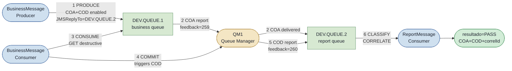
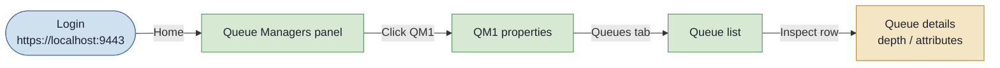

# Operations Runbook — IBM MQ COA/COD Demo

A self-contained guide for a new operator to stand up the IBM MQ broker, run
the COA/COD end-to-end demo, validate it, and navigate the IBM MQ web console.

---

## 1. Prerequisites

| Requirement | Notes |
|---|---|
| **JDK 25** (Amazon Corretto 25) | `JAVA_HOME=/home/rodrigo/.local/jdk25`. Required — `pom.xml` targets `maven.compiler.release=25`. |
| **Maven 3.9+** | Binary at `/home/rodrigo/.local/maven-current/bin/mvn`. |
| **Docker Engine 29+** | Container runtime for the broker. Docker Desktop users: the socket must be at `/var/run/docker.sock`. |
| **Toolchain helper** | `source ~/.local/ibmmq-env.sh` (sets `JAVA_HOME` and adds `mvn` to `PATH`). |

Verify the toolchain:

```bash
source ~/.local/ibmmq-env.sh
java -version        # should show: openjdk 25 ... Amazon Corretto
mvn -version         # should show: Apache Maven 3.9.x
docker info          # must not error
```

---

## 2. Configuration Reference

### 2.1 Default configuration — `application.yml`

Located at `ibmmq-jms-guide/src/main/resources/application.yml`.

Key bindings (`@ConfigurationProperties("ibm-mq")`):

| YAML key | Default value | Description |
|---|---|---|
| `ibm-mq.host` | `localhost` | Broker host |
| `ibm-mq.port` | `1414` | Listener port |
| `ibm-mq.channel` | `DEV.APP.SVRCONN` | SVRCONN channel for the `app` user |
| `ibm-mq.queue-manager` | `QM1` | Queue manager name |
| `ibm-mq.user` | `app` | MQCSP user |
| `ibm-mq.password` | env `IBM_MQ_PASSWORD`, fallback `passw0rd` | MQCSP password |
| `ibm-mq.business-queue` | `DEV.QUEUE.1` | Business (destination) queue |
| `ibm-mq.report-queue` | `DEV.QUEUE.2` | Report queue (`JMSReplyTo`) |
| `ibm-mq.tls-enabled` | `false` | TLS off in dev |

### 2.2 Demo override — `application-demo.yml`

Located at `ibmmq-jms-guide/src/main/resources/application-demo.yml`.  
Active only when the Micronaut environment `demo` is set.

```yaml
demo:
  coa-cod:
    enabled: true        # gates CoaCodDemoRunner — absent in normal startup

ibm-mq:
  channel: DEV.ADMIN.SVRCONN    # admin channel for context authority
  user: admin
  password: ${MQ_ADMIN_PASSWORD:passw0rd}
```

> **Why admin?** — The queue manager generates a COA/COD report via a
> PUT-with-context to the `JMSReplyTo` queue, which requires context authority
> (`+setall`). The low-privilege `app` user lacks it: the report PUT fails with
> `MQRC_NOT_AUTHORIZED (2035)` and the report lands on the DLQ silently. The
> `admin` user has full authority. In production, grant the minimal authority:
> `SET AUTHREC ... AUTHADD(PUT, SETALL)` for the application principal instead
> of using `admin`.

Note: `application-demo.yml` does NOT override `business-queue` or
`report-queue`, so the demo still uses **`DEV.QUEUE.1`** (business) and
**`DEV.QUEUE.2`** (reports) — the dev image defaults.

### 2.3 MQSC objects (`ibmmq-jms-guide/mqsc/`)

These are production-style objects applied once at queue manager creation
(autoconfig via `/etc/mqm`). They are reference setup — the demo uses the dev
image defaults (`DEV.*`), not these `APP.*` objects.

**`mqsc/10-channel-auth.mqsc`** — channel and authentication:

| Object | Type | Description |
|---|---|---|
| `APP.SVRCONN` | SVRCONN channel | Application channel |
| `APP.IDPWOS` | AUTHINFO (IDPWOS) | OS user/password auth, `CHCKCLNT(REQUIRED)` |
| CHLAUTH rules | — | Block `*MQADMIN` on `APP.SVRCONN`; block `SYSTEM.*`; map `app` → `app` |

**`mqsc/20-queues.mqsc`** — queues:

| Queue | Description |
|---|---|
| `APP.BUSINESS.QUEUE` | Business destination; persistent; backout after 5 rollbacks → `APP.BACKOUT.QUEUE` |
| `APP.REPORT.QUEUE` | Report queue (`JMSReplyTo`); persistent |
| `APP.BACKOUT.QUEUE` | Poison-message backout queue |
| `APP.DLQ` | Dead letter queue (configured as `DEADQ` on the queue manager) |

### 2.4 Environment variables

| Variable | Purpose | Default |
|---|---|---|
| `IBM_MQ_PASSWORD` | Password for the `app` user (normal startup) | `passw0rd` |
| `MQ_ADMIN_PASSWORD` | Password for the `admin` user (demo profile) | `passw0rd` |

---

## 3. Bring Up the Broker

All commands run from the `ibmmq-jms-guide/` directory.

```bash
cd ibmmq-jms-guide

# Start the broker (detached)
docker compose up -d

# Tail logs until the queue manager is ready
docker compose logs -f mq
```

**Expected output in the logs (ready signal):**

```
Started queue manager
```

Full readiness indicator: you should see a line like:

```
AMQ5041I: The queue manager task 'AUTOCONFIG' has ended.
...
AMQ5975I: IBM MQ queue manager 'QM1' started.
```

Once ready:

- MQ listener: `localhost:1414`
- Web console: `https://localhost:9443/ibmmq/console`
- Users: `app` / `passw0rd`, `admin` / `passw0rd`

**Tear down** (preserves data):

```bash
docker compose down
```

**Tear down + discard all data**:

```bash
docker compose down -v
```

---

## 4. COA/COD Demo Flow

### 4.1 Architecture



**Message flow summary:**

1. Producer sends to `DEV.QUEUE.1` with COA+COD report options; `JMSReplyTo=DEV.QUEUE.2`.
2. Queue manager delivers COA (feedback=259) to `DEV.QUEUE.2` immediately on arrival.
3. Business consumer performs a destructive GET from `DEV.QUEUE.1` in a transacted session.
4. Business consumer commits — the commit releases the COD trigger.
5. Queue manager delivers COD (feedback=260) to `DEV.QUEUE.2`.
6. Report consumer reads `DEV.QUEUE.2`, classifies feedback, correlates `correlationId → messageId`.

### 4.2 Run the Demo

**Pre-requisite:** broker must be up (`docker compose up -d`, section 3).

```bash
source ~/.local/ibmmq-env.sh
cd ibmmq-jms-guide

# Capture the run to a log file so the validation checks in section 5 are reproducible.
JAVA_HOME=/home/rodrigo/.local/jdk25 /home/rodrigo/.local/maven-current/bin/mvn mn:run \
  -Dmn.jvmArgs="--enable-native-access=ALL-UNNAMED -Dmicronaut.environments=demo" \
  2>&1 | tee /tmp/coa-cod-demo.log
```

> **Important:** `-Dmicronaut.environments=demo` and `--enable-native-access=ALL-UNNAMED`
> must be placed inside `-Dmn.jvmArgs`, not as bare Maven `-D` flags. `mn:run` forks
> a separate JVM for the application; a bare `-D` on the Maven CLI sets the Maven JVM,
> not the application JVM — the flag would be silently ignored.

> **When is it done?** The demo runs once at startup. Once you see the
> `[demo=COA/COD] [resultado=PASS]` summary line, the flow is complete. The
> application does **not** call `System.exit`; if the process does not return to
> the shell on its own, press **Ctrl-C** to stop it (the summary has already been
> written to `/tmp/coa-cod-demo.log`).

Alternative — using an environment variable (equivalent):

```bash
MICRONAUT_ENVIRONMENTS=demo \
JAVA_HOME=/home/rodrigo/.local/jdk25 /home/rodrigo/.local/maven-current/bin/mvn mn:run \
  -Dmn.jvmArgs="--enable-native-access=ALL-UNNAMED"
```

### 4.3 Expected Log Output

The application emits narrated `INFO` log lines tagged with `[stage=...]` and
`[demo=COA/COD]`. The log text is Brazilian Portuguese (source language) — this
is what you will see verbatim.

**Stage sequence (in order):**

| Token | Meaning |
|---|---|
| `[stage=BANNER]` | Demo runner starting, produce/consume announced |
| `[stage=PRODUCE]` | Message sent to `DEV.QUEUE.1`; `messageId` logged |
| `[stage=CONSUME]` | Message received destructively from `DEV.QUEUE.1` |
| `[stage=COMMIT]` | Transacted commit done — COD trigger released |
| `[stage=CLASSIFY]` | Report received; feedback code classified |
| `[stage=CORRELATE]` | `correlationId` matched back to original `messageId` |
| `[stage=COA]` | COA report (feedback=259) registered |
| `[stage=COD]` | COD report (feedback=260) registered |
| `[stage=RECONCILE]` | Both COA+COD confirmed; pending entry removed |
| `[resultado=PASS]` | Final summary — all assertions passed |

**Example verbatim log excerpt (passing run):**

```
INFO  [stage=BANNER] Iniciando a demo COA/COD ponta-a-ponta (produce -> consume -> COA/COD) contra o broker local.
INFO  [stage=PRODUCE] Mensagem de negocio enviada: businessKey=demo-coa-cod, messageId=ID:..., replyTo=DEV.QUEUE.2
INFO  [stage=CONSUME] Mensagem de negocio consumida (GET destrutivo): messageId=ID:..., body={"demo":"coa-cod","pedido":42}
INFO  [stage=COMMIT] Consumo confirmado (commit): COD liberado para a fila de relatorios, messageId=ID:...
INFO  [stage=CLASSIFY] Relatorio classificado: tipo=COA, feedback=259, correlId=ID:...
INFO  [stage=CORRELATE] Correlacionado a mensagem original: originalMsgId=ID:..., conhecido=true
INFO  [stage=COA] Confirmacao de chegada (arrival) registrada: correlId=ID:..., originalMsgId=ID:...
INFO  [stage=CLASSIFY] Relatorio classificado: tipo=COD, feedback=260, correlId=ID:...
INFO  [stage=COD] Confirmacao de entrega (delivery) registrada: correlId=ID:..., originalMsgId=ID:...
INFO  [stage=RECONCILE] Entrega completa (COA+COD): pendencia reconciliada e removida, ...
INFO  [demo=COA/COD] [resultado=PASS] Fluxo validado: COA(feedback=259)=true, COD(feedback=260)=true, correlId==messageId=true ...
```

---

## 5. Validate

A run is a **PASS** when all of the following hold:

| Check | Expected token in log |
|---|---|
| COA report received | `[stage=COA]` line present |
| COD report received | `[stage=COD]` line present |
| Feedback code for COA | `feedback=259` in the CLASSIFY line |
| Feedback code for COD | `feedback=260` in the CLASSIFY line |
| Correlation is correct | `correlId==messageId=true` in the PASS line |
| Final verdict | `[resultado=PASS]` in the log |

A run is a **FAIL** when the log shows `[resultado=FAIL]` instead.

### 5.1 Step-by-step validation checklist

1. Run the demo command (section 4.2) — it tees output to `/tmp/coa-cod-demo.log`.
2. Once the `[resultado=PASS]` summary line appears, the flow is complete; stop
   the process with **Ctrl-C** if it does not return on its own (section 4.2).
3. Confirm the final verdict is PASS:
   ```bash
   grep '\[resultado=PASS\]' /tmp/coa-cod-demo.log
   ```
   A matching line means the run passed; no match means it failed (section 7).
4. Confirm `[stage=COA]` appears **before** `[stage=COD]` (COA precedes COD):
   ```bash
   grep -nE '\[stage=(COA|COD)\]' /tmp/coa-cod-demo.log
   ```
5. Confirm the same `messageId` appears in the `[stage=PRODUCE]` and PASS lines:
   ```bash
   grep -E '\[stage=PRODUCE\]|\[resultado=PASS\]' /tmp/coa-cod-demo.log
   ```
6. If any check fails, see section 7 (Troubleshooting).

### 5.2 Integration test (alternative automated validation)

The Maven integration test `CoaCodEndToEndIT` spins up a real broker via
Testcontainers and asserts the same conditions programmatically:

```bash
cd ibmmq-jms-guide
JAVA_HOME=/home/rodrigo/.local/jdk25 /home/rodrigo/.local/maven-current/bin/mvn verify
```

`BUILD SUCCESS` confirms COA (feedback=259) + COD (feedback=260) both arrived
with `correlationId == messageId`.

---

## 6. IBM MQ Web Console Walkthrough

The web console is the IBM MQ graphical administration interface.

URL: **`https://localhost:9443/ibmmq/console`**

### 6.1 Login

1. Open `https://localhost:9443/ibmmq/console` in a browser.
2. Accept the self-signed TLS certificate warning (click "Advanced" →
   "Proceed" or equivalent; this is expected for a local dev container — the
   dev image ships a self-signed cert).
3. Enter credentials:
   - **Username:** `admin`
   - **Password:** `passw0rd` (matches `MQ_ADMIN_PASSWORD` in `docker-compose.yml`)
4. Click **Log in**.

Expected: the IBM MQ console home page loads, showing the queue manager `QM1`.

### 6.2 View the Queue Manager



Steps:

1. On the console home page, locate the **Queue Managers** panel. It lists `QM1`.
2. Click **QM1** to open the queue manager details page.
3. Click the **Queues** tab in the left-hand navigation (or the Manage section).
4. The queue list shows all local queues, including:
   - `DEV.QUEUE.1` — business queue
   - `DEV.QUEUE.2` — report queue
   - `DEV.DEAD.LETTER.QUEUE` — dead letter queue

The **Depth** column shows the current message count in each queue.

> After running the demo the depths of `DEV.QUEUE.1` and `DEV.QUEUE.2` will
> be **0** — the demo drains both queues. This is expected.

### 6.3 Publish a Test Message to a Queue

These steps let you publish a message directly from the console, independent of
the demo.

1. In the **Queues** list, click the row for **`DEV.QUEUE.1`**.
2. Click the **Create** button (or the **"+"** icon) to open the message
   creation panel.
3. In the message body field, enter a test payload, for example:
   ```json
   {"test": "console-message", "ts": 1}
   ```
4. Click **Put** (or **Send**) to publish the message to the queue.
5. The depth counter for `DEV.QUEUE.1` should increment by 1.

> The exact button labels depend on the IBM MQ console version. Look for
> "Create message", "Put message", or a **+** symbol near the queue row.

### 6.4 Browse Messages

Browsing lets you inspect a message without removing it from the queue (a
non-destructive peek).

1. In the **Queues** list, click the row for **`DEV.QUEUE.1`** (which now has
   depth ≥ 1 from the step above).
2. Click **Browse messages** or the eye/magnifier icon on the row.
3. The console shows the list of messages in the queue, with metadata columns:
   Message ID, Correlation ID, Put timestamp, and a preview of the body.
4. Click any row to expand the full message body and MQMD properties.

You should see the payload you published in step 6.3.

> To clean up after browsing, you can either let the demo consume the message,
> or delete it from the console (select the row → **Delete**).

### 6.5 Inspect Queue Depths at a Glance

The console queue list refreshes on demand. To see the current depth of all
queues, click the **Refresh** icon at the top-right of the queue list.

Key queues for this project:

| Queue | Expected depth after demo | Purpose |
|---|---|---|
| `DEV.QUEUE.1` | 0 (drained by business consumer) | Business destination |
| `DEV.QUEUE.2` | 0 (drained by report consumer) | COA/COD reports |
| `DEV.DEAD.LETTER.QUEUE` | 0 (should be empty on PASS) | DLQ — non-zero means a problem |

> A non-zero depth on `DEV.DEAD.LETTER.QUEUE` after the demo usually indicates
> the 2035 report-PUT authority error (see section 7).

---

## 7. Troubleshooting

### 7.1 Demo logs `[resultado=FAIL]` — report queue empty / no COA or COD

**Symptom:** demo finishes but `[stage=COA]` and/or `[stage=COD]` never appear;
`coaSeen=false` or `codSeen=false` in the FAIL line; `DEV.QUEUE.2` depth is 0
after the demo; `DEV.DEAD.LETTER.QUEUE` depth is non-zero.

**Root cause:** the `app` user lacks context authority (`+setall`). The queue
manager's report PUT fails with `MQRC_NOT_AUTHORIZED (2035)` and the report is
routed to the DLQ instead of the report queue.

**Fix:** ensure the demo uses the `admin` channel override by activating the
`demo` Micronaut environment (it applies `DEV.ADMIN.SVRCONN` + `admin` user
from `application-demo.yml`). Use the exact command in section 4.2 — in
particular, pass `-Dmicronaut.environments=demo` **inside** `-Dmn.jvmArgs`.

**In production:** grant the application principal the minimum required
authority instead of using `admin`:

```mqsc
SET AUTHREC PROFILE('APP.REPORT.QUEUE') OBJTYPE(QUEUE) +
    PRINCIPAL('appuser') AUTHADD(PUT, SETALL)
```

### 7.2 JVM native-access warning on JDK 25

**Symptom:** the IBM MQ client emits a warning:

```
WARNING: A terminally deprecated method in java.lang.System has been called
...
--enable-native-access
```

**Cause:** the IBM MQ client loads native libraries via `System.loadLibrary`.
JDK 25 requires explicit opt-in.

**Fix:** the demo command already includes `--enable-native-access=ALL-UNNAMED`
inside `-Dmn.jvmArgs`. The Maven Surefire/Failsafe `argLine` also carries it
for test runs. If running the jar directly, add it to the JVM args:

```bash
java --enable-native-access=ALL-UNNAMED -jar target/ibmmq-jms-guide-*.jar
```

### 7.3 Broker not starting / "Could not find a valid Docker environment"

**Symptom:** `docker compose up -d` fails or Testcontainers throws
"Could not find a valid Docker environment".

**Fix:** verify Docker is running and the socket is accessible:

```bash
curl --unix-socket /var/run/docker.sock http://localhost/info | grep -i version
```

If using Docker Desktop on WSL2, ensure the integration is enabled and the
socket is at `/var/run/docker.sock`. Testcontainers 2.0.5 (the version used
here) is compatible with Docker Engine 29+ / API 1.54.

### 7.4 `micronaut.environments=demo` has no effect

**Symptom:** demo runs but the demo runner is not instantiated; the narrated log
lines (`[stage=BANNER]`, `[stage=PRODUCE]`, ...) never appear; `[resultado=...]`
absent.

**Root cause:** `-Dmicronaut.environments=demo` was placed as a bare Maven
`-D` flag instead of inside `-Dmn.jvmArgs`. It configured the Maven JVM, not
the forked application JVM.

**Fix:** use the exact command from section 4.2, with both flags inside
`-Dmn.jvmArgs="..."`.

### 7.5 Build errors on first run (dependency download)

**Symptom:** `mvn mn:run` or `mvn verify` fails on the first run with network
or artifact errors.

**Fix:** the IBM MQ client (`com.ibm.mq.allclient:9.4.5.0`, ~8 MB) is fetched
from Maven Central on first run. Ensure internet access and re-run. If behind
a corporate proxy, configure Maven's `~/.m2/settings.xml` accordingly.
